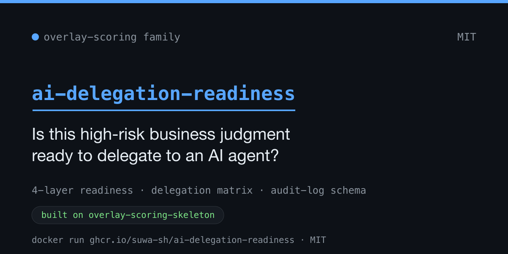

# ai-delegation-readiness



[](LICENSE)

> 🇬🇧 English version: [README.md](README.md)

高リスクな定型業務を AI エージェントに委任して良いかを **診断するツールと拡張可能な
フレームワーク**です。味の素グループの経理 AI エージェント(2026 年 2 月本番稼働)の
**公開分析からの抽出**です。

主な特徴は、次の 3 点です。

1. **委任の可否を診断します** — 業務の標準化・構造化・委任範囲・統制を機械的に採点し、
   導入効果の説明可能性とあわせて、決定的な合否で返します。
2. **機械可読の正本を持ちます** — 4 層フレーム・委任マトリクス・監査ログスキーマを
   定義として持ち、AI エージェントや CI から直接利用できます。
3. **フォークせず拡張できます** — 各社固有の質問や厳格化した閾値を、overlay で
   追加できます。

> **用語集**:
> - **J-SOX**(金融商品取引法の内部統制報告制度)は、上場企業に財務報告に係る内部統制の
>   評価・報告を求める制度です。
> - **監査ログ**は、AI の判断(誰が / いつ / 何を / なぜ / 結果)を後から再現・点検できる
>   ように残す記録です。
> - **4 層フレーム**は、標準化 → 構造化 → 委任範囲 → 統制 の順に積み上がる、委任の前提条件です。
> - **効果測定軸(efficacy axis)**は、導入効果の数値に説明可能な分母・基準値があるかを
>   確認する、4 層と並列の観点です。
> - **委任マトリクス(delegation matrix)**は、検証可能性 × 正解定義可能性 の 2 軸で、各判定を
>   委任 / LLM 補助 / 人間に残す に振り分ける採点です。
> - **overlay(オーバーレイ)**は、正本をフォークせず、各社固有の質問追加・閾値強化を行う
>   拡張ファイルです。

> **言語について**: `docs/` は日本語(著者の作業言語)で書いています。英語 README が
> 入口、本ファイル(日本語)が正本テキストです。

## Quick start(2 分で動かす)

セットアップは不要です。公開されているイメージを取得して実行するだけで、同梱のサンプルが
そのまま動きます。

```bash
docker run --rm ghcr.io/suwa-sh/ai-delegation-readiness:v0.2.0 --version

docker run --rm ghcr.io/suwa-sh/ai-delegation-readiness:v0.2.0 \
  check-readiness examples/business/sample-expense-approval.yaml
docker run --rm ghcr.io/suwa-sh/ai-delegation-readiness:v0.2.0 \
  score-delegation examples/judgments/sample-judgments.yaml
docker run --rm ghcr.io/suwa-sh/ai-delegation-readiness:v0.2.0 \
  validate-audit-log examples/audit-log-sample.json --level extended
docker run --rm ghcr.io/suwa-sh/ai-delegation-readiness:v0.2.0 \
  check-overlay examples/overlays/sample-company/extra-rules.yaml
docker run --rm ghcr.io/suwa-sh/ai-delegation-readiness:v0.2.0 list-definitions
```

`--version` はアプリのバージョンと同梱の overlay エンジンのバージョンを表示します。例:
`aidr 0.2.0 (overlay-scoring-skeleton 0.1.0)`。

各コマンドは決定的な終了コードを返すので、CI のゲートに使えます。
**0** ok ・ **1** partial(yellow)・ **2** block(red: 欠落・SLA 違反・overlay 却下)・
**3** 入力エラー。

## 使い方(想定ワークフロー)

コマンドは「自分のデータを用意して実行する」ものです。自社のファイルを置いたディレクトリを
コンテナにマウントします。以降の説明を読みやすくするため、シェル関数を定義しておきます。

```bash
aidr() { docker run --rm -v "$PWD:/data" -w /data \
  ghcr.io/suwa-sh/ai-delegation-readiness:v0.2.0 "$@"; }
```

[`examples/`](examples/) の各サンプルをひな型として書き換え、自社の値を入れてから
実行します。診断から拡張まで、次の順で使います。

### ステップ 0 — 準備

[`examples/`](examples/) のサンプルをひな型に、自社用の入力ファイルを作ります
(`my-business.yaml`、`my-judgments.yaml`)。

### ステップ 1 — 業務が委任に耐えるかを診断する

`my-business.yaml` の各層の問いに `yes` / `no` を埋め、対象業務を 4 層 + 効果測定で
採点します。

```bash
aidr check-readiness my-business.yaml
```

出力例(抜粋):

```text
Target: Expense claim approval (mid-size company, FY2026 review)

[..] L1 業務標準化層: REVISE (75%)
    no: L1Q4
[NG] L2 判断構造化層: BLOCK (33%)
    no: L2Q2, L2Q3
[..] L3 委任範囲層: REVISE (75%)
[NG] L4 統制・追跡層: BLOCK (0%)
[..] efficacy 効果測定: REVISE (75%)

Conclusion: BLOCK
  First gate to fix: layer L1
```

`[..]` revise / `[NG]` block を層ごとに示し、最後に総合判定を返します。**下の層が
崩れていると上の層は採点に意味がない**ため、`First gate to fix` が示す最下層から
順に埋めます。各層の問いと合否基準は [docs/01](docs/01_four_layer_framework.md) を
参照してください。

### ステップ 2 — 判定単位の委任領域を決める

`my-judgments.yaml` に判定リストを並べ、検証可能性 × 正解定義可能性 の 2 軸で、各判定を
委任 OK / LLM 補助 / 人間に残す に振り分けます。

```bash
aidr score-delegation my-judgments.yaml
```

出力例(抜粋):

```text
[GREEN ] receipt_mandatory_items_check: GREEN  (verifiability=high(3/3), answer_definability=high(3/3))
[GREEN ] entertainment_expense_judgment: GREEN  (verifiability=high(2/3), answer_definability=high(2/3))
[RED   ] new_hire_decision: RED  (verifiability=low(0/3), answer_definability=low(0/3))
[YELLOW] discriminatory_language_detection: YELLOW  (verifiability=high(2/3), answer_definability=low(1/3))
```

🟢 GREEN は委任 OK、🟡 YELLOW は LLM 補助(人間が最終判定)、🔴 RED は人間に残す、です。
各判定には推奨アクション(監査ログにどう記録するか)が併記されます。採点質問と象限の
意味は [docs/03](docs/03_delegation_matrix.md) を参照してください。

### ステップ 3 — 監査ログを検証する

委任を始めたら、AI が書き出すログが Who/When/What/Why/Result を満たすかを検証します。
`examples/audit-log-sample.json` をひな型に、自社のログ JSON を作ります。

```bash
cp examples/audit-log-sample.json my-log.json
aidr validate-audit-log my-log.json --level extended
```

出力例:

```text
[OK] schema=audit_log_extended: valid
```

`--level extended` は J-SOX グレードの拡張スキーマ(規定バージョン固定・離散 Result
enum・エスカレーション先必須化)で検証します。違反は JSON パスで報告されます。スキーマ
設計と、既存ログ基盤への当てはめ例は [docs/02](docs/02_audit_log_schema.md) と
[docs/04](docs/04_audit_log_gap_check.md) を参照してください。

### ステップ 4 — 自社ルールで拡張する(任意)

各社固有の質問や厳格化した閾値は overlay で追加し、適用前に検証します。

```bash
aidr check-overlay examples/overlays/sample-company/extra-rules.yaml
aidr check-readiness my-business.yaml --overlay examples/overlays/sample-company/extra-rules.yaml
```

`check-overlay` の出力例:

```text
[OK] overlay examples/overlays/sample-company/extra-rules.yaml merges cleanly onto base .../definitions/four-layer.yaml
```

overlay が `add`(追加)/ `strengthen`(強化)のルールを満たせば `[OK]`、違反すれば
`[NG]` と理由を返します。検証を通った overlay を `--overlay` で各コマンドに適用します。

## Who this is for

| あなたが... | まず読むもの |
|---|---|
| **業務側の意思決定者**(経理部長 / CFO / コンプラ責任者)で AI 化を検討中 | [`docs/01_four_layer_framework.md`](docs/01_four_layer_framework.md) — `aidr check-readiness` で業務を採点します |
| **実装エンジニア**で高リスク承認業務向け AI エージェントを設計中 | [`schemas/audit-log.schema.json`](schemas/audit-log.schema.json) + [`docs/02_audit_log_schema.md`](docs/02_audit_log_schema.md) — スキーマをロガーに組み込みます |
| **運用担当**で既存 AI 基盤のログを点検したい | [`docs/04_audit_log_gap_check.md`](docs/04_audit_log_gap_check.md) — 5 ステップ手法を自社 SQL スキーマに当てます |
| **コンサル / 提案者** | `docs/` 全部 + overlay 拡張モデル — clone してプライベートに overlay し、顧客固有の採点を提示します |

## What's in this repo

```
ai-delegation-readiness/
├── definitions/                 # 機械可読の正本フレームワーク(YAML)
│   ├── four-layer.yaml          #   4 層 + 効果測定軸 + extension_points
│   └── delegation-matrix.yaml   #   2 軸 + 領域マップ + extension_points
├── schemas/
│   └── audit-log.schema.json    # JSON Schema with $defs: minimum (A) / extended (B)
├── src/adr/                     # Python 診断ツール(コンテナイメージで配布)
├── bin/aidr                     # CLI エントリポイント(単一コマンド、5 サブコマンド)
├── examples/
│   ├── business/                # check-readiness のサンプル入力
│   ├── judgments/               # score-delegation のサンプル入力
│   ├── audit-log-sample.json    # サンプル監査ログ(extended 有効)
│   ├── overlays/                # overlay サンプル(Acme Corp)
│   └── skills/                  # Claude Code skill サンプル 2 種
└── docs/
    ├── 01_four_layer_framework.md
    ├── 02_audit_log_schema.md
    ├── 03_delegation_matrix.md
    └── 04_audit_log_gap_check.md
```

## How to extend(フレームワークの意図)

各社の独自ルールは **overlay で追加します**(正本ファイルはフォークしません)。
雛形は [`examples/overlays/sample-company/extra-rules.yaml`](examples/overlays/sample-company/extra-rules.yaml) を参照してください。

```yaml
version: 1
extends: four-layer-delegation-readiness

add:
  - id: "L4.ACME_Q6"
    text: 監査ログは tamper-evident store に保存されているか
    weight: 1.0

strengthen:
  "L4": {revise: 0.8}       # 元 0.6 → 強化のみ可
```

そして `--overlay` 付きで診断します([使い方(想定ワークフロー)](#使い方想定ワークフロー)で
定義した `aidr` 関数を使うと、ファイルもマウントされます)。

```bash
aidr check-readiness mybiz.yaml --overlay our-rules.yaml
```

フレームワークは次の 3 経路で再利用できます。

- **AI エージェント**: `definitions/four-layer.yaml` や
  `schemas/audit-log.schema.json` を system prompt や tool context にロードします。
  [`examples/skills/`](examples/skills/) に Claude Code skill のラッパー 2 種を用意しています
- **CI パイプライン**: 出力ログ 1 件ごとに
  `docker run --rm -v "$PWD:/data" -w /data ghcr.io/suwa-sh/ai-delegation-readiness:v0.2.0 validate-audit-log <log>`
  を呼び、exit code でゲートします
- **社内 overlay**: 自社固有の overlay をプライベートリポで管理し、`--overlay` で
  適用します。本リポはクリーンな upstream として pull できます

## The framework's invariants

正本フレームワーク(`definitions/*.yaml` / `schemas/*.json`)は **全社で一貫**を
保ちます。overlay で可能なのは、次の 2 つだけです。

- **`add`**: 配列要素の追加(既存要素は read-only)
- **`strengthen`**: 数値閾値の **強化方向のみ**(緩和は不可)

削除・置換・緩和は merge violation として `aidr check-overlay` が機械的に検出します。
これによりフォークせず安全に拡張できます。

## Background

本フレームワークは、味の素グループの経理 AI エージェント(2026 年 2 月本番稼働)に
関する **公開報道をもとに書かれた分析記事から抽出**しています(公開報道 → 分析記事 →
本フレームワーク)。

分析記事が引用する公式検証では、ドメイン特化エージェント = **93.3%**、汎用 LLM 単体 =
**53.3%** という 40 ポイント差が報告されています(領収書必須項目 / インボイス制度準拠 /
税務上の交際費判定の 3 タスク)。差を生んだのはモデルの賢さではなく、**業務ロジックを
LLM の周りで構造化**したことだと示されています。下層の標準化・構造化がモデル選定より
重要なのはこのためです。

**留保**: 広く引用される「工数 76% 削減」見出しは、分析記事に分母・基準値・スコープが
明示されていません。本リポは効果数値を保証せず、観測の観点だけを保持します(`docs/01`
の効果測定軸を参照してください)。

### 出典

- **分析記事**(直接の抽出元): [「味の素の経理AIエージェントに学ぶ 承認業務をAIに委任する前提条件」](https://suwa-sh.github.io/zenn-contents/articles/ajinomoto-accounting-agent_20260621/)

### 分析記事が引用している報道

- [ファーストアカウンティング公式プレスリリース (2026-04-24)](https://www.fastaccounting.jp/news/20260424/15929/)
- [ITmedia「工数 76% 削減」(2026-06-19)](https://www.itmedia.co.jp/business/articles/2606/19/news033.html)

## ライセンス

[MIT](LICENSE) を採用しています。

## セキュリティ

脆弱性報告は [SECURITY.md](SECURITY.md) を参照してください。
