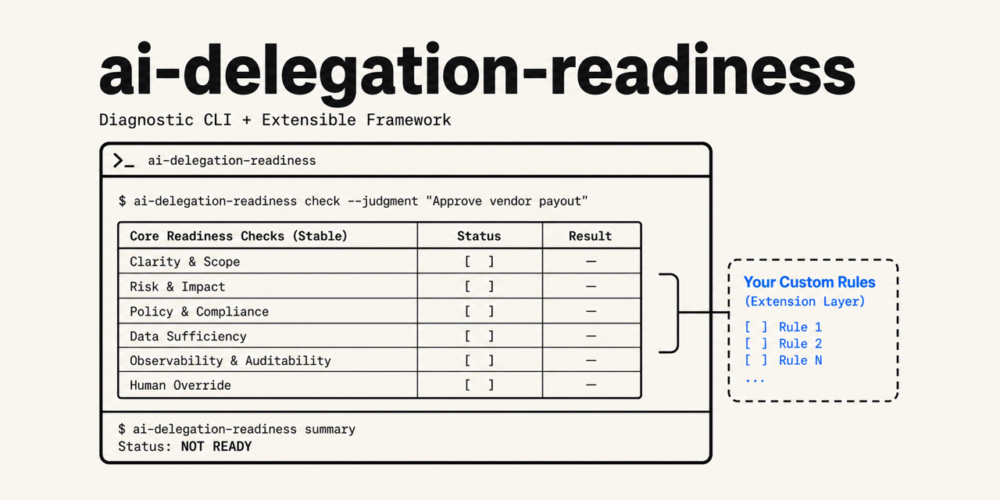

# ai-delegation-readiness

> 🇬🇧 English version: [README.md](README.md)

高リスクな定型業務を AI エージェントに委任するための **4 層前提条件**と
**監査ログ設計テンプレート**の参照実装。味の素グループ(AFS)の経理 AI エージェント
事例(2026 年 4 月発表)から再現可能な骨格を抽出し、自社で同種の委任を検討する
組織が「対象業務が委任に耐えるか」を診断できるチェックリストとして整える。

このリポジトリは**ドキュメント中心**の参照実装で、コード実装言語は持たない。
読み物として 4 層フレームを点検し、監査ログ JSON サンプルをそのまま雛形として
持ち帰ることを想定する。

## 想定読者

- 経理・承認・コンプライアンス業務を AI エージェントに委任しようとしている実装エンジニア
- 業務設計者・経理 / 管理部門のリーダー
- 自社の AI 統制設計(④統制・追跡層)に欠けがないかを点検したい運用担当

## 主要成果物

| ファイル | 内容 |
|---|---|
| [docs/01_four_layer_framework.md](docs/01_four_layer_framework.md) | 4 層フレーム(業務標準化 / 判断構造化 / 委任範囲 / 統制・追跡)+ 効果測定 のチェックリスト |
| [docs/02_audit_log_schema.md](docs/02_audit_log_schema.md) | 監査ログ最小スキーマ(Who/When/What/Why/Result)と J-SOX 観点 |
| [docs/03_delegation_matrix.md](docs/03_delegation_matrix.md) | 委任線引きマトリクス(検証可能性 × 正解定義可能性) |
| [examples/audit-log-sample.json](examples/audit-log-sample.json) | ダミー経費承認 1 件の監査ログ JSON サンプル |

## 自社運用での適用例(参考)

- [docs/04_agent_loop_audit_gap.md](docs/04_agent_loop_audit_gap.md) — リポ作者の自社運用基盤
  `agent-loop` の DB スキーマを④統制層の観点で点検した結果。**他社が真似するためのテンプレ部は
  01〜03 で完結**しているので、04 は適用例として参照のみで構わない。

## 使い方

1. `docs/01_four_layer_framework.md` のチェックリストを対象業務に当てて、4 層 + 効果測定が
   揃っているかを確認する
2. ③ 委任範囲層で迷ったら `docs/03_delegation_matrix.md` の 2 軸採点に落として判定する
3. ④ 統制・追跡層の監査ログ設計は `docs/02_audit_log_schema.md` の最小スキーマと
   `examples/audit-log-sample.json` を雛形にする
4. 自社の既存ログ基盤が④統制層を満たしているかは、`docs/04_agent_loop_audit_gap.md`
   の点検方法(SQL スキーマ × 5 観点マッピング)を参考に同様の点検をする

## 適用範囲と限界

- 本リポは**最小スコープの参照実装**であり、改ざん耐性・保存期間・原証憑参照・規定
  バージョン固定の運用は `docs/02` で「拡張点」として方向だけ示し、実装は提供しない
- 味の素事例の④統制層は公開情報が薄く、本リポでは **【観測事実】**(事例から確認できた範囲)と
  **【設計提案】**(本リポでの一般化・補完)を各 doc でラベル分けして示す
- 「76%」削減率の定義は記事に明示されておらず、本リポは効果測定の数値を保証しない

## 関連事例(参考リンク)

- [味の素フィナンシャル・ソリューションズ、ファーストアカウンティング 共同開発の経理 AI エージェント本番稼働](https://www.fastaccounting.jp/news/20260424/15929/)
- [工数「76%」削減 味の素グループが経理 AI エージェントで先陣を切れたワケ(ITmedia)](https://www.itmedia.co.jp/business/articles/2606/19/news033.html)

## ライセンス

[MIT](LICENSE)

## セキュリティ

脆弱性報告は [SECURITY.md](SECURITY.md) を参照。
