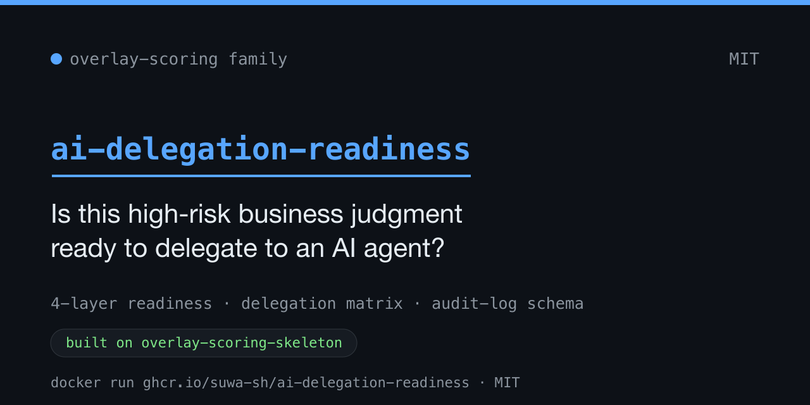
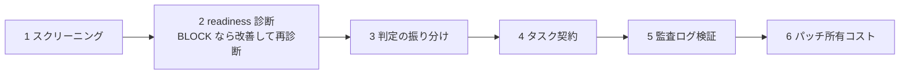

# ai-delegation-readiness



[](LICENSE)

> 🇬🇧 English version: [README.md](README.md)

## これは何(1 分で)

「この業務を AI エージェントに任せてよいか」を、勘ではなく**採点**で決めるための
診断ツールと拡張可能なフレームワークです。

- **AI エージェント** = 指示を受けて判断や作業を自動で進める AI プログラム
- **委任** = 人間がやっていた判断を AI に任せること。任せた後も責任は人間に残るため、
  任せてよい条件を先に点検する必要があります

このツールは、その点検を **本線 6 ステップ + 任意の拡張** に分解します。
各ステップが 1 つの問いに答えます。

| 本線 | 問い | コマンド |
|---|---|---|
| 1 | どのタスク群から手を付けるか | `aidr screen-transition` |
| 2 | この業務は委任に耐えるか | `aidr check-readiness` |
| 3 | 中のどの判定を任せるか | `aidr score-delegation` |
| 4 | タスクをどう渡し、誰が採点するか | `aidr check-task-contract` |
| 5 | 記録は後から検証できるか | `aidr validate-audit-log` |
| 6 | AI 生成パッチを将来も所有できるか | `aidr check-patch-ownership` |
| 拡張 | 自社ルールをどう足すか(任意) | `aidr check-overlay` + `--overlay` |
| 拡張 | 受入後の採否をどう振り返るか(任意) | `aidr summarize-patch-decisions` |
| 拡張 | 委任を受ける組織に、事故を止める体制があるか(任意) | `aidr assess-risk-architecture` |

主要サンプルは、架空の中堅製造業 **ミドリ精機株式会社** の物語でつながっています。
診断で一度 **BLOCK(委任不可)** になり、改善して **PASS** してから先へ進む —
という時間軸まで含めて、6 ステップを通しで体験できます
(物語の正本: [`examples/README.md`](examples/README.md))。


```mermaid
flowchart LR
    s1["1 スクリーニング"] --> s2["2 readiness 診断<br/>BLOCK なら改善して再診断"]
    s2 --> s3["3 判定の振り分け"]
    s3 --> s4["4 タスク契約"]
    s4 --> s5["5 監査ログ検証"]
    s5 --> s6["6 パッチ所有コスト"]
```

骨格は、味の素グループの経理 AI エージェント(2026 年 2 月本番稼働)の
**公開分析からの抽出**です。定義はすべて機械可読(YAML / JSON Schema)で、
AI エージェントや CI からも直接使えます。

## こんなとき読む

| あなたが... | まず読むもの |
|---|---|
| **初めて来た。全体を知りたい** | [docs/00 全体像](docs/00_overview.md) — 6 ステップをミドリ精機の物語で通しで見る |
| **業務側の意思決定者**(経理部長 / CFO / コンプラ責任者)で AI 化を検討中 | [docs/02 4 層フレーム](docs/02_four_layer_framework.md) — `aidr check-readiness` で業務を採点する |
| **どこから着手するか**を決めたい / 経営に説明したい | [docs/01 スクリーニング](docs/01_transition_screening.md) — 4 類型マップと「headcount は最後」の意思決定順序 |
| **実装エンジニア**で高リスク承認業務向け AI エージェントを設計中 | [schemas/audit-log.schema.json](schemas/audit-log.schema.json) + [docs/06](docs/06_audit_log_schema.md) — スキーマをロガーに組み込む |
| **maintainer / Engineering Manager**で AI 生成コードを受け入れる | [docs/11](docs/11_patch_ownership_gate.md) — 所有コスト・テスト完全性・高リスク境界でゲートする |
| **運用担当**で既存 AI 基盤のログを点検したい | [docs/07](docs/07_audit_log_gap_check.md) — 5 ステップ手法を自社 SQL スキーマに当てる |
| **EM / PMO**で、エージェントを運用する組織側の事故対応体制を点検したい | [docs/13](docs/13_risk_architecture.md) — 失敗シナリオごとに検知・抑制・エスカレーションを採点する |
| **コンサル / 提案者** | `docs/` 全部 + overlay 拡張モデル — clone してプライベートに overlay し、顧客固有の採点を提示する |

## Quick start(2 分で動かす)

セットアップは不要です。公開イメージを取得して実行すると、同梱のサンプル
(ミドリ精機の物語)がそのまま動きます。

```bash
docker run --rm ghcr.io/suwa-sh/ai-delegation-readiness:v0.13.0 --version

# 本線 6 ステップを物語の順に
docker run --rm ghcr.io/suwa-sh/ai-delegation-readiness:v0.13.0 \
  screen-transition examples/task-groups/sample-task-groups.csv
docker run --rm ghcr.io/suwa-sh/ai-delegation-readiness:v0.13.0 \
  check-readiness examples/business/sample-expense-approval.csv          # 初回診断 → BLOCK
docker run --rm ghcr.io/suwa-sh/ai-delegation-readiness:v0.13.0 \
  check-readiness examples/business/sample-expense-approval-after.csv    # 改善後 → PASS
docker run --rm ghcr.io/suwa-sh/ai-delegation-readiness:v0.13.0 \
  score-delegation examples/judgments/sample-judgments.csv
docker run --rm ghcr.io/suwa-sh/ai-delegation-readiness:v0.13.0 \
  check-task-contract examples/task-contracts/sample-green.csv
docker run --rm ghcr.io/suwa-sh/ai-delegation-readiness:v0.13.0 \
  validate-audit-log examples/audit-log-sample.json --level extended
docker run --rm ghcr.io/suwa-sh/ai-delegation-readiness:v0.13.0 \
  check-patch-ownership examples/patches/sample-cheap-green.csv

# 拡張(任意): パッチ受入の後を運用ループにする
docker run --rm ghcr.io/suwa-sh/ai-delegation-readiness:v0.13.0 \
  summarize-patch-decisions examples/patch-decisions/sample-midori-2026-07.jsonl

# 拡張(任意): 委任を受ける組織側の体制を採点する
docker run --rm ghcr.io/suwa-sh/ai-delegation-readiness:v0.13.0 \
  assess-risk-architecture examples/business/sample-risk-architecture.csv

# 拡張(任意)と定義の確認
docker run --rm ghcr.io/suwa-sh/ai-delegation-readiness:v0.13.0 \
  check-overlay examples/overlays/sample-company/extra-rules.yaml
docker run --rm ghcr.io/suwa-sh/ai-delegation-readiness:v0.13.0 list-definitions
```

`--version` はアプリのバージョンと同梱の overlay エンジンのバージョンを表示します。例:
`aidr 0.13.0 (overlay-scoring-skeleton 0.1.0)`。

各コマンドは決定的な終了コードを返すので、CI のゲートに使えます。

| コマンド | 0 | 1 | 2 | 3 |
|---|---|---|---|---|
| check-readiness / score-delegation / check-task-contract / check-patch-ownership | ok(green) | partial(yellow) | block(red) | 入力エラー・overlay 違反 |
| screen-transition | 成功(分類はゲートでないため類型によらず 0) | — | — | 未回答の欠落・不正値・overlay 違反 |
| validate-audit-log | valid | invalid(スキーマ違反) | — | 入力エラー(JSON 構文不正・ファイルなし) |
| check-overlay | マージ規則を満たす | 違反あり(却下) | — | YAML 構文・重複 key・ファイル入力エラー |
| summarize-patch-decisions | 全決定済み・RED 採用なし | 未決あり | RED を accepted した記録が 1 件以上(2 が 1 に優先) | 入力エラー・overlay 違反 |
| assess-risk-architecture | 全シナリオ High + owner 充足(pure-SE 帯の対象外も 0) | Medium あり・Low なし | Low あり、または surface owner 不在 | 入力エラー・矛盾回答・overlay 違反 |

レポートは `--format csv` で **CSV でも受け取れます**(上表の 7 コマンド。
先頭列 `record_type` で行の種類を判別でき、スプレッドシートでそのまま集計できます)。

## 学習パス(どの順で読むか)

| 順 | doc | 何が分かるか |
|---|---|---|
| 1 | [00 全体像](docs/00_overview.md) | 6 ステップの地図とミドリ精機の物語 |
| 2 | [01 スクリーニング](docs/01_transition_screening.md) | ステップ 1: どこから手を付けるか |
| 3 | [02 4 層フレーム](docs/02_four_layer_framework.md) | ステップ 2: 業務が委任に耐えるか |
| 4 | [03 組織 readiness 軸](docs/03_organization_axis.md) | ステップ 2: 組織側の受け皿 |
| 5 | [04 委任マトリクス](docs/04_delegation_matrix.md) | ステップ 3: どの判定を任せるか |
| 6 | [05 タスク契約](docs/05_task_contract_execution_rubric.md) | ステップ 4: どう渡し、誰が採点するか |
| 7 | [06 監査ログスキーマ](docs/06_audit_log_schema.md) | ステップ 5: 記録の設計 |
| 8 | [07 ログ基盤の点検](docs/07_audit_log_gap_check.md) | ステップ 5 応用: 既存基盤への当てはめ |
| 9 | [11 パッチ所有コスト](docs/11_patch_ownership_gate.md) | ステップ 6: AI 生成差分の受入ゲート |
| 応用 | [08 高責任ドメイン overlay](docs/08_high_stakes_domain_overlay.md) / [09 内製化 overlay](docs/09_insourcing_judgment_overlay.md) / [10 権限設計 overlay](docs/10_agent_authorization_overlay.md) | 知財/法務/薬事、内製化の判断責任、能力軸と同意軸 |
| 応用 | [13 組織リスクアーキテクチャ](docs/13_risk_architecture.md) | 拡張: 委任を受ける組織側の検知・抑制・エスカレーション体制 |

> **言語について**: `docs/` は日本語(著者の作業言語)で書いています。英語 README が
> 入口、本ファイル(日本語)が正本テキストです。定義ファイルの質問文は英語(`text`)と
> 日本語(`text_ja`)を併記しています。

## 使い方(想定ワークフロー)

コマンドは「自分のデータを用意して実行する」ものです。自社のファイルを置いたディレクトリを
コンテナにマウントします。以降の説明を読みやすくするため、シェル関数を定義しておきます。

```bash
aidr() { docker run --rm -v "$PWD:/data" -w /data \
  ghcr.io/suwa-sh/ai-delegation-readiness:v0.13.0 "$@"; }
```

入力ファイルは `aidr init` でテンプレートを生成して埋めます(ステップ 0)。
各ステップの詳しい読み方は学習パスの doc を参照してください。

### ステップ 0 — 準備(`aidr init` でテンプレート生成 → スプレッドシートで記入)

自社用の入力ファイルは、**問い付きの CSV テンプレート**を生成し、
スプレッドシート(Google Sheets / Excel)で開いて 回答 セルに `yes` / `no`
(はい / いいえ でも可)を埋めます。問いの正本は `definitions/*.yaml` に
一元管理されており、生成される質問列は常に定義と一致します。

```bash
aidr init --target transition    --format csv > my-task-groups.csv   # ステップ 1 用
aidr init --target four-layer    --format csv > my-business.csv      # ステップ 2 用
aidr init --target matrix        --format csv > my-judgments.csv     # ステップ 3 用
aidr init --target task-contract --format csv > my-contract.csv      # ステップ 4 用
aidr init --target patch-ownership --format csv > my-patch.csv       # ステップ 6 用
aidr init --target risk-architecture --format csv > my-risk-arch.csv # 拡張(組織体制)用

# 自社 overlay の追加質問も含めて生成
aidr init --target four-layer --format csv --overlay our-rules.yaml > my-business.csv
```

- CSV は UTF-8 BOM 付きで、Excel でそのまま開けます。タスク群・判定を増やすときは
  **列を複製**します(行 = 質問、列 = タスク群/判定の横持ち形式)
- 記入例は [`examples/`](examples/) にあります(同じテンプレートにミドリ精機の回答を
  書き込んだもの。記入の流れは [`examples/README.md`](examples/README.md) 参照)
- YAML でも同じ内容を書けます(`--format` 省略時は YAML テンプレート。記入例は
  [`examples/business/sample-expense-approval.yaml`](examples/business/sample-expense-approval.yaml))

### ステップ 1 — どのタスク群から手を付けるかを地図にする

```bash
aidr screen-transition my-task-groups.csv
```

タスク群が AI 移行 4 類型(成長 / 高自動化 / 再編 / 変化小)に、委任設計の優先度順で
振り分けられます。最優先は「再編」(人は残るが人員需要は減りうる、役割再設計が要るゾーン)、
「高自動化」が次のステップへ進む候補です。権利・財務・健康・規制に関わるタスク群には、
類型によらず `[HITL]`(人間の最終判断が必須)が付きます。
全質問への回答が必須で、未回答は欠落 id を列挙したエラーになります。
→ [docs/01](docs/01_transition_screening.md)

### ステップ 2 — 業務が委任に耐えるかを診断する(BLOCK なら改善して再診断)

```bash
aidr check-readiness my-business.csv
```

4 層(標準化 → 構造化 → 委任範囲 → 統制)+ 効果測定 + 組織 readiness で採点します。
`[OK]` pass / `[..]` revise / `[NG]` block を層・軸ごとに示し、最後に総合判定を返します。
**BLOCK は参考スコアではなくゲートです** — `First gate to fix` が示す最下層から改善し、
PASS になってから次へ進みます。ミドリ精機のサンプルは初回 BLOCK
([`sample-expense-approval.csv`](examples/business/sample-expense-approval.csv))→
改善後 PASS([`sample-expense-approval-after.csv`](examples/business/sample-expense-approval-after.csv))の
2 幕構成です。→ [docs/02](docs/02_four_layer_framework.md) / [docs/03](docs/03_organization_axis.md)

### ステップ 3 — 判定単位の委任領域を決める

```bash
aidr score-delegation my-judgments.csv
```

検証可能性 × 正解定義可能性の 2 軸で、各判定を 🟢 委任 OK / 🟡 LLM 補助(人間が最終判定)/
🔴 人間に残す に振り分けます。各判定には推奨アクション(監査ログにどう記録するか)が
併記されます。→ [docs/04](docs/04_delegation_matrix.md)

### ステップ 4 — 委任するタスクの契約を点検する

```bash
aidr check-task-contract my-contract.csv
```

委任する 1 タスクの実行契約を、意図 / 境界 / 証跡 / 採点者の 4 要素で点検します。
🟢 契約充足 / 🟡 要素に穴 / 🔴 委任不可。採点者が AI なのに二重評価(iRULER)が無い契約は
🔴 で止まります。→ [docs/05](docs/05_task_contract_execution_rubric.md)

### ステップ 5 — 監査ログを検証する

```bash
aidr validate-audit-log my-log.json --level extended
```

AI が書き出すログが Who/When/What/Why/Result を満たすかを検証します。
`--level extended` は J-SOX グレードの拡張スキーマ(規定バージョン固定・離散 Result
enum・エスカレーション先必須化)です。→ [docs/06](docs/06_audit_log_schema.md) / [docs/07](docs/07_audit_log_gap_check.md)

### ステップ 6 — AI 生成パッチの所有コストをゲートする

```bash
aidr check-patch-ownership my-patch.csv
```

最小の探針、将来 owner と 3 年コスト、実質的なテスト証拠、hollow green、
認可・削除・課金・規制・公開契約の変更を点検します。高リスクは統制済みでも
YELLOW で人間へ回し、テスト証拠なし・hollow green・高リスク統制不足は RED です。
`--emit-decision-record <path> --team <name>` を付けると、判定を pending の決定記録として
JSONL に追記できます。→ [docs/11](docs/11_patch_ownership_gate.md)

### 拡張(任意) — パッチ受入の後を運用ループにする

GREEN / YELLOW / RED は自動 merge 命令ではなく、人間が採否を決める最低条件です。
その採否を決定記録として残し、月次で破棄率・決定済み率を振り返ります。

```bash
aidr summarize-patch-decisions decisions/ --period 2026-08 --team midori-seiki-platform
```

→ [docs/12](docs/12_patch_decision_loop.md)

### 拡張(任意) — 委任を受ける組織側の体制を採点する

委任の可否(ステップ 2〜4)は業務単位の診断です。こちらは**委任を受けて運用する
組織の側**に、失敗シナリオを「検知できる・止められる・責任者に届く」体制があるかを
採点します(元論文: [arXiv:2607.01421](https://arxiv.org/abs/2607.01421))。

```bash
aidr assess-risk-architecture examples/business/sample-risk-architecture.csv
# organization: ミドリ精機 経理エージェント運用チーム
# profile: D1=2 D2=2 D3=1 D4=2 D5=1 D6=2 D7=2  total=12  band=ai_native
# [LOW   ] scenario_f_drift (サイレントな境界契約ドリフト): tau=1 (d=0 c=1 e=0) ...
# owners: contract_owner=yes agent_workflow_owner=yes boundary_channel_owner=NO
# conclusion: BLOCK   (exit code 2)
```

サンプルは、経理エージェントを多段自律実行に広げたミドリ精機が「境界の失敗への
備えが最も薄い」状態にあることを、8 つの代表シナリオと 3 つの surface owner
(contract / agent-workflow / boundary channel)の在任チェックで可視化します。

**楽観バイアスを抑える 3 つの注記**(結果を売り込みに使う前に):

- 「owner を置けば未カバー失敗は消える」という論文の定量結果は、著者による
  **分析上の反事実(derived counterfactual)であり実測ではない** — 自組織の
  インシデント実績で検証する仮説として扱う
- boundary channel owner の**共同指名(joint ownership)は RACI アンチパターン**に
  なりやすい — 平時の Accountable と障害時の意思決定者を 1 名に絞る
- カバレッジが低い組織へ**一律の追加ガバナンスを課すと失敗する** — 統制強度は
  自律性レベル(D2)に比例させる

→ [docs/13](docs/13_risk_architecture.md)

### 拡張(任意) — 自社ルールを overlay で足す

各社固有の質問や厳格化した閾値は overlay で追加し、適用前に検証します。
正本ファイルはフォークしません。

```bash
aidr check-overlay examples/overlays/sample-company/extra-rules.yaml
aidr check-readiness my-business.csv --overlay examples/overlays/sample-company/extra-rules.yaml
```

```yaml
# examples/overlays/sample-company/extra-rules.yaml(ミドリ精機の自社ルール例)
version: 1
extends: four-layer-delegation-readiness

add:
  - id: "L4.MIDORI_Q6"
    text: Is the audit log stored in a tamper-evident store (WORM, hash chain, or signed)?
    text_ja: "監査ログは改ざん検知可能なストア(WORM・ハッシュチェーン・署名)に保存されているか"
    weight: 1.0

strengthen:
  "L4": {pass: 1.0, revise: 0.8}   # 元 0.6 → 強化のみ可
```

**同梱のドメイン overlay(応用例)**:

```bash
# 高責任専門業務(知財/法務/薬事): 成立条件 4 つのハードゲート層 L5 + 慎重側の閾値
aidr check-readiness examples/business/sample-ip-agent-readiness.csv \
  --overlay examples/overlays/high-stakes-domain/four-layer.yaml
# => L1-L4 が全 PASS でも、成立条件が 1 つ欠ければ L5 で BLOCK

aidr score-delegation examples/judgments/sample-ip-judgments.csv \
  --overlay examples/overlays/high-stakes-domain/delegation-matrix.yaml
# => base では green の境界例(2/3)が yellow / red に落ちる

# 内製化の判断責任: 並列軸 L_insourcing(5 問)を追加
aidr check-readiness examples/business/sample-insourcing-readiness.csv \
  --overlay examples/overlays/insourcing-judgment/four-layer.yaml
# => L1-L4・組織が全 PASS でも、上流判断に社内の固有名が欠ければ L_insourcing が REVISE/BLOCK

# エージェント権限設計: 並列軸 L_capability / L_consent(各 3 問)を追加
aidr check-readiness examples/business/sample-agent-authz-readiness.csv \
  --overlay examples/overlays/agent-authorization/four-layer.yaml
# => 能力軸と同意軸を別々に採点。能力側が満点でも同意側の BLOCK は相殺されない

aidr check-task-contract examples/task-contracts/sample-agent-authz-contract.csv \
  --overlay examples/overlays/agent-authorization/task-contract.yaml
# => base では green の契約が、権限範囲の上限を確定していないため yellow に落ちる
```

→ [docs/08](docs/08_high_stakes_domain_overlay.md) / [docs/09](docs/09_insourcing_judgment_overlay.md) /
[docs/10](docs/10_agent_authorization_overlay.md)

権限設計 overlay の 2 軸は**プロンプトインジェクション対策ではありません**。攻撃者が LLM の
判断を操作した場合、権限も同意も正規のまま、対象の指定だけが攻撃者の制御下に入るためです。

## What's in this repo

```
ai-delegation-readiness/
├── definitions/                 # 機械可読の正本フレームワーク(YAML。質問文は text / text_ja 併記)
│   ├── transition-screening.yaml #  3 軸 + 移行 4 類型マップ + extension_points
│   ├── four-layer.yaml          #   4 層 + 効果測定軸・組織 readiness 軸 + extension_points
│   ├── delegation-matrix.yaml   #   2 軸 + 領域マップ + extension_points
│   ├── task-contract.yaml       #   実行ルーブリック 4 要素 + ゲート policy + extension_points
│   ├── patch-ownership.yaml     #   AI 生成差分の所有コスト + hard gate + extension_points
│   ├── patch-decision.yaml      #   決定記録の語彙(decision/discard_reason/reading/bands) + extension_points
│   └── risk-architecture.yaml   #   組織リスクアーキテクチャ(7次元プロファイル + シナリオ + owners) + extension_points
├── schemas/
│   ├── audit-log.schema.json    # JSON Schema with $defs: minimum (A) / extended (B)
│   └── patch-decision.schema.json # 決定記録 1 件の JSON Schema
├── src/adr/                     # Python 診断ツール(コンテナイメージで配布)
├── bin/aidr                     # CLI エントリポイント(単一コマンド、11 サブコマンド)
├── examples/                    # ミドリ精機(架空)の物語でつながるサンプル一式
│   ├── README.md                #   物語の正本(会社プロファイル + サンプル一覧 + 応用例)
│   ├── task-groups/             #   ステップ 1: screen-transition の入力
│   ├── business/                #   ステップ 2: check-readiness の入力(初回 BLOCK / 改善後 PASS + 応用例)
│   ├── judgments/               #   ステップ 3: score-delegation の入力(+ 応用例)
│   ├── task-contracts/          #   ステップ 4: check-task-contract の入力(green / red)
│   ├── audit-log-sample.json    #   ステップ 5: サンプル監査ログ(escalated ケース)
│   ├── patches/                 #   ステップ 6: check-patch-ownership の入力(green / yellow / red)
│   ├── patch-decisions/         #   拡張: summarize-patch-decisions の入力(物語 + 機能デモ)
│   ├── overlays/                #   拡張: ミドリ精機の自社ルール + ドメイン overlay(応用例)
│   └── skills/                  #   AI 取り込み口: Claude Code skill サンプル 6 種
└── docs/                        # 解説(読み順は「学習パス」参照)
    ├── 00_overview.md           #   全体像(最初に読む)
    ├── 01〜06, 11               #   本線 6 ステップの詳細
    ├── 07〜10                   #   応用(ログ基盤点検 / 高責任ドメイン / 内製化 / 権限設計)
    └── 12〜13                   #   拡張(パッチ受入の運用ループ / 組織リスクアーキテクチャ)
```

## How to extend(フレームワークの意図)

正本フレームワーク(`definitions/*.yaml` / `schemas/*.json`)は **全社で一貫**を保ちます。
overlay で可能なのは、次の 2 つだけです。

- **`add`**: 配列要素の追加(既存要素は read-only)
- **`strengthen`**: 数値閾値の **強化方向のみ**(緩和は不可)

削除・置換・緩和は merge violation として `aidr check-overlay` が機械的に検出します。
これによりフォークせず安全に拡張できます。

フレームワークは次の 3 経路で再利用できます。

- **AI エージェント**: `definitions/*.yaml` や `schemas/audit-log.schema.json` を
  system prompt や tool context にロードします。
  [`examples/skills/`](examples/skills/) に Claude Code skill のラッパー 6 種を用意しています
- **CI パイプライン**: 出力ログ 1 件ごとに
  `docker run --rm -v "$PWD:/data" -w /data ghcr.io/suwa-sh/ai-delegation-readiness:v0.13.0 validate-audit-log <log>`
  を呼び、exit code でゲートします
- **社内 overlay**: 自社固有の overlay をプライベートリポで管理し、`--overlay` で
  適用します。本リポはクリーンな upstream として pull できます

## Background

本フレームワークは、味の素グループの経理 AI エージェント(2026 年 2 月本番稼働)に
関する **公開報道をもとに書かれた分析記事から抽出**しています(公開報道 → 分析記事 →
本フレームワーク)。

分析記事が引用する公式検証では、ドメイン特化エージェント = **93.3%**、汎用 LLM 単体 =
**53.3%** という 40 ポイント差が報告されています(領収書必須項目 / インボイス制度準拠 /
税務上の交際費判定の 3 タスク)。差を生んだのはモデルの賢さではなく、**業務ロジックを
LLM の周りで構造化**したことだと示されています。下層の標準化・構造化がモデル選定より
重要なのはこのためです。

**留保**: 広く引用される「工数 76% 削減」見出しは、分析記事に分母・基準値・スコープが
明示されていません。本リポは効果数値を保証せず、観測の観点だけを保持します(`docs/02`
の効果測定軸を参照してください)。

### 出典

- **分析記事**(直接の抽出元): [「味の素の経理AIエージェントに学ぶ 承認業務をAIに委任する前提条件」](https://suwa-sh.github.io/zenn-contents/articles/ajinomoto-accounting-agent_20260621/)

### 分析記事が引用している報道

- [ファーストアカウンティング公式プレスリリース (2026-04-24)](https://www.fastaccounting.jp/news/20260424/15929/)
- [ITmedia「工数 76% 削減」(2026-06-19)](https://www.itmedia.co.jp/business/articles/2606/19/news033.html)

## ライセンス

[MIT](LICENSE) を採用しています。

## セキュリティ

脆弱性報告は [SECURITY.md](SECURITY.md) を参照してください。
