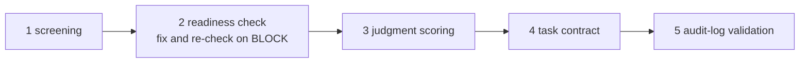

# ai-delegation-readiness


[](LICENSE)

> 🇯🇵 日本語版は [README.ja.md](README.ja.md)

## What this is (in one minute)

A diagnostic tool and extensible framework for deciding **whether a business
judgment is ready to be delegated to an AI agent** — by scoring, not by gut
feeling.

- **AI agent** = an AI program that carries out judgments and work on
  instruction
- **Delegation** = handing a judgment a human used to make over to an AI.
  Responsibility stays with the human side, which is why the preconditions
  deserve a check before you delegate

The tool breaks that check into a **main line of 5 steps plus an optional
extension**. Each step answers one question:

| Step | Question | Command |
|---|---|---|
| 1 | Which task groups should we start with? | `aidr screen-transition` |
| 2 | Can this process withstand delegation? | `aidr check-readiness` |
| 3 | Which individual judgments do we delegate? | `aidr score-delegation` |
| 4 | How is each task handed over, and who scores it? | `aidr check-task-contract` |
| 5 | Can the record be verified afterwards? | `aidr validate-audit-log` |
| Ext. | How do we add company-specific rules? (optional) | `aidr check-overlay` + `--overlay` |

The bundled samples are connected by the story of a fictional mid-size
manufacturer, **Midori Seiki Co., Ltd.** The story includes a timeline — the
first diagnosis comes back **BLOCK**, the team fixes the gaps, and only a
**PASS** re-diagnosis unlocks the next step
(canonical profile: [`examples/README.md`](examples/README.md), in Japanese).



The framework is distilled from the **published analysis** of Ajinomoto
Group's accounting AI agent (in production since February 2026). Every
definition is machine-readable (YAML / JSON Schema), so AI agents and CI can
consume it directly.

## Who this is for

| If you are... | Start with... |
|---|---|
| **New here and want the big picture** | [docs/00 overview](docs/00_overview.md) (Japanese) — the 5 steps told through the Midori Seiki story |
| A **business decision maker** (head of accounting, CFO, compliance lead) considering AI for a process | [docs/02](docs/02_four_layer_framework.md) — score your process with `aidr check-readiness` |
| Deciding **where to start** / briefing management | [docs/01](docs/01_transition_screening.md) — the 4-type transition map and the headcount-last decision order |
| An **engineer** designing an AI agent for high-risk approvals | [schemas/audit-log.schema.json](schemas/audit-log.schema.json) + [docs/06](docs/06_audit_log_schema.md) — wire the schema into your logger |
| An **operator** auditing an existing AI platform's logging | [docs/07](docs/07_audit_log_gap_check.md) — apply the 5-step method to your own SQL schema |
| A **consultant / proposal author** | All of `docs/` + the overlay model — clone, overlay in private, present client-specific scoring |

## Quick start (2 minutes)

No setup — pull the published image and run it. The bundled samples (the
Midori Seiki story) work out of the box:

```bash
docker run --rm ghcr.io/suwa-sh/ai-delegation-readiness:v0.10.1 --version

# The 5 main-line steps, in story order
docker run --rm ghcr.io/suwa-sh/ai-delegation-readiness:v0.10.1 \
  screen-transition examples/task-groups/sample-task-groups.csv
docker run --rm ghcr.io/suwa-sh/ai-delegation-readiness:v0.10.1 \
  check-readiness examples/business/sample-expense-approval.csv          # first diagnosis -> BLOCK
docker run --rm ghcr.io/suwa-sh/ai-delegation-readiness:v0.10.1 \
  check-readiness examples/business/sample-expense-approval-after.csv    # after fixes -> PASS
docker run --rm ghcr.io/suwa-sh/ai-delegation-readiness:v0.10.1 \
  score-delegation examples/judgments/sample-judgments.csv
docker run --rm ghcr.io/suwa-sh/ai-delegation-readiness:v0.10.1 \
  check-task-contract examples/task-contracts/sample-green.csv
docker run --rm ghcr.io/suwa-sh/ai-delegation-readiness:v0.10.1 \
  validate-audit-log examples/audit-log-sample.json --level extended

# Extension (optional) and definition inspection
docker run --rm ghcr.io/suwa-sh/ai-delegation-readiness:v0.10.1 \
  check-overlay examples/overlays/sample-company/extra-rules.yaml
docker run --rm ghcr.io/suwa-sh/ai-delegation-readiness:v0.10.1 list-definitions
```

`--version` prints the app version and the bundled overlay engine version, e.g.
`aidr 0.10.1 (overlay-scoring-skeleton 0.1.0)`.

Every command returns a deterministic exit code so you can gate CI on it:

| Command | 0 | 1 | 2 | 3 |
|---|---|---|---|---|
| check-readiness / score-delegation / check-task-contract | ok (green) | partial (yellow) | block (red) | input error / overlay violation |
| screen-transition | success (classification, not a gate — 0 whatever the types) | — | — | missing/invalid answers, overlay violation |
| validate-audit-log | valid | invalid (schema violations) | — | input error (malformed JSON, missing file) |
| check-overlay | merges cleanly | violations (rejected) | — | — |

Reports are also available as **CSV** via `--format csv` (the 5 commands in the
table above; the leading `record_type` column distinguishes row kinds so
spreadsheets can aggregate them directly).

## Usage workflow

The commands run against *your* data. Mount the directory that holds your files
into the container. A shell function keeps the rest of this guide readable:

```bash
aidr() { docker run --rm -v "$PWD:/data" -w /data \
  ghcr.io/suwa-sh/ai-delegation-readiness:v0.10.1 "$@"; }
```

Generate your input files with `aidr init` (step 1 below), then run the
commands in this order. Question texts carry both English (`text`) and
Japanese (`text_ja`) in `definitions/*.yaml`.

1. **Prepare** — generate a question-annotated CSV template via
   `aidr init --target transition|four-layer|matrix|task-contract --format csv > my-file.csv`
   (add `--overlay` to include your company's extra questions), open it in
   Google Sheets / Excel (UTF-8 BOM included), and fill the 回答 (answer) cells
   with yes/no (はい/いいえ also accepted). Duplicate columns to add task
   groups / judgments in the wide format. The bundled [`examples/`](examples/)
   are these templates filled with Midori Seiki's answers; YAML input still
   works (one YAML example is kept as a twin).
2. **Map where to start** — `aidr screen-transition my-task-groups.csv` sorts
   task groups into the four AI-transition types in delegation-design priority
   order: *reorganization* first (role redesign needed), *high automation*
   feeds the next steps. Groups touching rights / finances / health / regulated
   matters carry a `[HITL]` marker whatever their type. Every question must be
   answered — missing answers are an input error. See
   [docs/01](docs/01_transition_screening.md).
3. **Diagnose the process and the organization** —
   `aidr check-readiness my-business.csv` scores the four layers
   (standardization → structuring → scope → control) plus the efficacy and
   organization axes. **BLOCK is a gate, not a score**: fix the layer named by
   `First gate to fix`, then re-check. The bundled story runs first-BLOCK
   ([`sample-expense-approval.csv`](examples/business/sample-expense-approval.csv))
   then PASS
   ([`sample-expense-approval-after.csv`](examples/business/sample-expense-approval-after.csv)).
   See [docs/02](docs/02_four_layer_framework.md) / [docs/03](docs/03_organization_axis.md).
4. **Score the judgments** — `aidr score-delegation my-judgments.csv` places
   each judgment into GREEN (delegate), YELLOW (LLM-assist, a human decides), or
   RED (human-only). See [docs/04](docs/04_delegation_matrix.md).
5. **Check the task contract** — `aidr check-task-contract my-contract.csv`
   checks intent / boundary / evidence / scorer. An AI judge with no iRULER
   double-evaluation blocks (RED). See
   [docs/05](docs/05_task_contract_execution_rubric.md).
6. **Validate the audit log** —
   `aidr validate-audit-log my-log.json --level extended` checks who / when /
   what / why / result at J-SOX grade. See [docs/06](docs/06_audit_log_schema.md).
7. **Extend (optional)** — add your own questions / thresholds via an overlay,
   validated by `aidr check-overlay <path>` and applied with `--overlay`.
   Bundled domain overlays: high-stakes professional work (IP / legal / pharma,
   [docs/08](docs/08_high_stakes_domain_overlay.md)), insourcing judgment
   responsibility ([docs/09](docs/09_insourcing_judgment_overlay.md)), and agent
   authorization design ([docs/10](docs/10_agent_authorization_overlay.md)):

   ```bash
   aidr check-readiness examples/business/sample-ip-agent-readiness.csv \
     --overlay examples/overlays/high-stakes-domain/four-layer.yaml
   # => L1-L4 all PASS, yet one missing prerequisite blocks at L5

   aidr score-delegation examples/judgments/sample-ip-judgments.csv \
     --overlay examples/overlays/high-stakes-domain/delegation-matrix.yaml
   # => boundary cases (2/3 on an axis) drop from green to yellow / red

   aidr check-readiness examples/business/sample-insourcing-readiness.csv \
     --overlay examples/overlays/insourcing-judgment/four-layer.yaml
   # => L1-L4 and organization all PASS, yet a missing in-house owner is REVISE/BLOCK

   aidr check-readiness examples/business/sample-agent-authz-readiness.csv \
     --overlay examples/overlays/agent-authorization/four-layer.yaml
   # => capability and consent score as two independent axes; a full capability
   #    axis does not offset a blocked consent axis
   ```

   The agent-authorization overlay's two axes are **not** a defense against
   prompt injection: when an attacker steers the LLM's judgment, both the
   authority and the consent stay legitimate and only the designation falls
   under the attacker's control.

See [`README.ja.md`](README.ja.md#使い方想定ワークフロー) for sample output of every
command in the workflow.

## What's in this repo

```
ai-delegation-readiness/
├── definitions/                 # Machine-readable canonical framework (YAML; questions carry text + text_ja)
│   ├── transition-screening.yaml #  3 axes + 4 transition types map + extension_points
│   ├── four-layer.yaml          #   4 layers + efficacy & organization axes + extension_points
│   ├── delegation-matrix.yaml   #   2 axes + region map + extension_points
│   └── task-contract.yaml       #   4 execution-rubric elements + gate policy + extension_points
├── schemas/
│   └── audit-log.schema.json    # JSON Schema with $defs: minimum (A) / extended (B)
├── src/adr/                     # Python diagnostic tool (shipped as a container image)
├── bin/aidr                     # CLI entry point (single command, 8 subcommands)
├── examples/                    # Samples connected by the Midori Seiki (fictional) story
│   ├── README.md                #   Canonical story profile + sample index + applied cases (Japanese)
│   ├── task-groups/             #   Step 1: screen-transition input
│   ├── business/                #   Step 2: check-readiness inputs (first BLOCK / after PASS + applied cases)
│   ├── judgments/               #   Step 3: score-delegation inputs (+ applied cases)
│   ├── task-contracts/          #   Step 4: check-task-contract inputs (green / red)
│   ├── audit-log-sample.json    #   Step 5: sample audit log (escalated case)
│   ├── overlays/                #   Extension: company rules + domain overlays (applied cases)
│   └── skills/                  #   AI entry point: three Claude Code skill samples
└── docs/                        # Explanations, Japanese (reading order: the learning path in README.ja.md)
    ├── 00_overview.md           #   The big picture (read first)
    ├── 01-06                    #   The 5 main-line steps in detail
    └── 07-10                    #   Applied: log-platform check / high-stakes domains / insourcing / agent authorization
```

## How to extend

The canonical foundation (`definitions/*.yaml`, `schemas/*.json`) is
**framework-consistent across companies**. Overlays may only:

- **`add`** new items to a list (existing items stay read-only)
- **`strengthen`** numeric thresholds (lowering is rejected)

Anything else (delete, replace, weaken) is a merge violation and is detected
mechanically by `aidr check-overlay`. This is what makes the framework safe to
extend without forking.

```yaml
# examples/overlays/sample-company/extra-rules.yaml (Midori Seiki's own rules)
version: 1
extends: four-layer-delegation-readiness

add:
  - id: "L4.MIDORI_Q6"
    text: Is the audit log stored in a tamper-evident store (WORM, hash chain, or signed)?
    weight: 1.0

strengthen:
  "L4": {pass: 1.0, revise: 0.8}       # was 0.6 — stricter only
```

The framework is reused in three ways:

- **AI agents**: load `definitions/*.yaml` and
  `schemas/audit-log.schema.json` into the system prompt or tool context.
  See [`examples/skills/`](examples/skills/) for three ready-to-adapt Claude
  Code skill wrappers.
- **CI pipelines**: run `docker run --rm -v "$PWD:/data" -w /data ghcr.io/suwa-sh/ai-delegation-readiness:v0.10.1 validate-audit-log <log>` on each emitted log; gate
  on exit code.
- **Internal overlays**: keep your company-specific overlay in a private repo and
  apply with `--overlay`. The framework stays a clean upstream you can pull from.

## Background

The framework is distilled from a **published analysis** of the Ajinomoto Group
accounting AI agent (in production since February 2026): the maintainer wrote an
analysis article from publicly reported coverage, then extracted the framework
from that analysis. The provenance chain is: public coverage → analysis article →
this framework.

On three published tasks (receipt mandatory items, invoice scheme compliance, tax
entertainment-expense judgment), the analysis reports a domain-specialized agent
reaching **93.3%** versus **53.3%** for a vanilla LLM. The gap was closed not by a
smarter model but by **structuring the business logic** around the LLM — which is
why the framework's lower layers (standardization, structuring) matter more than
the choice of model.

**Caveat**: the widely-cited "76% workload reduction" headline has no defined
denominator, baseline, or scope in the source articles. This repository does not
warrant efficacy figures; it preserves the **observability viewpoint**
(`docs/02` efficacy axis).

### Source

- **Analysis article** (Japanese, the immediate source from which the framework was distilled): [「味の素の経理AIエージェントに学ぶ 承認業務をAIに委任する前提条件」](https://suwa-sh.github.io/zenn-contents/articles/ajinomoto-accounting-agent_20260621/)

### Coverage cited in the analysis article

- [Ajinomoto Financial Solutions × First Accounting press release (2026-04-24)](https://www.fastaccounting.jp/news/20260424/15929/)
- [ITmedia "76% workload reduction" coverage (2026-06-19, Japanese)](https://www.itmedia.co.jp/business/articles/2606/19/news033.html)

## License

[MIT](LICENSE)

## Security

See [SECURITY.md](SECURITY.md) for reporting vulnerabilities.
