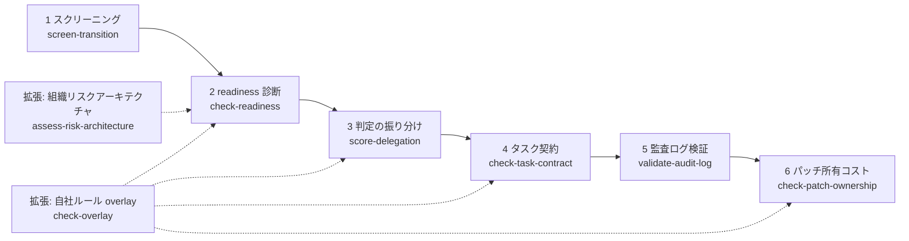

# 00. 全体像 — 6 つの問いで「AI への委任」を安全に進める

## TL;DR

このツールは「この業務を AI エージェントに任せてよいか」を、勘ではなく採点で決めるための
CLI と定義ファイルの集まりです。使い方は **本線 6 ステップ + 任意の拡張** に整理できます。
それぞれのステップが 1 つの問いに答えます:
①どこから手を付けるか ②業務が委任に耐えるか ③どの判定を任せるか
④タスクをどう渡すか ⑤記録は残っているか ⑥生成パッチを将来も所有できるか。
本書は、架空の会社の物語で 6 ステップを通しで体験する入口です。

## 前提

- **AI エージェント** = 指示を受けて、判断や作業を自動で進める AI プログラム
- **委任(delegation)** = 人間がやっていた判断を AI エージェントに任せること。
  任せた後も**責任は人間の側に残る**ので、任せてよい条件を先に点検する必要があります
- **CLI** = ターミナルで打つコマンド。本ツールのコマンド名は `aidr` です

これ以外の用語は、登場する場所で都度説明します。

## When to use this

- このリポジトリに初めて来て、何がどの順で使えるのかを知りたい
- 「AI に業務を任せたいが、何から考えればよいか分からない」状態を、
  具体的な 6 つの問いに分解したい
- 各詳細 doc(01〜11)を読む前に、全体の地図を持ちたい

## 物語で見る 6 ステップ — ミドリ精機株式会社の場合

主要サンプルは、架空の中堅製造業 **ミドリ精機株式会社**(従業員約 800 名・J-SOX 対象)の
物語でつながっています(プロファイルの正本は [`examples/README.md`](../examples/README.md))。
経理部が経営会議で「経理業務に AI を活用せよ」と指示を受けたところから始まります。



| 要素名 | 説明 |
|---|---|
| 1 スクリーニング | タスク群を 4 類型に振り分け、どこから手を付けるかを決める |
| 2 readiness 診断 | 選んだ業務が委任に耐えるかを層で点検する。**BLOCK ならここで止まる** |
| 3 判定の振り分け | 業務の中の判定単位を、委任 OK / LLM 補助 / 人間 に振り分ける |
| 4 タスク契約 | 委任する 1 タスクの与え方・採点者を点検する |
| 5 監査ログ検証 | 運用開始後、AI が書いた記録がスキーマを満たすか検証する |
| 6 パッチ所有コスト | AI が生成した差分を、人間が将来も保守・説明できる条件で受け入れる |
| 拡張 overlay | 自社固有の質問・厳しい閾値を、正本を書き換えずに追加する |
| 拡張 組織リスクアーキテクチャ | 委任を受けて運用する組織側に、失敗を検知・抑制・エスカレーションする体制があるかを採点する |

### ステップ 1: どこから手を付けるか(スクリーニング)

経理部は最初に「どのタスク群から着手するか」を決めます。3 つの軸
(AI に晒される度合い / 人間が残る必要 / 需要の弾力性)の質問に答えると、
タスク群が **AI 移行 4 類型**(成長 / 高自動化 / 再編 / 変化小)に振り分けられます。

```bash
bin/aidr screen-transition examples/task-groups/sample-task-groups.csv
```

入力: [`examples/task-groups/sample-task-groups.csv`](../examples/task-groups/sample-task-groups.csv)

ミドリ精機では、決算開示資料ドラフトが「再編」(最優先で役割再設計が要る)、
経費精算チェックが「高自動化」(次のステップに進む候補)になりました。
経理部は経費精算チェックを最初の題材に選びます。→ 詳細は [docs/01](01_transition_screening.md)

### ステップ 2: 業務が委任に耐えるか(readiness 診断・2 幕)

経費精算承認業務を 4 層(標準化 → 構造化 → 委任範囲 → 統制)+ 並列軸で診断します。

**第 1 幕 — 初回診断は BLOCK でした**:

```bash
bin/aidr check-readiness examples/business/sample-expense-approval.csv
```

入力: [`examples/business/sample-expense-approval.csv`](../examples/business/sample-expense-approval.csv)

```text
Target: 経費精算承認(ミドリ精機・経理部、FY2026 初回診断)

[..] L1 業務標準化層: REVISE (75%)
[NG] L2 判断構造化層: BLOCK (33%)
[..] L3 委任範囲層: REVISE (75%)
[NG] L4 統制・追跡層: BLOCK (0%)
...
Conclusion: BLOCK
  First gate to fix: layer L1
```

**BLOCK は「参考スコア」ではなくゲートです**。このまま先へ進んではいけません。
ミドリ精機の経理部は半年かけて、SOP の詳細化・判定ロジックの構造化・監査ログと
補正フローの設計を行いました。

**第 2 幕 — 改善後の再診断で PASS**:

```bash
bin/aidr check-readiness examples/business/sample-expense-approval-after.csv
# => Conclusion: PASS
```

入力: [`examples/business/sample-expense-approval-after.csv`](../examples/business/sample-expense-approval-after.csv)

PASS になって初めて、次のステップに進めます。→ 詳細は [docs/02](02_four_layer_framework.md)(4 層)と [docs/03](03_organization_axis.md)(組織の受け皿)

### ステップ 3: どの判定を任せるか(判定の振り分け)

業務まるごとではなく、中の**判定単位**で任せる範囲を決めます。2 軸
(検証可能性 × 正解定義可能性)の質問で、各判定が 🟢 委任 OK / 🟡 LLM 補助 / 🔴 人間に残す
に振り分けられます。

```bash
bin/aidr score-delegation examples/judgments/sample-judgments.csv
```

入力: [`examples/judgments/sample-judgments.csv`](../examples/judgments/sample-judgments.csv)

ミドリ精機では、領収書チェックとインボイスチェックが 🟢、採用面接の合否(境界比較の例)は
🔴 になりました。→ 詳細は [docs/04](04_delegation_matrix.md)

### ステップ 4: タスクをどう渡すか(タスク契約)

🟢 と決めた領収書チェックを AI に渡す前に、実行契約を 4 要素
(意図 = 合格条件 / 境界 = 禁止とエスカレーション / 証跡 = 記録範囲 / 採点者)で点検します。

```bash
bin/aidr check-task-contract examples/task-contracts/sample-green.csv
# => Region: GREEN — 契約充足
```

入力: [`examples/task-contracts/sample-green.csv`](../examples/task-contracts/sample-green.csv)

AI が AI を単一の基準で採点する構成は、ここで 🔴 として止まります
([`sample-red-ai-judge.csv`](../examples/task-contracts/sample-red-ai-judge.csv) が失敗例)。→ 詳細は [docs/05](05_task_contract_execution_rubric.md)

### ステップ 5: 記録は残っているか(監査ログ検証)

運用が始まったら、AI が書き出すログが「誰が・いつ・何を・なぜ・どうしたか」を
満たすかを機械検証します。

```bash
bin/aidr validate-audit-log examples/audit-log-sample.json --level extended
# => [OK] schema=audit_log_extended: valid
```

入力: [`examples/audit-log-sample.json`](../examples/audit-log-sample.json) — 交際費のグレーケースを AI が**自動承認せず人間にエスカレーションした**記録です。
→ 詳細は [docs/06](06_audit_log_schema.md)(スキーマ)と [docs/07](07_audit_log_gap_check.md)(既存基盤の点検)

### ステップ 6: 生成パッチを将来も所有できるか(パッチ所有コスト)

AI がコード差分を生成してテストが緑でも、それだけでは受け入れません。最小の探針か、
将来の所有者と 3 年コストが明確か、テストが実装の言い換えだけになっていないか、
認可・削除・課金・規制・公開契約の変更ではないかを点検します。

```bash
bin/aidr check-patch-ownership examples/patches/sample-cheap-green.csv
# => Region: GREEN — 所有可能
```

高リスク変更は、すべての統制が揃っても自動受入せず YELLOW で人間へ回します。
テスト証拠なし・hollow green・高リスク統制の不足は RED です。
→ 詳細は [docs/11](11_patch_ownership_gate.md)

### 拡張(任意): 自社ルールを足す

ミドリ精機は「規程集の法務レビュー」「改ざん検知可能なログ保存」という自社基準を
overlay で追加しました。正本ファイルは書き換えません。

```bash
bin/aidr check-overlay examples/overlays/sample-company/extra-rules.yaml
bin/aidr check-readiness my-business.csv --overlay examples/overlays/sample-company/extra-rules.yaml
```

### 拡張(任意): パッチ受入の後を運用ループにする

ステップ 6 の GREEN / YELLOW / RED は自動 merge 命令ではなく、人間が採否を決める最低条件でした。
ミドリ精機はその採否を決定記録として残し、月次で破棄率・決定済み率を振り返っています。
本線 6 ステップは変わらず、このループはステップ 6 の先に位置する任意運用です。

```bash
bin/aidr summarize-patch-decisions examples/patch-decisions/sample-midori-2026-07.jsonl
```

→ 詳細は [docs/12](12_patch_decision_loop.md)

### 拡張(任意): 委任を受ける組織側の体制を採点する

本線 6 ステップは「何をどう委任するか」の診断でした。運用が始まると、
事故を「検知できる・止められる・責任者に届く」体制が組織の側に要ります。
ミドリ精機が経理エージェントを多段自律実行に広げた設定で、8 つの代表失敗シナリオと
3 つの surface owner の在任を採点するのがこの拡張です。

```bash
bin/aidr assess-risk-architecture examples/business/sample-risk-architecture.csv
```

→ 詳細は [docs/13](13_risk_architecture.md)

## 学習パス(どの順で読むか)

| 順 | doc | 何が分かるか |
|---|---|---|
| 1 | 本書(00) | 全体像と 6 ステップの物語 |
| 2 | [01 スクリーニング](01_transition_screening.md) | どこから手を付けるかの決め方 |
| 3 | [02 4 層フレーム](02_four_layer_framework.md) | 業務が委任に耐えるかの診断 |
| 4 | [03 組織 readiness 軸](03_organization_axis.md) | 組織側の受け皿の診断 |
| 5 | [04 委任マトリクス](04_delegation_matrix.md) | 判定単位の振り分け |
| 6 | [05 タスク契約](05_task_contract_execution_rubric.md) | 委任タスクの与え方・採点者 |
| 7 | [06 監査ログスキーマ](06_audit_log_schema.md) | 記録の設計 |
| 8 | [07 ログ基盤の点検](07_audit_log_gap_check.md) | 既存基盤への当てはめ |
| 9 | [11 パッチ所有コスト](11_patch_ownership_gate.md) | AI 生成差分の受入ゲート |
| 応用 | [08 高責任ドメイン overlay](08_high_stakes_domain_overlay.md) / [09 内製化 overlay](09_insourcing_judgment_overlay.md) / [10 権限設計 overlay](10_agent_authorization_overlay.md) | 知財/法務/薬事、内製化の判断責任、能力軸と同意軸 |
| 拡張 | [12 パッチ受入の運用ループ](12_patch_decision_loop.md) | ステップ 6 の先: 決定記録と月次の破棄率振り返り |
| 拡張 | [13 組織リスクアーキテクチャ](13_risk_architecture.md) | 委任を受ける組織側の検知・抑制・エスカレーション体制の採点 |

## References

- サンプルの正本: [`examples/README.md`](../examples/README.md)
- 定義の正本: [`definitions/`](../definitions/)
- 入口: [`README.ja.md`](../README.ja.md)
