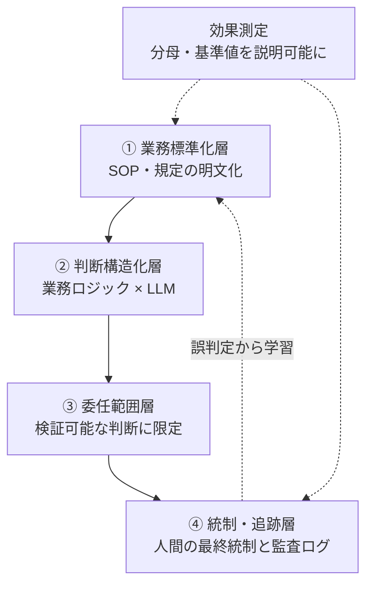

# 01. 4 層フレームで委任の可否を診断する

## TL;DR

高リスクな定型業務を AI に委任するための前提条件は、**4 層** + **効果測定**
(並列の独立観点)で表せる。**下の層が崩れていると、上の層をいくら作っても委任は
成立しない**。本書は各層の問いと合否基準を示し、`aidr check-readiness` で
業務に当てて採点する手順を案内する。

味の素グループ(AFS)の経理 AI エージェント事例から骨格を抽出した。事実と一般化は
ラベル分けで示す:**【観測事実】**(記事の公開情報から確認できる)/ **【設計提案】**
(本リポでの一般化)。④統制層は記事自身が「公開情報が薄い」と明言しているため、
設計提案ラベルが大半を占める。

## When to use this

- 対象業務がある(経費承認 / ベンダー登録 / 与信判定 等)
- ベンダー比較を始める前に「自社業務が委任に耐えるか」を客観的に診断したい
- 「AI 入れたい」社内提案を Go/No-Go で評価する材料が必要

## Quick check

3 分で動かせる。

```bash
bin/aidr check-readiness examples/business/sample-expense-approval.yaml
```

サンプルの結果(L4 統制層が未着手の中規模企業を想定):

```
[..] L1 業務標準化層: REVISE (75%)
[NG] L2 判断構造化層: BLOCK (33%)
[..] L3 委任範囲層:   REVISE (75%)
[NG] L4 統制・追跡層: BLOCK (0%)
[..] efficacy 効果測定: REVISE (75%)

Conclusion: BLOCK
  First gate to fix: layer L1
```

自社業務を採点するには `examples/business/sample-expense-approval.yaml` を
コピーして、各問いに Yes/No を埋める。

## The 4 layers



各層の問いと合否基準は `definitions/four-layer.yaml` が正本。以下は要約。

### ① 業務標準化層

判断の前提となる規定・手続きが明文化されていることが土台。標準化は AI が
参照するルールセットを供給すると同時に、例外ケースを減らして精度を安定させる。

**主な問い**:

- 判断基準は文書化され、暗黙知に依存していないか
- 例外ケースは例外手続きとして明文化されているか
- 規定は版管理されている(改定履歴を辿れる)か
- SOP は第三者が読んで再現できる粒度か

**合否**: 全問 Yes = pass、過半数 Yes = revise(SOP 整備が必要)、それ以下 = block。

**【観測事実】** 味の素グループは経理 BPO・シェアードサービスとして業務標準化を
積み上げ、ITmedia は「30 年以上続く業務標準化」と表現(「30 年」の具体的内訳は
一次情報では確認できていない)。

### ② 判断構造化層

明文化された規定を、AI が判定に使える形(どの入力を・どの条件で・どう判定するか)に
構造化する層。**この層が LLM 単体との差を生む**。

**主な問い**:

- 規定の各項目を「どの入力を / どの条件で / どう判定するか」の三つ組に落とせるか
- 決定論的処理 / LLM の推論 / 人間エスカレーション の線引きがあるか
- 判定ロジックが変わったときに回帰テストで精度劣化を検出できるか

**【観測事実】** 公式検証(領収書必須項目 / インボイス制度準拠 / 税務上の交際費判定)で
ドメイン特化エージェント = 93.3%、汎用 LLM 単体 = 53.3%。差を生んだのはモデルの
賢さではなく業務ロジック × LLM の組み合わせ。

### ③ 委任範囲層

**検証可能で正解を定義できる判断のみ AI に委ねる**線引き。文脈の重い判断は推論で
補助し、確信が持てないケースと例外は人間に残す。線引きそのものが設計の中心で
競争力の源泉。

**主な問い**:

- 第三者が同一入力で同じ判定を採点できるか
- 規定の条番号(または SOP のステップ番号)を引けるか
- 倫理判断・新規ポリシー策定など正解を定義しにくい領域を除外できているか
- 後から監査ログで判定を再現できるか

判定単位での 2 軸採点は `docs/03_delegation_matrix.md` を参照。

### ④ 統制・追跡層

**ここが本事例の公開情報で最も薄く、論点が集中する層**。承認業務を AI に委ねると、
内部統制上の論点が立ち上がる。

**主な問い**:

- 「判定」と「実行」が AI に一体化していないか(職務分掌)
- 差し戻し理由をログから提示できるか(参照規定 + チェック項目まで再現できるか)
- 監査ログが Who/When/What/Why/Result を構造的に記録しているか
- 規定バージョンをログに固定し、過去判定を遡及検証できるか
- 誤承認の補正フローが設計されてログに残るか

監査ログ最小スキーマは `docs/02_audit_log_schema.md` を、自社運用基盤への
当てはめ例は `docs/04_agent_loop_audit_gap.md` を参照。

**【観測事実】** 公開情報には統制層の具体(誤承認補正フローや監査ログ設計)が
ほとんど開示されておらず、再現を目指す側は **ここを自前で設計する必要がある**。

## The efficacy axis(効果測定)

4 層を満たしていても、**導入効果の数値が「何を分母にした削減率か」を説明できない**と
意思決定に使えない。

**主な問い**:

- 削減率の分母・基準値・期間を説明できるか
- 期待値(ベンダー試算)と実績(自社実測)を区別しているか
- 全業務対象か一部対象かを明示しているか
- AI 起因の誤承認 / 差し戻し件数を効率と別に集計しているか

**【観測事実】** 月 1 万件 × 5 分 → 年約 1 万時間の削減見込み。一方 ITmedia の見出し
「工数 76% 削減」は **分母が記事に明示されていない**。本リポは効果測定の数値を
保証せず、観点だけを保持する。

## Self-check sheet(5 項目)

| 観点 | 問い |
|---|---|
| ① 標準化 | 判断基準は明文化され、暗黙知に依存していないか |
| ② 構造化 | 規定を AI が判定に使える形に落とせるか |
| ③ 委任範囲 | 正解を定義でき検証できる判断に絞れているか |
| ④ 統制 | 人間の最終承認・監査ログ・例外エスカレーションを設計したか |
| 効果測定 | 削減率の分母・基準値を説明できるか |

下層が崩れていれば、導入すべきは AI ではなく業務標準化である。**AI 導入プロジェクトの
大半は、実は AI 以前の As-Is 整備プロジェクト**。

## Caveats

- 記事はベンダーとの共同発表に基づく成功事例であり、「76% 削減」の基準値や
  誤承認時の対応が独立に検証できない
- 会計領域の AI 導入失敗・誤承認による監査指摘の先例は公開情報ではほぼ検出できない。
  情報ギャップであり「リスクが無い」証拠ではない
- LLM 固有のリスク(自己検証の弱さ / グレーゾーン判定のブレ / 申請文への悪意ある指示)が
  残る。委任範囲を検証可能な判断に絞り、人間の最終統制を残すことが一次防御

## References

- 正本: [`definitions/four-layer.yaml`](../definitions/four-layer.yaml)(問い・閾値・拡張ポイントの正本)
- 関連 doc: [`02_audit_log_schema.md`](02_audit_log_schema.md) / [`03_delegation_matrix.md`](03_delegation_matrix.md) / [`04_agent_loop_audit_gap.md`](04_agent_loop_audit_gap.md)
- CLI: `bin/aidr check-readiness --help`
- 出典:
  - [ファーストアカウンティング公式 (2026-04-24)](https://www.fastaccounting.jp/news/20260424/15929/)
  - [ITmedia「工数 76% 削減」(2026-06-19)](https://www.itmedia.co.jp/business/articles/2606/19/news033.html)
