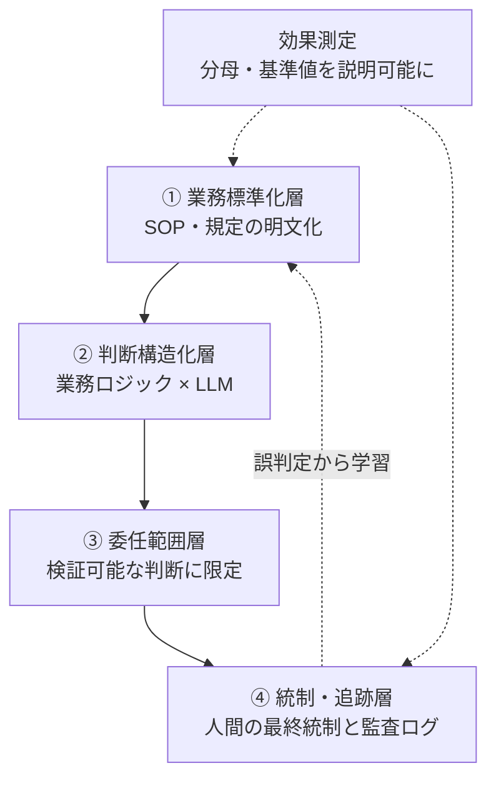

# 01. 4 層フレーム + 効果測定 チェックリスト

高リスクな定型業務を AI エージェントに委任するための前提条件は、**4 層の階層** +
**効果測定**(4 層と並列の独立観点)として整理できる。**下の層が崩れていると、上の
層をいくら作り込んでも委任は成立しない**。

各層・各項目には **【観測事実】**(味の素事例の公開情報から確認できた内容)と
**【設計提案】**(本リポでの一般化・補完)をラベル分けして併記する。④統制・追跡層は
記事自身が「公開情報が薄い」と明言しているため、設計提案ラベルが大半を占める。

## ① 業務標準化層

判断の前提となる規定・手続きが明文化されていることが土台。標準化は AI が参照する
ルールセットを供給すると同時に、例外ケースを減らして精度を安定させる。

### 問い

- 判断基準が **文書化** されており、ベテランの暗黙知に依存していないか
- 例外ケースが **例外手続きとして明文化** されているか(暗黙の例外ではないか)
- 規定が改定されたとき、**改定履歴**(版番号・改定日・改定理由)を辿れるか
- 業務オペレーションの SOP が **第三者が読んで再現できる粒度**で書かれているか

### 合否基準

| 判定 | 状態 |
|---|---|
| 継続 | 上記の問いに過半数 yes。AI 委任の検討に進める |
| 再標準化 | 暗黙知依存・改定履歴欠落のいずれかあり。AI 検討の前に SOP 整備が必要 |
| 委任不可 | そもそも文書化された判断基準が存在しない |

### 味の素事例での対応(確認できた範囲)

- 【観測事実】味の素グループは経理 BPO・シェアードサービスとして業務標準化を積み上げ、
  ITmedia は「30 年以上続く業務標準化」と表現(ただし「30 年」の具体的内訳は一次情報では
  確認できていない)
- 【観測事実】味の素フィナンシャル・ソリューションズ(AFS)は味の素グループの国内財務
  経理を集約するシェアードサービス会社

## ② 判断構造化層

明文化された規定を、AI が判定に使える形(どの項目を・どの条件で・どう判定するか)に
構造化する層。**この層が LLM 単体との差を生む**。

### 問い

- 規定の各項目を **「どの入力を / どの条件で / どう判定するか」** の組に落とせるか
- 機械的に決定論的に処理できる部分と、LLM の推論で文脈評価する部分の **線引き**が
  あるか
- 確信が持てない場合の **人間エスカレーション** が判定フローに組み込まれているか
- 判定ロジックが変わったときに **回帰テスト** で精度劣化を検出できるか

### 合否基準

| 判定 | 状態 |
|---|---|
| 継続 | 規定 → 判定条件 のマッピングが用意でき、決定論 / LLM / 人間 の 3 層の線引きがある |
| 再構造化 | LLM に丸投げしていて精度測定が無い。決定論的な部分を切り出し直す必要あり |
| 委任不可 | 規定を AI が解釈可能な形に落とせない(自然言語のままでバラバラ) |

### 味の素事例での対応(確認できた範囲)

- 【観測事実】公式検証(領収書必須項目・インボイス制度準拠・税務上の交際費判定の 3 項目)で、
  経理 AI エージェント = **93.3%**、汎用 LLM 単体 = **53.3%**(差 40 ポイント)
- 【観測事実】差を生んだのはモデルの賢さではなく、経理・財務の業務ロジック(規定と
  手続き)を LLM に組み合わせた点。共同開発は経理特化 AI ベンダーのファースト
  アカウンティング
- 【設計提案】高確度で機械的に処理できる部分は決定論的に、文脈依存の判断は LLM の推論で、
  確信が持てないものは人間に、という 3 層の使い分けを推奨

## ③ 委任範囲層

**検証可能で正解を定義できる判断のみを AI に委ねる**線引き。文脈の重い判断は推論で
補助し、確信が持てないケースと例外は人間に残す。線引きそのものが設計の中心であり
競争力の源泉になる。

### 問い

- 委任対象の判断は **第三者が同一入力で同じ判定を採点できる**か
- 判定の根拠となる **規定の条番号(または手続書のステップ番号)を引ける**か
- 倫理的判断・新規ポリシー策定など **正解を定義しにくい領域**を除外できているか
- 委任範囲を **後から検証** できる(ログから再現できる)か

### 合否基準

| 判定 | 状態 |
|---|---|
| 継続 | 判定が検証可能・正解定義可能・規定に対応している。`docs/03` の 2 軸採点で高 × 高 |
| 縮小 | 一部の判定が主観的・ケース判断。委任範囲を絞って再線引きする |
| 委任不可 | 正解が定義できない領域。LLM の推論補助は可だが最終判定は人間に残す |

### 味の素事例での対応(確認できた範囲)

- 【観測事実】AI に任せたのは経費精算の経理承認という、規定が明文化され正誤を機械的に
  検証しやすい領域
- 【観測事実】公式が精度を公表した 3 項目はいずれも「規定に照らして合っているか」を
  後から検証できる判断:領収書必須項目の確認 / インボイス制度準拠チェック / 税務上の
  交際費判定
- 【観測事実】倫理的判断や新規ポリシーの策定のような、正解を定義しにくい領域には
  踏み込んでいない

## ④ 統制・追跡層

**ここが本事例の公開情報で最も薄く、論点が集中する層**。承認業務を AI に委ねると、
内部統制上の論点が立ち上がる。

> **冒頭注**: 以下の問いと合否基準は、味の素事例の公開情報には踏み込まれていない
> 領域での **設計提案** が大半を占める。観測できた事実は「監査ログの最小項目が
> 必要」という方向性に限られる。

### 問い

- **職務分掌**:「判定」と「実行」が AI に一体化していないか。本来分けるべき承認と
  実行の分掌が崩れていないか
- **説明責任**:差し戻し理由をログから提示できるか。判断の根拠(参照規定 + チェック項目)
  まで再現できるか
- **監査ログ**:Who/When/What/Why/Result の 5 項目を構造的に記録できているか
  (詳細は `docs/02_audit_log_schema.md`)
- **規定の経年劣化**:税制改正・新会計基準で規定が陳腐化したとき、**規定バージョン**を
  ログに固定し、過去判定を遡及検証できるか
- **誤承認の補正フロー**:誤判定を発見したときの取消・再判定・人間最終承認の手順が
  ログに残る形で設計されているか

### 合否基準

| 判定 | 状態 |
|---|---|
| 継続 | Who/When/What/Why/Result + 規定バージョン + 人間関与 が監査ログに残る |
| 補強 | 5 項目のうち 1〜2 項目が部分充足。欠けを埋めてから本番運用へ |
| 委任不可 | 監査ログ設計が存在しない。J-SOX 観点で説明責任を果たせない |

### 味の素事例での対応(確認できた範囲)

- 【観測事実】公開情報には統制層の具体(誤承認の補正フローや監査ログの設計)が
  ほとんど開示されておらず、再現を目指す側は **ここを自前で設計する必要がある**
- 【設計提案】監査ログ最小スキーマは `docs/02_audit_log_schema.md` を参照
- 【設計提案】自社運用基盤(agent-loop)の DB スキーマを④統制層で点検した実例は
  `docs/04_agent_loop_audit_gap.md`

## 効果測定(4 層と並列の独立観点)

4 層を満たしていても、**導入効果の数値が「何を分母にした削減率か」を説明できない**と
意思決定に使えない。

### 問い

- 削減率を語るときに **分母・基準値・期間** を説明できるか
- 「期待値」と「実績」を区別しているか(ベンダー試算 vs 自社実測)
- 全業務対象か一部対象かを明示しているか
- AI 起因の **誤承認 / 差し戻しの件数** を別に集計しているか(効率と品質を一緒に扱わない)

### 合否基準

| 判定 | 状態 |
|---|---|
| 継続 | 削減率の定義・基準値・期間を文書化できる。実績と期待値を区別する |
| 再計測 | 数値の前提が不明。再計測してから対外発表に使う |

### 味の素事例での対応(確認できた範囲)

- 【観測事実】月 1 万件・1 件約 5 分の承認判断を AI が代替、年間約 1 万時間の削減を見込む
- 【観測事実】ITmedia は見出しで「**工数 76% 削減**」と打ち出しているが、**76% が何を
  分母にした削減率か、本文では定義・算出基準が明示されていない**(全経費精算が対象か
  一部か、期待値か実績かも記事からは判別できない)
- 【設計提案】導入効果を語るときは「何の工数を、何を基準に」測ったかを確認する姿勢が
  必要。本リポでは数値を保証せず、効果測定の **観点だけを保持**する

## 自社で再現するためのチェックリスト

4 層 + 効果測定 の 5 項目で自社業務を点検する。zenn 記事 §「自社で再現するための
チェックリスト」に効果測定が独立観点として入っているため、4 層に押し込まずに保持する。

| 観点 | 問い | 味の素事例での対応(確認できた範囲) |
|---|---|---|
| ① 標準化 | 判断基準は明文化されているか。暗黙知に依存していないか | グループ経理を集約し標準化を継続 |
| ② 構造化 | 規定を AI が判定に使える形に落とせるか | 業務ロジック × LLM で 93.3%(LLM 単体 53.3%) |
| ③ 委任範囲 | 正解を定義でき検証できる判断に絞れているか | 領収書必須項目・インボイス準拠・交際費判定の 3 項目で検証 |
| ④ 統制 | 人間の最終承認・監査ログ・例外エスカレーションを設計したか | 公開情報では詳細不明(設計提案で補完) |
| 効果測定 | 削減率の分母・基準値を説明できるか | 月 1 万件 × 5 分 → 年約 1 万時間。「76%」の定義は記事に明示なし |

## 反証と未解決の問い

- **検証可能性の限界**:記事はベンダーとの共同発表に基づく成功事例であり、「76% 削減」の
  基準値や、誤承認時の対応が独立に検証できない
- **失敗事例の不在は「安全」を意味しない**:会計領域の AI 導入失敗・誤承認による監査
  指摘・J-SOX 違反の先例は、公開情報ではほぼ検出できなかった。情報ギャップであり
  「リスクが無い」証拠ではない
- **LLM 固有のリスク**:自己検証の弱さ・グレーゾーン判定のブレ・申請文への悪意ある
  指示の混入。委任範囲を検証可能な判断に絞り、人間の最終統制を残すことが一次防御

## 推奨

高リスクな定型業務を AI エージェントに委任しようとする組織への推奨は明快である。
**AI の性能比較から入らない**。まず自社の対象業務が次の 5 項目を満たすかを点検する。

1. 標準化されているか
2. 判断基準を AI が使える形に構造化できるか
3. 正解を定義でき検証できる範囲に絞れるか
4. 人間の最終統制と監査ログを設計できるか
5. 効果測定の分母・基準値を説明できるか

下層が崩れていれば、導入すべきは AI ではなく業務標準化である。**AI 導入プロジェクトの
大半は、実は AI 以前の As-Is 整備プロジェクト**。
