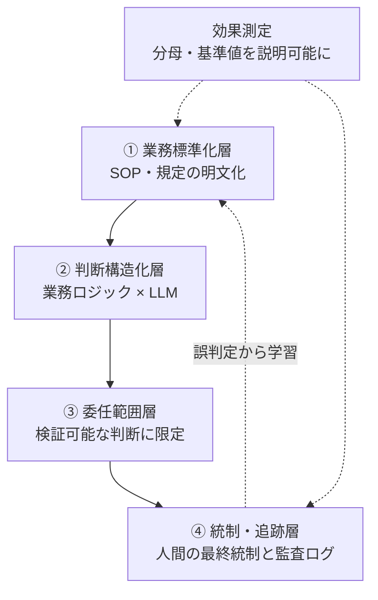

# 01. 4 層フレームで委任の可否を診断する

## TL;DR

高リスクな定型業務を AI に委任するための前提条件は、**4 層** + **効果測定**
(並列の独立観点)で表せます。**下の層が崩れていると、上の層をいくら作っても
委任は成立しません**。本書は各層の問いと合否基準を示し、`aidr check-readiness`
で業務に当てて採点する手順を案内します。

本フレームワークは **味の素自身ではなく、事例記事から骨格を抽出しています**。
事実と一般化はラベル分けで示します:**【観測事実】**(記事の公開情報から
確認できます)/ **【設計提案】**(本リポでの一般化です)。④統制層は事例記事
自身が「公開情報が薄い」と明言しているため、設計提案ラベルが大半を占めます。

## 前提(これだけ知っていれば読めます)

- 全体像([docs/00](00_overview.md))の本線 5 ステップのうち、本書は
  **ステップ 2(業務が委任に耐えるか)** を扱います
- **SOP** = 標準作業手順書。誰がやっても同じ結果になるよう手順を書いたもの
- **エスカレーション** = AI が判断に迷うケースを人間に引き渡すこと
- 物語上の位置: ミドリ精機(架空。[`examples/README.md`](../examples/README.md))の
  経理部が、スクリーニングで選んだ経費精算承認業務を診断する場面です

## When to use this

- 対象業務がある(経費承認 / ベンダー登録 / 与信判定 など)
- ベンダー比較を始める前に「自社業務が委任に耐えるか」を客観的に診断したい
- 「AI 入れたい」社内提案を Go/No-Go で評価する材料が必要

## Quick check

3 分で動かせます。ミドリ精機の経費精算承認業務の**初回診断**です。

```bash
bin/aidr check-readiness examples/business/sample-expense-approval.yaml
```

```text
Target: 経費精算承認(ミドリ精機・経理部、FY2026 初回診断)

[..] L1 業務標準化層: REVISE (75%)
    no: L1.Q4
    -> upper layers are gated by this verdict
[NG] L2 判断構造化層: BLOCK (33%)
    no: L2.Q2, L2.Q3
[..] L3 委任範囲層: REVISE (75%)
    no: L3.Q4
[NG] L4 統制・追跡層: BLOCK (0%)
    no: L4.Q1, L4.Q2, L4.Q3, L4.Q4, L4.Q5
[..] efficacy 効果測定: REVISE (75%)
    no: efficacy.E3
[NG] organization 組織 readiness層: BLOCK (0%)
    unknown: organization.C1, organization.C2, organization.C3, organization.C4, organization.C5, organization.C6

Conclusion: BLOCK
  First gate to fix: layer L1
```

規定はあるが、SOP の粒度・判定ロジックの構造化・統制層が足りない状態です。
組織 readiness 軸は未記入なので `unknown` = BLOCK になります
(組織軸の詳細は [`05_organization_axis.md`](05_organization_axis.md))。

**BLOCK はゲートです**。ミドリ精機の物語では、ここから半年の改善を経て
再診断([`examples/business/sample-expense-approval-after.yaml`](../examples/business/sample-expense-approval-after.yaml))で
PASS になり、次のステップ(判定単位の振り分け)へ進みます。

```bash
bin/aidr check-readiness examples/business/sample-expense-approval-after.yaml
# => Conclusion: PASS
```

自社業務を採点する場合は、`examples/business/sample-expense-approval.yaml` を
コピーして各問いに Yes/No を埋めてください。質問の日本語文は
[`definitions/four-layer.yaml`](../definitions/four-layer.yaml) の `text_ja` にあります。

## The 4 layers


```mermaid
flowchart TB
    L1["① 業務標準化層<br/>SOP・規定の明文化"]
    L2["② 判断構造化層<br/>業務ロジック × LLM"]
    L3["③ 委任範囲層<br/>検証可能な判断に限定"]
    L4["④ 統制・追跡層<br/>人間の最終統制と監査ログ"]
    M["効果測定<br/>分母・基準値を説明可能に"]
    L1 --> L2 --> L3 --> L4
    L4 -.->|誤判定から学習| L1
    M -.-> L1
    M -.-> L4
```

各層の問いと合否基準は `definitions/four-layer.yaml` が正本です。以下は要約です。

### ① 業務標準化層

判断の前提となる規定・手続きが明文化されていることが土台です。標準化は AI が
参照するルールセットを供給すると同時に、例外ケースを減らして精度を安定させます。

**主な問い**:

- 判断基準は文書化され、暗黙知に依存していないか
- 例外ケースは例外手続きとして明文化されているか
- 規定は版管理されている(改定履歴を辿れる)か
- SOP は第三者が読んで再現できる粒度か

**合否**: 全問 Yes で pass、過半数 Yes で revise(SOP 整備が必要)、それ以下は
block になります。

**【観測事実】** 味の素グループは経理 BPO・シェアードサービスとして業務標準化を
積み上げており、ITmedia は「30 年以上続く業務標準化」と表現しています(「30 年」の
具体的内訳は一次情報では確認できていません)。

### ② 判断構造化層

明文化された規定を、AI が判定に使える形(どの入力を・どの条件で・どう判定するか)に
構造化する層です。**この層が LLM 単体との差を生みます**。

**主な問い**:

- 規定の各項目を「どの入力を / どの条件で / どう判定するか」の三つ組に落とせるか
- 決定論的処理 / LLM の推論 / 人間エスカレーション の線引きがあるか
- 判定ロジックが変わったときに回帰テストで精度劣化を検出できるか

**【観測事実】** 公式検証(領収書必須項目 / インボイス制度準拠 / 税務上の交際費判定)で、
ドメイン特化エージェントが 93.3%、汎用 LLM 単体が 53.3% と報告されています。差を
生んだのはモデルの賢さではなく、業務ロジック × LLM の組み合わせです。

### ③ 委任範囲層

**検証可能で正解を定義できる判断のみを AI に委ねる**線引きを行います。文脈の重い
判断は推論で補助し、確信が持てないケースと例外は人間に残します。線引きそのものが
設計の中心であり、競争力の源泉になります。

**主な問い**:

- 第三者が同一入力で同じ判定を採点できるか
- 規定の条番号(または SOP のステップ番号)を引けるか
- 倫理判断・新規ポリシー策定など正解を定義しにくい領域を除外できているか
- 後から監査ログで判定を再現できるか

判定単位での 2 軸採点は `docs/03_delegation_matrix.md` を参照してください。

### ④ 統制・追跡層

**ここが本事例の公開情報で最も薄く、論点が集中する層です**。承認業務を AI に
委ねると、内部統制上の論点が立ち上がります。

**主な問い**:

- 「判定」と「実行」が AI に一体化していないか(職務分掌)
- 差し戻し理由をログから提示できるか(参照規定 + チェック項目まで再現できるか)
- 監査ログが Who/When/What/Why/Result を構造的に記録しているか
- 規定バージョンをログに固定し、過去判定を遡及検証できるか
- 誤承認の補正フローが設計されてログに残るか

監査ログ最小スキーマは `docs/02_audit_log_schema.md` を、既存ログ基盤への
当てはめ例は `docs/04_audit_log_gap_check.md` を参照してください。

**【観測事実】** 公開情報には統制層の具体(誤承認補正フローや監査ログ設計)が
ほとんど開示されておらず、再現を目指す側は **ここを自前で設計する必要があります**。

## The efficacy axis(効果測定)

4 層を満たしていても、**導入効果の数値が「何を分母にした削減率か」を説明できない**と
意思決定に使えません。

**主な問い**:

- 削減率の分母・基準値・期間を説明できるか
- 期待値(ベンダー試算)と実績(自社実測)を区別しているか
- 全業務対象か一部対象かを明示しているか
- AI 起因の誤承認 / 差し戻し件数を効率と別に集計しているか

**【観測事実】** 月 1 万件 × 5 分 → 年約 1 万時間の削減見込みが報告されています。
一方で、ITmedia の見出し「工数 76% 削減」は **分母が記事に明示されていません**。
本リポは効果測定の数値を保証せず、観点だけを保持します。

## Self-check sheet(5 項目)

| 観点 | 問い |
|---|---|
| ① 標準化 | 判断基準は明文化され、暗黙知に依存していないか |
| ② 構造化 | 規定を AI が判定に使える形に落とせるか |
| ③ 委任範囲 | 正解を定義でき検証できる判断に絞れているか |
| ④ 統制 | 人間の最終承認・監査ログ・例外エスカレーションを設計したか |
| 効果測定 | 削減率の分母・基準値を説明できるか |

下層が崩れていれば、導入すべきは AI ではなく業務標準化です。**AI 導入プロジェクトの
大半は、実は AI 以前の As-Is 整備プロジェクトです**。

## Caveats

- 事例記事はベンダーとの共同発表に基づく成功事例であり、「76% 削減」の基準値や
  誤承認時の対応を独立に検証できません
- 会計領域の AI 導入失敗・誤承認による監査指摘の先例は、公開情報ではほぼ検出できません。
  情報ギャップであり、「リスクが無い」証拠ではありません
- LLM 固有のリスク(自己検証の弱さ / グレーゾーン判定のブレ / 申請文への悪意ある指示)が
  残ります。委任範囲を検証可能な判断に絞り、人間の最終統制を残すことが一次防御になります

## References

- 正本: [`definitions/four-layer.yaml`](../definitions/four-layer.yaml)(問い・閾値・拡張ポイントの正本です)
- 関連 doc: [`02_audit_log_schema.md`](02_audit_log_schema.md) / [`03_delegation_matrix.md`](03_delegation_matrix.md) / [`04_audit_log_gap_check.md`](04_audit_log_gap_check.md) / [`05_organization_axis.md`](05_organization_axis.md)(組織 readiness の並列軸)/ [`07_high_stakes_domain_overlay.md`](07_high_stakes_domain_overlay.md)(知財/法務/薬事向けに L5 ゲート層を足すドメイン overlay。base の層構成は変わりません)
- CLI: `bin/aidr check-readiness --help`
- 物語の前後: 前のステップは [09 スクリーニング](09_transition_screening.md)(どこから手を付けるか)、
  次のステップは [03 委任マトリクス](03_delegation_matrix.md)(判定単位の振り分け)
- 出典:
  - [メンテナによる分析記事 (Zenn / gh-pages ミラー)](https://suwa-sh.github.io/zenn-contents/articles/ajinomoto-accounting-agent_20260621/)
  - [ファーストアカウンティング公式 (2026-04-24)](https://www.fastaccounting.jp/news/20260424/15929/)
  - [ITmedia「工数 76% 削減」(2026-06-19)](https://www.itmedia.co.jp/business/articles/2606/19/news033.html)
