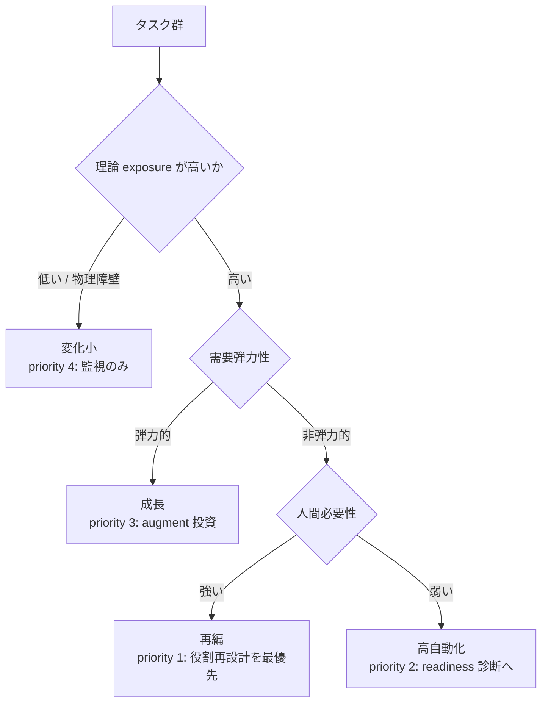
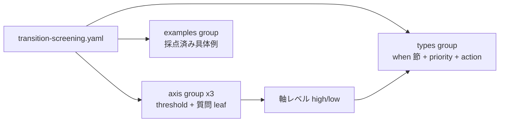

# 01. 委任の前に「どのタスク群から手を付けるか」を 4 類型で地図にする

## TL;DR

経営から「AI を活用せよ」と言われたとき、最初の問いは「**どの仕事から?**」です。
`aidr screen-transition` は、タスク群ごとに 9 個の質問へ yes/no で答えると、
その仕事が AI によって **どう変わりそうか(4 類型)** と **どこから委任設計に
手を付けるべきか(優先順位)** を返します。
これは委任の合否を決めるゲートではなく、**着手順を決めるための地図**です。
人員削減の予測でもありません — 各類型には「headcount(人数)は最後に決める」
という推奨の意思決定順序が付きます。

## 前提

- 全体像([docs/00](00_overview.md))の本線 6 ステップのうち、本書は
  **ステップ 1(どこから手を付けるか)** を扱います
- **タスク群** = まとまりのある仕事の束(例: 「経費精算チェック」「見積書の作成」)。
  職種名ではなく、仕事の中身で括ります
- **HITL**(human-in-the-loop)= 人間を最終判断に残す運用
- 物語上の位置: ミドリ精機(架空。[`examples/README.md`](../examples/README.md))の
  経理部が、経営指示を受けて最初にやることを決める場面です

## When to use this

- AI 化の対象選定で「削減対象探し」に引きずられず、**どのタスク群から委任設計に手を付けるか**を根拠付きで決めたいとき
- 顧客・経営への提案で「4 類型マップ → 委任設計 → headcount は最後」の**意思決定順序**を一次データ付きで示したいとき
- `check-readiness` / `score-delegation` にかける対象(母集団)を選ぶ前段が欲しいとき

## ミドリ精機の事例で見る

経理部は、自部門とその周辺のタスク群 4 つを並べて実行しました。

```bash
bin/aidr screen-transition examples/task-groups/sample-task-groups.csv
```

入力: [`examples/task-groups/sample-task-groups.csv`](../examples/task-groups/sample-task-groups.csv)

```text
[REORG ] priority 1: financial_disclosure_draft: REORGANIZATION [HITL]  (technical_exposure=high(2/3), human_necessity=high(2/3), demand_elasticity=low(1/3))
[AUTO  ] priority 2: expense_entry_check: HIGH_AUTOMATION  (technical_exposure=high(3/3), human_necessity=low(0/3), demand_elasticity=low(0/3))
[GROWTH] priority 3: sales_proposal_draft: GROWTH  (technical_exposure=high(3/3), human_necessity=high(1/3), demand_elasticity=high(3/3))
[STABLE] priority 4: equipment_maintenance: MINIMAL_CHANGE  (technical_exposure=low(1/3), human_necessity=high(1/3), demand_elasticity=low(1/3))
```

この出力は上から順に、こう読みます。

| 行 | 読み方 |
|---|---|
| 決算開示資料ドラフト → **再編** | AI で作業は大きく変わるが、人は中心に残り続ける。**役割の再設計が最も要る仕事**なので priority 1。`[HITL]` = 財務・規制の領域なので、どう変えても最終判断は人間に残す |
| 経費精算チェック → **高自動化** | ルールで機械的に判定でき、人が残る理由が薄い。**委任の本命候補**。次のステップ(readiness 診断 → 判定採点)へ進む |
| 見積・提案書ドラフト → **成長** | 速く安く出せるほど商談が増える。削減ではなく、**AI で対応量を増やす投資先** |
| 設備保全 → **変化小** | 現場の物理作業が中心で、当面 AI の影響が小さい。**監視のみ**で過剰投資を避ける |

ミドリ精機の物語は、ここで「経費精算チェック」を最初の題材に選び、
readiness 診断([docs/02](02_four_layer_framework.md))へ進みます。

実行時の注意は 2 つだけです。

- **全質問への回答が必須**です(未回答があると欠落 id を列挙してエラーになります)。
  未回答を no 扱いすると「人間は不要」側に誤分類されるのを防ぐためです
- 成功時の exit code は**常に 0** です。分類は合否ゲートではないため、
  類型は exit code に写しません

自社のタスク群でやるときは `bin/aidr init --target transition --format csv > my-task-groups.csv` で
テンプレートを生成して埋めてください。

## Concept

ここからは、出力の意味(外側)→ 分類の仕組み → 質問と閾値(内側)→
出典と限界 → 機械可読の構造、の順に掘り下げます。

### 4 つの類型 — 出力が意味するもの

| 類型 | どんな仕事か | 次にやること(action の要旨) | 優先度 |
|---|---|---|---|
| 再編(reorganization) | AI で作業は変わるが、人が中心に残る。ただし人数の需要は減りうる | タスク分解 → automate/augment/human の仕分け → 役割再定義 → reskill → **headcount は最後**。削減の前に再配置(redeploy)を評価 | 1(最優先) |
| 高自動化(high_automation) | 機械的に判定でき、人が残る理由が薄い | まず `check-readiness` で業務を診断し、PASS 後に `score-delegation` で判定単位に採点 | 2 |
| 成長(growth) | コストが下がるほど需要が増える | augment(人の増強)に投資し、対応量を増やす。headcount の追加も再設計後に判断 | 3 |
| 変化小(minimal_change) | 物理作業などで当面影響が小さい | 監視のみ。ツールや規制が変わったら再スクリーニング | 4 |

「再編」が最優先である理由: 人は残るのに人数需要は減りうる、という**一番設計が難しい
ゾーン**だからです。augmentation(人の増強)と一括りにすると、この力学が見えなくなります。

各類型の推奨文言(action)の正本は
[`definitions/transition-screening.yaml`](../definitions/transition-screening.yaml) です。
値はここに二重保持しません。

### 分類の仕組み — 3 つの軸

類型は、3 つの軸への回答から決まります。

| 軸 | 平たく言うと | high になる条件 |
|---|---|---|
| 理論 exposure(technical_exposure) | その仕事の時間は、いま の AI で短縮**できてしまう**か(実際に使われているかは問わない) | 3 問中 2 問 yes |
| 人間必要性(human_necessity) | 規制・人間関係・物理作業の**どれか 1 つでも**理由があれば、人は残る | 3 問中 **1 問でも** yes |
| 需要弾力性(demand_elasticity) | 安く・速くなったら、その仕事の量は増えるか | 3 問中 2 問 yes |

3 軸の high/low の組み合わせが、次の決定木で 4 類型に落ちます。



読み方: まず「AI に晒されているか」。晒されていなければ変化小。晒されていて需要が
伸びるなら成長。需要が伸びず、人が残る理由があるなら再編、無ければ高自動化です。

### 質問と閾値 — 何に答えるのか

9 個の質問の日本語文です(正本は定義 YAML の `text_ja`。回答はすべて yes/no)。

| id | 質問(要旨) |
|---|---|
| E1 | タスク時間の過半が、物理作業や対面でなく情報処理(文書・データ・コード)か |
| E2 | 主要タスクの入出力がデジタルデータだけで完結するか |
| E3 | 現行の AI ツールで品質を保ったまま、中核タスクの所要時間を半減できるか |
| H1 | 権利・財務・健康・規制に影響し、法令・監査上、人間の判断や署名が要求されるか(**HITL 既定固定域**) |
| H2 | 対人関係そのもの(信頼・交渉・ケア)が、この仕事の価値の中核か |
| H3 | 現場での物理作業や身体的スキルが不可欠か |
| D1 | コストや納期が大きく下がれば、依頼件数が増える見込みがあるか |
| D2 | 価格や速度がボトルネックで、満たされていない潜在需要が今あるか |
| D3 | 需要の伸びを止める上限(規制枠・固定予算など)が無いか |

閾値の設計意図:

- 人間必要性だけ「**1 つでも yes で high**」です。規制・関係・物理は、どれか 1 つでも
  人が残る十分な理由になるためです
- E1〜E3 の exposure は「理論上できる」を測ります。実際の採用率とは大きな差があります
  (後述の capability overhang)。境界すれすれの分類は人が見直してください

### HITL フラグ — 類型とは独立の印

H1(規制固定域)が yes のタスク群には、**類型がどれであっても**
`human_control_required: true`(text 出力では `[HITL]`)が付きます。
たとえば「成長」に分類されても、財務の最終承認は人間に残す — この指示が
類型の陰に隠れないようにするためです。

次のステップ(判定単位の採点)との対応:

| 本書(タスク群の粗い分類) | 委任マトリクス([docs/04](04_delegation_matrix.md)、判定単位) | 意味 |
|---|---|---|
| H1 = yes(規制固定域) | red 領域(human only)の運用上の既定 | 最終判断は人間。AI は参照のみ |
| H2 / H3 = yes(関係・物理) | (マトリクス対象のタスク自体が少ない) | — |
| human_necessity = low | green / yellow を `score-delegation` で判定 | 判定単位の採点へ進む |

H1 = yes でも、群の中の個別判定が green になることはあります(例: 財務承認業務の中の
機械的チェック)。その場合も最終承認の判定だけは red(human only)に残します。

### 意思決定の順序 — headcount は最後

4 類型の地図は「誰を減らすか」ではなく「どの職務をどう再設計するか」を決めるためのものです。
推奨順序は各類型の `action`(正本: 定義 YAML)に埋め込まれ、CLI 出力にそのまま表示されます。

1. タスク分解(職種名でなくタスク単位で見る)
2. automate / augment / human の仕分け
3. 役割再定義
4. reskill と権限移譲
5. **headcount は最後に決める**

削減判断の前には redeploy 経路(スキル隣接性)の評価を挟みます。WEF Future of Jobs Report 2025 は
100 人中 **29 人が現職 upskill / 19 人が redeploy 可能 / 11 人が移行困難**という目安を示します
(**confidence: claim_needs_verification** — 一次 PDF が取得できず二次要約由来。
顧客向け資料で断定値として使わないでください)。マクロ推計であり個社にそのまま写像はできませんが、
「削減候補に見える層にも相当の再配置余地がある」ことの参照値になります。

### 出典と限界 — この地図をどこまで信じてよいか

骨格は OpenAI「AI Jobs Transition Framework for the EU」(2026-06)から抽出しています。
ただし **本定義の決定木は原典の再現ではありません**。原典は ESCO 職業分類上の定量推計
(net-effect)であり、本定義はその概念構造を観測可能な yes/no 質問に落とした
**簡易スクリーニング(design_proposal)**です。

| 数値 | 値 | confidence |
|---|---|---|
| EU 雇用シェア(成長/高自動化/再編/変化小) | **12 / 14 / 27 / 47%** | observed_fact |
| 米国版(比較用) | 18 / 24 / 12 / 46% | observed_fact |
| capability overhang(理論 vs 観測 exposure) | 92.8% vs 24.6% | observed_fact |
| exposure-only モデルの採用変動説明力 | 約 14%(比較優位モデルは約 60%) | claim_needs_verification |
| 生成 AI 導入組織で測定可能リターンなし | 95% | claim_needs_verification |

**取り違え注意**: 一部の二次メディアは EU の数値を「自動化 18% / 再編 24%」と報じていますが、
これは**米国版の数値の取り違え**です。OpenAI の EU 報告書は「EU は米国より automation 比率が
小さい」と明記しており、EU の高自動化は 14% が正です。出典 URL と confidence ラベルは定義 YAML の
`types` group の `case_evidence` が正本で、`--format json` の出力にも同梱されます。

### ■構造(パイプラインのどこに入るか)


| 要素名 | 説明 |
|---|---|
| screen-transition | **本書のコマンド**。母集団(タスク群)の分類と優先順位付け。合否は出さない |
| check-readiness | 優先度が付いた業務の readiness を点検 |
| score-delegation | 高自動化ゾーンの判定単位を委任マトリクスで採点 |
| check-task-contract | 委任する 1 タスクの与え方・採点者を点検 |
| validate-audit-log | 運用開始後のログを検証 |

順序の正本は README の「使い方(想定ワークフロー)」です。

### ■データ(定義ファイルの概念モデル)

概念モデルは委任マトリクス([docs/04](04_delegation_matrix.md))と同じ枠組みです:
axis group(header の `threshold` + 質問 leaf)と、軸レベルの組をルックアップする
`types` group(委任マトリクスの `regions` に相当)、および `examples` group(データ)。



| エンティティ | 説明 |
|---|---|
| axis group | `technical_exposure` / `human_necessity` / `demand_elasticity`。header の `threshold` で high/low を決める |
| 質問 leaf | 観測可能な yes/no 質問(`text` 英 / `text_ja` 日)。`flag: human_control` を持つ leaf(H1)は HITL フラグの源 |
| types group | 軸レベル 3 つ組 → 類型のルックアップ。`delegation_priority` と `action`(推奨文言の正本)を持つ |
| examples group | 採点済みの具体例(design_proposal)。**各類型の判定基準を例示するリファレンスケース**で、ミドリ精機の物語とは独立。overlay で自社例を追加できる |

### 拡張(overlay)

overlay で可能なのは 3 軸 + examples への `add` のみです。**threshold の strengthen は
意図的に開けていません** — 閾値を上げると exposure=high に入りにくくなり、再編対象が
変化小(監視のみ)へ落ちて**見逃される**ためです(準備の地図では見逃しが害)。

## References

- 正本: [`definitions/transition-screening.yaml`](../definitions/transition-screening.yaml)
- サンプル: [`examples/task-groups/sample-task-groups.csv`](../examples/task-groups/sample-task-groups.csv)
- 次のステップ: [02 4 層フレーム](02_four_layer_framework.md)
- 出典: [Mapping Europe's AI Workforce Opportunity (OpenAI EU)](https://openai.com/index/mapping-ai-jobs-transition-eu/) /
  [The AI Jobs Transition Framework for the EU (PDF)](https://cdn.openai.com/pdf/the-ai-jobs-transition-framework-for-the-eu.pdf) /
  [GPTs are GPTs (Eloundou et al. 2023)](https://arxiv.org/abs/2303.10130) /
  [WEF Future of Jobs Report 2025 (PDF)](https://reports.weforum.org/docs/WEF_Future_of_Jobs_Report_2025.pdf) /
  抽出元の分析記事: [OpenAIのEU職種4類型マップを経営の職務再設計に使う](https://suwa-sh.github.io/zenn-contents/articles/openai-eu-ai-jobs-transition_20260630/)
