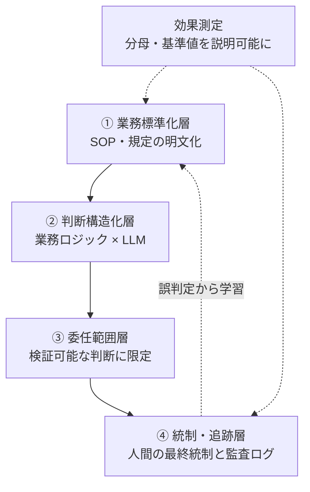

# 02. 4 層フレームで委任の可否を診断する

## TL;DR

スクリーニングで選んだ業務を、**本当に AI に任せてよいか?** —
`aidr check-readiness` は、業務の前提条件への yes/no 回答から、
**PASS(委任してよい)/ REVISE(直してから)/ BLOCK(委任不可)** を返します。
前提条件は積み上げの 4 層(規定の文書化 → 判定の構造化 → 任せる範囲の線引き →
統制と記録)で、**下の層が崩れていると、上の層をいくら作っても委任は成立しません**。
BLOCK は参考スコアではなくゲートです — 直してから再診断します。

本フレームワークは **味の素自身ではなく、事例記事から骨格を抽出しています**。
事実と一般化はラベル分けで示します:**【観測事実】**(記事の公開情報から
確認できます)/ **【設計提案】**(本リポでの一般化です)。④統制層は事例記事
自身が「公開情報が薄い」と明言しているため、設計提案ラベルが大半を占めます。

## 前提

- 全体像([docs/00](00_overview.md))の本線 5 ステップのうち、本書は
  **ステップ 2(業務が委任に耐えるか)** を扱います
- **SOP** = 標準作業手順書。誰がやっても同じ結果になるよう手順を書いたもの
- **エスカレーション** = AI が判断に迷うケースを人間に引き渡すこと
- 物語上の位置: ミドリ精機(架空。[`examples/README.md`](../examples/README.md))の
  経理部が、スクリーニングで選んだ経費精算承認業務を診断する場面です

## When to use this

- 対象業務がある(経費承認 / ベンダー登録 / 与信判定 など)
- ベンダー比較を始める前に「自社業務が委任に耐えるか」を客観的に診断したい
- 「AI 入れたい」社内提案を Go/No-Go で評価する材料が必要

## ミドリ精機の事例で見る(初回 BLOCK → 改善 → PASS)

経理部は、経費精算承認業務を初めて診断しました。

```bash
bin/aidr check-readiness examples/business/sample-expense-approval.csv
```

入力: [`examples/business/sample-expense-approval.csv`](../examples/business/sample-expense-approval.csv)

```text
Target: 経費精算承認(ミドリ精機・経理部、FY2026 初回診断)

[..] L1 業務標準化層: REVISE (75%)
    no: L1.Q4
    -> upper layers are gated by this verdict
[NG] L2 判断構造化層: BLOCK (33%)
    no: L2.Q2, L2.Q3
[..] L3 委任範囲層: REVISE (75%)
    no: L3.Q4
[NG] L4 統制・追跡層: BLOCK (0%)
    no: L4.Q1, L4.Q2, L4.Q3, L4.Q4, L4.Q5
[..] efficacy 効果測定: REVISE (75%)
    no: efficacy.E3
[NG] organization 組織 readiness層: BLOCK (0%)
    unknown: organization.C1, organization.C2, organization.C3, organization.C4, organization.C5, organization.C6

Conclusion: BLOCK
  First gate to fix: layer L1
```

この出力は、こう読みます。

| 行 | 読み方 |
|---|---|
| `[..] L1 ... REVISE / no: L1.Q4` | 規定はあるが、SOP の粒度(L1.Q4)が粗い。`->` 行は「この層の結果が上の層をゲートしている」印 |
| `[NG] L2 ... BLOCK` | 判定ロジックの構造化が途中。no の質問 id が並ぶ |
| `[NG] L4 ... BLOCK (0%)` | 統制・追跡層は未着手 |
| `unknown: organization.C1...` | 未回答の質問は unknown(採点上 no)。組織軸が未記入なので BLOCK |
| `First gate to fix: layer L1` | **最初に直すべき最下層**。ここから改善する |

**BLOCK はゲートです**。経理部は半年かけて SOP の詳細化・判定ロジックの構造化・
監査ログと補正フローの設計・組織の受け皿整備を行い、再診断で PASS になりました。

```bash
bin/aidr check-readiness examples/business/sample-expense-approval-after.csv
# => Conclusion: PASS
```

入力: [`examples/business/sample-expense-approval-after.csv`](../examples/business/sample-expense-approval-after.csv)

PASS になって初めて、次のステップ(判定単位の振り分け → [docs/04](04_delegation_matrix.md))へ進みます。
自社業務を診断するときは `bin/aidr init --target four-layer --format csv > my-business.csv` で
テンプレートを生成して埋めてください。

## Concept

ここからは、診断結果の意味(外側)→ 4 層の仕組み → 各層の問い(内側)→
効果測定 → セルフチェック → 留保、の順に掘り下げます。

### 診断結果の読み方

| 表示 | 意味 |
|---|---|
| `[OK]` PASS | その層・軸は前提を満たしている |
| `[..]` REVISE | 過半は満たすが穴がある。埋めてから委任する |
| `[NG]` BLOCK | 前提が崩れている。委任しない |
| `First gate to fix` | 4 層は積み上げなので、**崩れている最下層**から直す |
| efficacy / organization | 4 層とは独立の**並列軸**。層のゲートには関与しないが、総合判定には効く |

総合判定(Conclusion)は、層と並列軸の最も悪い判定に引きずられます。
「業務(4 層)は満点なのに組織軸で BLOCK」のような穴を隠さないためです。

### 4 層の仕組み — なぜ積み上げなのか



規定が明文化されていなければ(①)、AI が参照するルールが存在しません。
ルールが判定の形に構造化されていなければ(②)、精度は安定しません。
検証できる判断に絞らなければ(③)、誤りに気づけません。
統制と記録がなければ(④)、誤りを正せず説明もできません。
下から順に埋まっていることが、委任の前提です。

### 各層の問い(詳細)

各層の問いと合否基準の正本は `definitions/four-layer.yaml` です
(日本語の質問文は `text_ja`)。以下は要約です。

#### ① 業務標準化層

判断の前提となる規定・手続きが明文化されていることが土台です。標準化は AI が
参照するルールセットを供給すると同時に、例外ケースを減らして精度を安定させます。

**主な問い**: 判断基準の文書化 / 例外手続きの明文化 / 規定の版管理 /
第三者が再現できる SOP 粒度。**合否**: 全問 yes で pass、過半数 yes で revise。

**【観測事実】** 味の素グループは経理 BPO・シェアードサービスとして業務標準化を
積み上げており、ITmedia は「30 年以上続く業務標準化」と表現しています(「30 年」の
具体的内訳は一次情報では確認できていません)。

#### ② 判断構造化層

明文化された規定を、AI が判定に使える形(どの入力を・どの条件で・どう判定するか)に
構造化する層です。**この層が LLM 単体との差を生みます**。

**主な問い**: 規定の三つ組化 / 決定論的処理・LLM 推論・人間エスカレーションの線引き /
回帰テストの有無。

**【観測事実】** 公式検証(領収書必須項目 / インボイス制度準拠 / 税務上の交際費判定)で、
ドメイン特化エージェントが 93.3%、汎用 LLM 単体が 53.3% と報告されています。差を
生んだのはモデルの賢さではなく、業務ロジック × LLM の組み合わせです。

#### ③ 委任範囲層

**検証可能で正解を定義できる判断のみを AI に委ねる**線引きを行います。文脈の重い
判断は推論で補助し、確信が持てないケースと例外は人間に残します。線引きそのものが
設計の中心であり、競争力の源泉になります。

**主な問い**: 第三者が同一入力で同じ採点をできるか / 規定の条番号を引けるか /
正解を定義しにくい領域の除外 / 監査ログからの再現。
判定単位での 2 軸採点は [docs/04](04_delegation_matrix.md) を参照してください。

#### ④ 統制・追跡層

**ここが本事例の公開情報で最も薄く、論点が集中する層です**。承認業務を AI に
委ねると、内部統制上の論点が立ち上がります。

**主な問い**: 「判定」と「実行」の分離(職務分掌)/ 差し戻し理由のログ提示 /
Who/When/What/Why/Result の構造化記録 / 規定バージョンのログ固定 / 誤承認の補正フロー。
監査ログ最小スキーマは [docs/06](06_audit_log_schema.md) を、既存ログ基盤への
当てはめ例は [docs/07](07_audit_log_gap_check.md) を参照してください。

**【観測事実】** 公開情報には統制層の具体(誤承認補正フローや監査ログ設計)が
ほとんど開示されておらず、再現を目指す側は **ここを自前で設計する必要があります**。

### 効果測定軸(efficacy)

4 層を満たしていても、**導入効果の数値が「何を分母にした削減率か」を説明できない**と
意思決定に使えません。

**主な問い**: 削減率の分母・基準値・期間 / 期待値と実績の区別 / 対象範囲の明示 /
AI 起因の誤承認の独立集計。

**【観測事実】** 月 1 万件 × 5 分 → 年約 1 万時間の削減見込みが報告されています。
一方で、ITmedia の見出し「工数 76% 削減」は **分母が記事に明示されていません**。
本リポは効果測定の数値を保証せず、観点だけを保持します。

組織側の受け皿を診断する並列軸(organization)は [docs/03](03_organization_axis.md) を
参照してください。

### Self-check sheet(5 項目)

| 観点 | 問い |
|---|---|
| ① 標準化 | 判断基準は明文化され、暗黙知に依存していないか |
| ② 構造化 | 規定を AI が判定に使える形に落とせるか |
| ③ 委任範囲 | 正解を定義でき検証できる判断に絞れているか |
| ④ 統制 | 人間の最終承認・監査ログ・例外エスカレーションを設計したか |
| 効果測定 | 削減率の分母・基準値を説明できるか |

下層が崩れていれば、導入すべきは AI ではなく業務標準化です。**AI 導入プロジェクトの
大半は、実は AI 以前の As-Is 整備プロジェクトです**。

### Caveats

- 事例記事はベンダーとの共同発表に基づく成功事例であり、「76% 削減」の基準値や
  誤承認時の対応を独立に検証できません
- 会計領域の AI 導入失敗・誤承認による監査指摘の先例は、公開情報ではほぼ検出できません。
  情報ギャップであり、「リスクが無い」証拠ではありません
- LLM 固有のリスク(自己検証の弱さ / グレーゾーン判定のブレ / 申請文への悪意ある指示)が
  残ります。委任範囲を検証可能な判断に絞り、人間の最終統制を残すことが一次防御になります

## References

- 正本: [`definitions/four-layer.yaml`](../definitions/four-layer.yaml)
- サンプル: [`examples/business/sample-expense-approval.csv`](../examples/business/sample-expense-approval.csv)(初回 BLOCK)/
  [`sample-expense-approval-after.csv`](../examples/business/sample-expense-approval-after.csv)(改善後 PASS)
- CLI: `bin/aidr check-readiness --help` / テンプレート生成は `bin/aidr init --target four-layer --format csv`
- 次のステップ: [03 組織 readiness 軸](03_organization_axis.md) → [04 委任マトリクス](04_delegation_matrix.md)
- 関連 doc: [`06_audit_log_schema.md`](06_audit_log_schema.md) / [`07_audit_log_gap_check.md`](07_audit_log_gap_check.md) / [`08_high_stakes_domain_overlay.md`](08_high_stakes_domain_overlay.md)(知財/法務/薬事向けに L5 ゲート層を足すドメイン overlay)
- 出典:
  - [メンテナによる分析記事 (Zenn / gh-pages ミラー)](https://suwa-sh.github.io/zenn-contents/articles/ajinomoto-accounting-agent_20260621/)
  - [ファーストアカウンティング公式 (2026-04-24)](https://www.fastaccounting.jp/news/20260424/15929/)
  - [ITmedia「工数 76% 削減」(2026-06-19)](https://www.itmedia.co.jp/business/articles/2606/19/news033.html)
