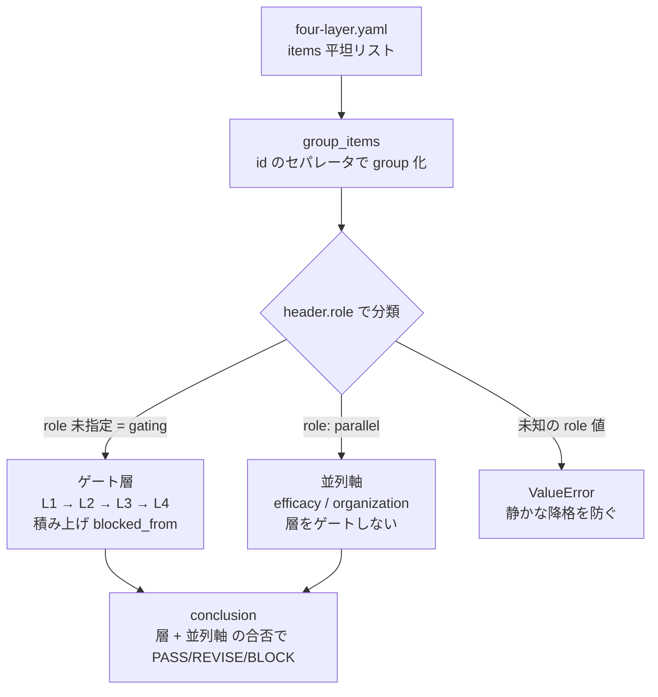
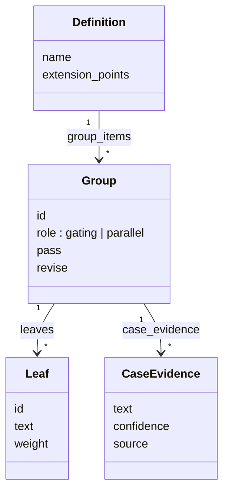

# 03. 組織 readiness 軸で「組織が委任を受け止められるか」を診断する

## TL;DR

業務そのものは AI に任せられる状態でも、**受け止める組織の側は準備ができているか?** —
やめる決断を誰ができるのか、使いこなす人材はいるのか、ベンダーの知見は社内に移るのか。
組織 readiness 軸は、この「組織側の受け皿」を 6 つの条件で採点します。
`check-readiness` の中で 4 層と**並列**に採点されるので、
「業務は委任できるが組織が未成熟」が、緑の業務スコアに隠れず独立した穴として現れます。

本軸は **味の素モデルの分析記事「6 条件チェックリスト + 反証 5」** から骨格を抽出しています。
事実と一般化はラベル分けで示します:**【観測事実】** / **【設計提案】**。

## 前提

- 全体像([docs/00](00_overview.md))のステップ 2(readiness 診断)のうち、
  **組織側の受け皿**を診断する並列軸の解説です。4 層([docs/02](02_four_layer_framework.md))と
  同じコマンドで一緒に採点されます
- **並列軸** = 4 層のゲート(下層が上層を止める積み上げ)には関与せず、
  独立した合否として並ぶ観点
- **bus factor** = 何人抜けたらプロジェクトが止まるか。1 なら、その 1 人が単一障害点です
- **リテラシー層** = AI ツールを業務側で受け止めて使いこなす人材の層

## When to use this

- 4 層(業務プロセス)の診断は済み、**組織側の受け皿**を点検したい
- 新規事業フェーズで少人数フルスタックに AI を入れる前のセルフチェックをしたい
- AI 導入提案で「ベンダー比較」でなく「組織の障害」を材料にしたい

## 事例で見る

*業務*は整っているが*組織*が未成熟なチームの例です(応用例。ミドリ精機の物語とは
独立した、味の素の分析記事由来のサンプルです)。

```bash
bin/aidr check-readiness examples/business/ajinomoto-discovery-team.csv
```

入力: [`examples/business/ajinomoto-discovery-team.csv`](../examples/business/ajinomoto-discovery-team.csv)

```text
Target: 経理業務の AI 委任(少人数フルスタックの探索チーム・探索フェーズ)

[OK] L1 業務標準化層: PASS (100%)
[OK] L2 判断構造化層: PASS (100%)
[OK] L3 委任範囲層: PASS (100%)
[OK] L4 統制・追跡層: PASS (100%)
[OK] efficacy 効果測定: PASS (100%)
[NG] organization 組織 readiness層: BLOCK (33%)
    no: organization.C2, organization.C4, organization.C5, organization.C6

Conclusion: BLOCK
```

この出力は、こう読みます。

| 行 | 読み方 |
|---|---|
| L1〜L4・efficacy が全 PASS | **業務プロセス側は満点**。プロセスの診断だけなら委任できてしまう |
| organization が BLOCK / no: C2, C4, C5, C6 | 受け皿人材(C2)・知識移転契約(C4)・拡大期の分割設計(C5)・bus factor 対策(C6)が無い |
| Conclusion: BLOCK | 並列軸の穴は総合判定に効く。**組織の受け皿を作ってから委任する** |

並列軸なので `First gate to fix` は出ません — 業務層の改善では埋まらない、
組織側の独立した宿題だからです。

## Concept

### 6 条件(組織 readiness の問い)

正本は [`definitions/four-layer.yaml`](../definitions/four-layer.yaml) の `organization` group
(`organization.C1`〜`C6`)です。値はここに二重保持しません。

| id | 条件 | 確認の観点 | ラベル |
|---|---|---|---|
| C1 | 撤退判断の権限と文化 | 8-12 ヶ月以内に「やめる」決定ができる権限がある | 【観測事実】LaboMe® 約 8.5 ヶ月で撤退 |
| C2 | 全社リテラシー層 | 受け皿となるビジネス側人材が 2 桁人数で育っている | 【観測事実】味の素はビジネス DX 人財 2,200 名 |
| C3 | AI ツール基盤の定着 | 個人レベルで Copilot / 社内チャット / RAG が定着 | 【観測事実】AJI AI Chat 月間アクティブ率 約 70% |
| C4 | 知識移転契約 | SI/ベンダー契約で内面化(I)を KPI 化できる | 【設計提案】IPA モデル契約を起点に |
| C5 | 漸進分割の設計 | Stream-aligned → Complicated Subsystem/Platform の剥がし方を事前設計 | 【設計提案】Team Topologies 漸進分割 |
| C6 | bus factor 対策 | ペアプロ / ADR / Knowledge Transfer Day を運用 | 【設計提案】意図的な知識分散 |

合否基準(base): **pass 1.0(6/6)** / **revise 0.66(4/6 以上)**。記事の「4 つ以上なら試行は妥当、
3 つ以下ならまず受け皿作り」に一致します(6 問等重みで 4/6=0.667≥0.66、3/6=0.5<0.66 → block)。

### 反証 5(軸の根拠)

軸の閾値を厳しめに置く根拠として、`organization` group の `case_evidence` に記録しています。
**記事が数値の再確認を留保した反証 1・2 は `claim_needs_verification` とし、事実断定しません**。

| # | 反証 | confidence |
|---|---|---|
| 1 | AI 委譲モードで技能 ~17% 低下(Anthropic 研究、要再確認) | claim_needs_verification |
| 2 | ジュニア雇用 ~20% 減(Stanford payroll、要再確認) | claim_needs_verification |
| 3 | bus factor 1 のリポジトリは ~16% が消滅 | observed_fact |
| 4 | 10→50 人 inflection で 40-60% velocity decline | observed_fact |
| 5 | METR 2026/02 改定(19% 遅延結論を 2026 に引かない) | gap_in_source |

### ■構造(採点コンポーネントの振り分け)

`check-readiness` は定義の全 group を読み、header の `role` で**ゲート層**と**並列軸**に
振り分けます。組織軸は efficacy と同じ並列軸で、層のゲート(`blocked_from`)には関与しません。



- **ゲート層**: `L1`〜`L4`。下層が pass でないと `blocked_from` を立て、上層点検の前提を示す。
- **並列軸**: `efficacy` / `organization`。単独で採点し conclusion に寄与するが、層のゲートには
  関与しない。leaf 0 個の並列軸は「未評価」としてスキップし、誤 BLOCK を防ぐ。
- **未知 role**: `paralell` のような typo は静かにゲート層へ降格させず、`ValueError` で落とす。

### ■データ(定義の概念モデル)



- **Group.role** が振り分けの唯一のキー。`organization` は `role: parallel`。
- **overlay** は `extension_points` の宣言に従い、`organization` group への `add`(質問追加)と
  `strengthen`(閾値の強化方向のみ)ができる。緩和・上書き・削除は `aidr check-overlay` が拒否する。

## References

- 正本: [`definitions/four-layer.yaml`](../definitions/four-layer.yaml) の `organization` group / `extension_points`
- 採点: [`src/adr/check_readiness.py`](../src/adr/check_readiness.py)(`axis_role` / 層と並列軸の振り分け)
- サンプル: [`examples/business/ajinomoto-discovery-team.csv`](../examples/business/ajinomoto-discovery-team.csv) /
  [`examples/overlays/organization-readiness-ajinomoto.yaml`](../examples/overlays/organization-readiness-ajinomoto.yaml)
- 関連: [`02_four_layer_framework.md`](02_four_layer_framework.md)(4 層 + 効果測定)
- 次のステップ: [04 委任マトリクス](04_delegation_matrix.md)
