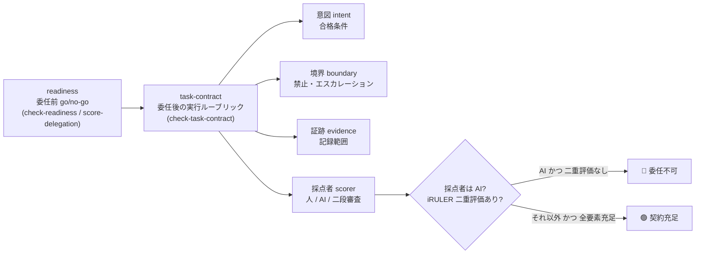

# 06. 委任タスクを意図・境界・証跡・採点者で点検する

## TL;DR

readiness(委任してよいか)を通したあと、**1 つのタスクをどう与え、出力をどう採点するか**を
点検します。**委任実行ルーブリック 4 要素** — **意図**(合格条件)/ **境界**(禁止・エスカレーション)/
**証跡**(記録範囲)/ **採点者**(人 / AI / 二段審査) — を各 presence 質問で採点し、
🟢 契約充足 / 🟡 要素に穴 / 🔴 委任不可 を返します。

**採点者が AI(ai_judge)なのに iRULER 二重評価が無い契約は 🔴 で止めます**(安全ゲート)。

正本は [`definitions/task-contract.yaml`](../definitions/task-contract.yaml) です。

## 前提(これだけ知っていれば読めます)

- 全体像([docs/00](00_overview.md))の本線 5 ステップのうち、本書は
  **ステップ 4(タスクをどう渡すか)** を扱います
- **AI-as-judge(AI 採点者)** = AI の出力を別の AI が採点する構成
- **ルーブリック** = 採点基準を明文化した表
- **Goodhart(グッドハート)の法則** = 「指標が目標になると、指標として壊れる」。
  AI 採点者は見える採点基準に合わせた体裁だけを整えるように最適化しがちです
- 物語上の位置: ミドリ精機が、委任 OK と判定した領収書チェックをエージェントに
  渡す前の契約点検の場面です

## When to use this

- readiness(go/no-go)は通ったが、「では、どう回すか」の設計が曖昧なとき
- 開発職で「委任 → 採点 → 編集」の型を初めて作り、それを非開発職に展開する前
- AI を採点者(AI-as-judge)に使う契約で、暴走(Goodhart / 捏造)への歯止めを CI ゲートで効かせたいとき

## Quick use

```bash
bin/aidr check-task-contract examples/task-contracts/sample-green.yaml
bin/aidr check-task-contract examples/task-contracts/sample-red-ai-judge.yaml
```

`sample-red-ai-judge.yaml` は 4 要素がすべて宣言済みでも、採点者が AI で二重評価が無いため
🔴 になります(exit 2)。終了コードは **0** 契約充足 / **1** 要素に穴 / **2** 委任不可 /
**3** 入力エラー(`scorer.type` 欠落・不正 enum)です。CI ゲートに使えます。

## 想定ワークフロー(準備 → 実行 → 解釈)

1. **準備**: 委任する 1 タスクについて、下の 4 要素を思い出しながら
   `examples/task-contracts/sample-green.yaml` を複製し、各質問に yes/no で答えます。
   `scorer.type` は必須(`human` / `ai_judge` / `two_stage`)、AI 採点なら
   `scorer.iruler_double_eval` も答えます。
2. **実行**: `bin/aidr check-task-contract <自分の契約>.yaml` を走らせます。
3. **解釈**: 🔴 なら「欠落した要素を宣言」または「AI 採点者に二重評価 / 人の二段目を足す」まで
   委任しません。🟡 なら穴の要素を埋めます。🟢 で回します。

## Concept — 委任実行ルーブリック 4 要素

readiness は委任**前**(この業務を任せてよいか)、本ルーブリックは委任**後**(このタスクを
どう回すか)を見ます。位置づけは次のとおりです。



各要素と採点質問は次のとおりです(各 group 2 つ以上 yes で present)。

| 要素 | 何を問うか | 採点質問 |
|---|---|---|
| **意図 intent** | 何を満たせば合格か | I1 合格条件の明文化 / I2 機械検証可能 / I3 主成果物の明示 |
| **境界 boundary** | やってはいけないこと・いつ止めるか | B1 禁止事項 / B2 エスカレーション条件 / B3 データアクセス境界(最小権限) |
| **証跡 evidence** | どの入出力を残すか | E1 記録範囲の定義 / E2 Who/When/What/Why/Result / E3 決定的ステップで記録 |
| **採点者 scorer** | 誰が採点するか | S1 採点者割付 / S2 採点ルーブリックの明文化(+ データ: `scorer.type` / `scorer.iruler_double_eval`) |

**present / partial / absent**: group の yes 数が threshold(既定 2)以上で present、1 以上 threshold 未満で
partial、0 で absent です。**absent が 1 つでもあれば 🔴**、absent は無いが partial があれば 🟡、
全要素 present かつ安全ゲート成立で 🟢 です。

## iRULER 二重評価ゲート(AI-as-judge の必須要件)

採点者に AI(`ai_judge`)を使うと、**AI は「見える採点基準」を最適化**します(Goodhart)。
単一ルーブリックで採点させると、基準を満たす体裁だけを整える出力に誘導されます。
**iRULER**(CHI 2026)は「**ルーブリック自体を別のルーブリックで評価する**」二重評価を提案します。

本ツールは、`scorer.type: ai_judge` かつ `scorer.iruler_double_eval` が yes でない契約を
**🔴(exit 2)で止めます**。解除するには次のどちらかを足します。

- `scorer.iruler_double_eval: yes`(二重評価を実装する)
- `scorer.type: two_stage`(人の二段目審査を置く。二段目が第二の点検を担うためゲートは効きません)

## Goodhart 緩和 do/don't(ルーブリック設計チェックリスト)

ルーブリック運用は「主観を排除する」のではなく「**メタ層の主観に移すだけ**」です。
次の失敗様態と緩和を 1 枚で点検します。

| 失敗様態(don't) | 何が起きるか | 緩和(do) |
|---|---|---|
| **response inflation** | 基準語を盛り込むほど高得点になる | **rotating rubrics**(採点軸を定期的に入れ替える) |
| **citation theater** | 引用の体裁だけ整え中身が伴わない | **hidden holdout criteria**(採点対象に伏せた基準を持つ) |
| **可視基準への過剰最適化** | 見える基準だけに最適化し全体品質が落ちる | **judge-family diversity**(採点モデルを多様化する) |
| **メタ層の劣化を検知できない** | 採点者自体の劣化に気づけない | **periodic human audits**(定期的な人手監査) |

> **注意(overlay 単調性)**: presence 質問を overlay で `add` したら、threshold の同時強化を
> 検討してください。質問を増やして threshold を据え置くと「2 つ以上 yes」の相対的な難度が
> 下がり、判定が緩みます。安全ゲート(iRULER)は gates の boolean policy 側にあり
> overlay で緩和できませんが、presence 閾値は絶対値なので add と threshold はセットで考えます。

## References

- 正本: [`definitions/task-contract.yaml`](../definitions/task-contract.yaml)(質問の日本語文は `text_ja`)
- サンプル入力: [`examples/task-contracts/sample-green.yaml`](../examples/task-contracts/sample-green.yaml) / [`sample-red-ai-judge.yaml`](../examples/task-contracts/sample-red-ai-judge.yaml)(ミドリ精機の経費チェック委任の 2 例)
- CLI: `bin/aidr check-task-contract --help`
- 物語の前後: 前のステップは [03 委任マトリクス](03_delegation_matrix.md)(委任前の領域判定)、
  次のステップは [02 監査ログスキーマ](02_audit_log_schema.md)(証跡 evidence の schema)
- 出典: iRULER(CHI 2026)/ OpenAI「How agents are transforming work」(2026-06-25)
