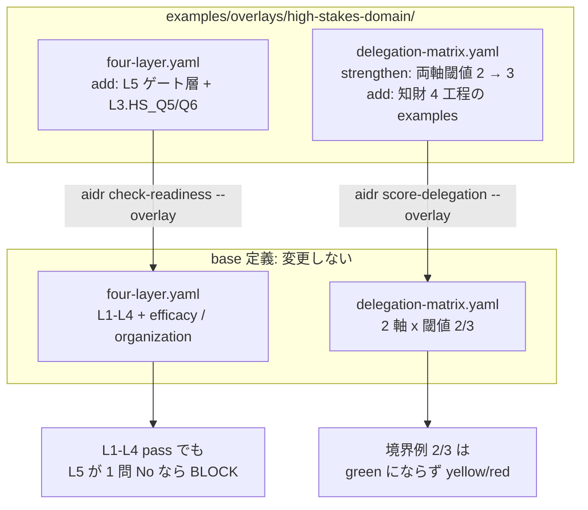

# 08. 高責任専門業務(知財/法務/薬事)を overlay で慎重側に採点する

## TL;DR

知財・法務・薬事のような、**誤りが訴訟・権利喪失・行政処分に直結する仕事**にも
AI を使えるのか? — 答えは「一般には No、**4 つの成立条件を満たすときだけ例外的に Yes**」です。
成立条件は、①秘匿情報を閉域で扱える ②見落としを人間が捕まえるループがある
③形骸化を前提に HITL を訓練している ④基盤モデルの毎年の移行コストを織り込んでいる。
本 overlay は base 定義を変えずに、この成立条件をハードゲート層 **L5**(1 つでも No なら
BLOCK)として足し、委任マトリクスの閾値も慎重側(満点でなければ high と扱わない)に強化します。

骨格は **オムロン知財 AI エージェント内製の分析記事** から抽出しています。
事実と一般化はラベル分けで示します: **【観測事実】** / **【設計提案】**。

## 前提

- 本書は**応用編**です。本線 6 ステップ([docs/00](00_overview.md))と
  overlay の仕組み(README の「自社ルールで拡張する」)を先に読んでください
- **HITL**(human-in-the-loop)= 人間を実行経路(最終判断)に残す運用
- **recall(再現率)**= 見つけるべきものをどれだけ漏らさず見つけたか。
  「見落としが許されない」工程では recall が命です
- **RAG** = 社内文書などを検索して LLM の回答に注入する構成
- **EOL** = End of Life。基盤モデルの提供終了
- 題材は架空の知財部門で、ミドリ精機の物語とは独立した応用例です

## When to use this

- 知財・法務・薬事部門を持つ組織への AI 委任提案で、「高責任業務こそ AI 適地」という
  楽観論を**反証つきの採点**で限定したい
- 自部門の業務(特許分類・先行技術調査・ドラフト作成・網羅調査)を工程に分解し、
  どの工程まで委ねるかを判定したい
- オムロン型の内製(基盤は managed、ドメイン特化層を内製)を検討していて、
  着手前に成立条件を点検したい

## 事例で見る(架空の知財部門)

```bash
# 業務全体の readiness(成立条件ゲート込み)
bin/aidr check-readiness examples/business/sample-ip-agent-readiness.csv \
  --overlay examples/overlays/high-stakes-domain/four-layer.yaml

# 工程(判定)単位の委任領域(慎重側の閾値)
bin/aidr score-delegation examples/judgments/sample-ip-judgments.csv \
  --overlay examples/overlays/high-stakes-domain/delegation-matrix.yaml
```

入力: [`examples/business/sample-ip-agent-readiness.csv`](../examples/business/sample-ip-agent-readiness.csv) /
[`examples/judgments/sample-ip-judgments.csv`](../examples/judgments/sample-ip-judgments.csv)

readiness サンプルは「業務プロセスは整っている(L1〜L4 全 PASS)が、
HITL がコンプレイセンシー前提で設計されていない(L5.Q3: no)」架空の知財部門です。

```text
Target: 先行技術調査エージェント(架空の知財部門・FY2026 評価)

[OK] L1 業務標準化層: PASS (100%)
[OK] L2 判断構造化層: PASS (100%)
[OK] L3 委任範囲層: PASS (100%)
[OK] L4 統制・追跡層: PASS (100%)
[NG] L5 高責任ドメイン成立条件層: BLOCK (75%)
    no: L5.Q3
    -> upper layers are gated by this verdict
[..] efficacy 効果測定: REVISE (75%)
    no: efficacy.E3
[..] organization 組織 readiness層: REVISE (83%)
    no: organization.C6

Conclusion: BLOCK
  First gate to fix: layer L5
```

L5 には revise 帯がありません(pass 1.0 / revise 1.0)。**4 条件のうち 1 つでも欠ければ
委任不可**、が記事の結論に忠実な設計です。

## Concept

### 成立条件 4 つ(L5 ハードゲート)

正本は [`examples/overlays/high-stakes-domain/four-layer.yaml`](../examples/overlays/high-stakes-domain/four-layer.yaml)
の `L5` group です。値はここに二重保持しません。

| id | 条件 | 確認の観点 | 欠けたときに起きること |
|---|---|---|---|
| Q1 | 閉域データ | 秘匿情報(出願前発明・訴訟資料・治験データ等)を公知化・漏えいリスクなく閉域で扱う | 出願前発明のクラウド入力は公知化(新規性喪失)とみなされうる。欧州は絶対新規性・猶予なし |
| Q2 | 高 recall 人検証 | 見落とし(false negative)を人が検証するループがある | RAG は recall と precision がトレードオフ。網羅要求の工程で見落としが残る |
| Q3 | 訓練された HITL | コンプレイセンシー前提で介入手順を設計・訓練している | 「人を置くだけ」の HITL は形骸化する。専門ベンダー製の法務 RAG でも架空判例が残る |
| Q4 | 基盤移行運用 | 基盤モデルの短命 EOL(最短 12 ヶ月)への毎年の追随コストを織り込む | 移行・値上げ・ロックインが継続コストとして毎年発生する |

### 工程別の委任適性(委任マトリクスの worked examples)

特許業務を工程に分けると、委任適性は**入力の構造化度 × 検証可能性 × 可逆性 × 誤りの許容度**で
決まります(【設計提案】記事レイヤ 1 の序列を本マトリクスに当てはめたもの。【観測事実】として
記事から取れるのは、オムロンが先行技術調査と分析レポート生成を主対象にした点のみ)。

| 工程 | 強化後 region | 理由 | 人に残る部分 |
|---|---|---|---|
| 特許分類 | green | 有限ラベル分類。正解ラベルが大量 | 細分類の最終確定 |
| 先行技術調査(候補抽出) | yellow | 検証可能だが「候補が十分か」は文脈依存 | 該当なしの最終判断 |
| 明細書ドラフト | yellow | 構造化再編のルールは文書化可能だが、クレーム範囲の検証は再実行テスト化できない | 権利範囲・進歩性の法的検証 |
| 無効資料調査(「該当なし」確定) | red | 網羅保証は事後検証も一意な正解定義も欠く | 1 件も見落とせない確定判断 |

一貫する軸は、**検索・分類・下書き(可逆)は AI へ、最終判断・網羅保証・説明責任(不可逆)は人へ**です。
可逆性・誤りコストは L3 の追加質問(`L3.HS_Q5` / `HS_Q6`)が readiness 側で点検します
(追加後の L3 は 6 問等重み: pass は 6/6、revise は 5/6 以上)。

### 割り引きの読み方(反証がどこに効いているか)

「高責任業務にも AI を内製適用すれば工数を大幅削減できる」という暫定結論を弱める反証は
強い部類です。本 overlay では反証を**注記ではなく採点の形**に落としています。

| 反証 | 効く場所 |
|---|---|
| 自己申告 20% 短縮 vs 実測 19% 遅延(METR RCT、2026-02 改定で留保つき) | 閾値強化の根拠(効果の自己申告を割り引く) |
| 生成 AI 導入組織の ~95% が P&L 効果なし(MIT NANDA、二次照合) | 閾値強化の根拠 |
| 専門ベンダー製の法務 RAG でも架空判例が残る | L5.Q3(訓練された HITL)の根拠 |
| 出願前発明のクラウド入力は公知化リスク | L5.Q1(閉域データ)の根拠 |
| 基盤モデルは最短 12 ヶ月で EOL | L5.Q4(基盤移行運用)の根拠 |

出典と confidence(observed_fact / claim_needs_verification)は overlay の
`L5.case_evidence` に記録しています。

**base 継承の worked examples の読み替え**: overlay は既存要素を書き換えられないため、
base の worked examples の `region` 表記は base 閾値(2/3)時点の採点のままです。
強化後の閾値(3/3)で読むと、次の 4 件はより厳しい region に落ちます
(この読み替えは `tests/test_score_delegation.py` が固定しています):

| base の example | base 表記 | 強化後 |
|---|---|---|
| entertainment_expense_determination | green | red |
| coding_mechanical_refactor | green | yellow |
| discriminatory_expression_detection | yellow | red |
| expense_account_code_suggestion | yellow | red |

### 法務・薬事への読み替え

worked examples の一次根拠は特許工程ですが、軸の構造はドメイン中立です。
自ドメインの overlay を作るときは本 overlay をコピーし、L5 の 4 条件の構造
(秘匿性 / 人検証ループ / 訓練された HITL / 基盤ライフサイクル)を保ったまま
質問文と case_evidence を差し替えてください(【設計提案】)。

| 観点 | 知財(本 overlay の例) | 法務での読み替え | 薬事での読み替え |
|---|---|---|---|
| 秘匿情報(Q1) | 出願前発明 | 訴訟資料・営業秘密 | 治験データ・申請前情報 |
| 網羅要求の工程(Q2) | 先行技術調査・無効資料調査 | 判例・条項の網羅チェック | 有害事象の網羅報告 |
| 下書き工程(yellow 相当) | 明細書ドラフト | 契約条項ドラフト | CSR・プロトコールドラフト |
| 不可逆な確定(red 相当) | 「該当なし」確定・権利範囲 | 訴訟方針・締結判断 | 申請可否・安全性の確定判断 |

### ■構造(overlay が base のどこに効くか)



- **L5 はゲート層**: header に `role` を指定しないため、`check-readiness` の `axis_role()` が
  ゲート層として扱い、L4 の後に積み上がります(振り分けの仕組みは
  [`03_organization_axis.md`](03_organization_axis.md) の■構造を参照。データモデルも同 doc と共通)。
- **opt-in**: overlay を `--overlay` で渡した診断にだけ効きます。base だけで使う利用者には無影響です。

## References

- 正本: [`examples/overlays/high-stakes-domain/four-layer.yaml`](../examples/overlays/high-stakes-domain/four-layer.yaml) /
  [`examples/overlays/high-stakes-domain/delegation-matrix.yaml`](../examples/overlays/high-stakes-domain/delegation-matrix.yaml)
- サンプル: [`examples/business/sample-ip-agent-readiness.csv`](../examples/business/sample-ip-agent-readiness.csv) /
  [`examples/judgments/sample-ip-judgments.csv`](../examples/judgments/sample-ip-judgments.csv)
- 関連 doc: [`02_four_layer_framework.md`](02_four_layer_framework.md)(4 層フレーム)/
  [`04_delegation_matrix.md`](04_delegation_matrix.md)(委任マトリクス)/
  [`03_organization_axis.md`](03_organization_axis.md)(並列軸とゲート層の振り分け)
- 出典: [オムロンの知財 AI エージェント内製に学ぶ「高責任業務への AI 委任」設計](https://suwa-sh.github.io/zenn-contents/articles/omron-ip-agent-insourcing_20260629/)(分析記事)/
  [AWS builders.flash 実装事例](https://aws.amazon.com/jp/builders-flash/202511/omron-intellectual-property-ai-agent/)(準一次)
