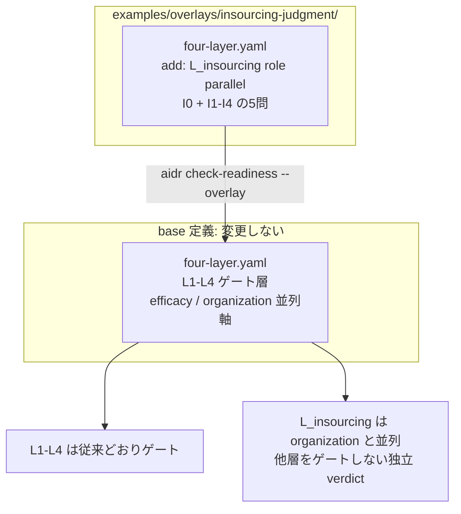

# 09. 内製化=「どの判断責任を社内に残すか」を overlay で採点する

## TL;DR

「AI を導入すれば内製化できる」は本当か? — **内製化の本質は、作業を社内に
戻すことではなく、上流の判断責任(何を作るか・どんな構成にするか・何をもって
合格とするか・例外を誰が引き取るか)に社内の固有名がつくこと**です。
本 overlay は、この判断責任の所在を 5 問で採点する並列軸 **`L_insourcing`** を足します。
業務の委任 readiness(L1〜L4)とは独立に採点されるので、
「業務は委任できるが、判断責任の内製化は未確立」が独立した穴として現れます。

骨格は **みずほ証券の内製化分析記事**から抽出しています。事実と一般化はラベルで分けます:
**【観測事実】** / **【設計提案】**。

## 前提

- 本書は**応用編**です。本線 6 ステップ([docs/00](00_overview.md))と
  並列軸の考え方([docs/03](03_organization_axis.md))を先に読んでください
- **内製化(insourcing)**= 外部ベンダーに任せていた開発・判断を社内に取り戻すこと
- **判断責任の所有** = 「その判断に社内の固有名(具体的な担当者・役職)がつくか」。
  作業を誰がやるかではなく、決定を誰が持つかを見ます
- 題材はミドリ精機の DX推進室です。本線 6 ステップ(経理業務の物語)とは別部門の応用例です

## When to use this

- AI 導入提案で「採用すれば内製化」という誤解を、**採点で崩したい**とき
- 顧客・自部門の「4 つの上流判断(要件優先順位 / アーキ / 受入基準 / 例外差し戻し)に社内の固有名がつくか」を点検したいとき
- 業務プロセスの委任 readiness(L1〜L4)は整っていても、**判断責任の社内化**が別問題として残っていないか確認したいとき

## 事例で見る(ミドリ精機 DX推進室)

```bash
# 内製化判断責任を並列軸として採点(業務・組織の採点はそのまま)
bin/aidr check-readiness examples/business/sample-insourcing-readiness.csv \
  --overlay examples/overlays/insourcing-judgment/four-layer.yaml

# 軸の構成を確認(parallel_axes に L_insourcing が出る)
bin/aidr list-definitions --target four-layer \
  --overlay examples/overlays/insourcing-judgment/four-layer.yaml
```

入力: [`examples/business/sample-insourcing-readiness.csv`](../examples/business/sample-insourcing-readiness.csv)

サンプルは、業務(L1〜L4)も組織(organization)も整っているが、
アーキテクチャの最終判断に社内の固有名がつかない(`I2: no`)状態のミドリ精機です。

```text
[OK] L1 業務標準化層: PASS (100%)
[OK] L2 判断構造化層: PASS (100%)
[OK] L3 委任範囲層: PASS (100%)
[OK] L4 統制・追跡層: PASS (100%)
[OK] efficacy 効果測定: PASS (100%)
[OK] organization 組織 readiness層: PASS (100%)
[..] L_insourcing 内製化判断責任層: REVISE (80%)
    no: L_insourcing.I2

Conclusion: REVISE
```

`L_insourcing` は並列軸なので、`REVISE` でも「First gate to fix」は出ません。
業務スコアが緑でも、内製化判断責任の穴が別の verdict として残ります。

## Concept

### 5 問の採点項目

正本は [`examples/overlays/insourcing-judgment/four-layer.yaml`](../examples/overlays/insourcing-judgment/four-layer.yaml)
の `L_insourcing` group です。値はここに二重保持しません。

| id | 層 | 問い | 何を測るか |
|---|---|---|---|
| I0 | 層0 | コア/ノンコアの線引きが文書化・社内決裁されているか | 何を内製と呼ぶか。ここを誤ると上が崩れる |
| I1 | 層1 | 要件の優先順位を社内の誰が決裁するか | 何を作り/作らないかの判断所有 |
| I2 | 層1 | 主要な技術選定(アーキ)の最終判断を社内の誰が持つか | 技術判断の所有 |
| I3 | 層1 | 受入基準(合否ライン)を社内の誰が定義・検収するか | 品質判断の所有 |
| I4 | 層1 | 例外・差し戻しでどこで人が介入し誰が責任を負うか | 例外時の責任所在 |

コードを誰が書いたかではなく、**各判断に社内の固有名がつくか**で測ります。

### 閾値と層0→層1 の読み方

- `pass: 1.0`(5/5)/ `revise: 0.8`(4/5)/ 3/5 以下は block
- **I0(層0)は等重みの 1 問**です。エンジンは軸内をフラット加重で採点するため、
  I0 だけを層1 のハードゲートにはできません。**I0 が no のときは、下流の I1〜I4 は前提が崩れている**
  と読み替え、まず線引き(I0)を直します(記事の「線引きが先」)。採点上は軸全体の
  `REVISE`/`BLOCK` 信号として表面化します。【設計提案】
- **revise 0.8 の根拠**: 内製化は「採用を包含するより大きな制度設計」であり、4 つの上流判断は
  それぞれ社内の固有名を要します。下記の反証が高い bar を支持するため、organization 軸(0.66)より
  厳しく置きます。

### 反証の割り引き(どこに効くか)

「採用すれば内製化できる」という通俗論を弱める反証は強い部類です。本 overlay では反証を
`L_insourcing.case_evidence` に記録し、閾値と質問の根拠にしています。

| 反証 | 効く場所 | confidence |
|---|---|---|
| みずほは好例でなく**表明段階**(金融庁が方針表明と実行の乖離を指摘) | 軸全体を「表明で満点にしない」根拠 | gap_in_source |
| **全面内製は失敗する**(採用コスト2倍/離職停止/技術的負債) | I0(線引きが先)の根拠 | claim_needs_verification |
| **IT人材の偏在**(日本72%ベンダー所属、一次PDF未突合) | 個社設計だけでは越えられない=期待値設定 | claim_needs_verification |
| コア/ノンコア分割はコストセンター→価値創造の定石 | I0 の根拠 | observed_fact |

### 既存軸との重複を避けた設計(層2・層3 はマップで示す)

記事の 4 層のうち、**層2・層3 は既存軸と重複する**ため、本 overlay では**質問を再実装せず**、
対応関係だけを示します。非重複の核心=層0(I0)+ 層1(I1〜I4)に絞っています。

| 記事の層 | 本 overlay の扱い | 既存の受け皿 |
|---|---|---|
| 層0 コア/ノンコアの線引き | **I0 として採点** | — |
| 層1 上流の判断責任 | **I1〜I4 として採点(核心)** | — |
| 層2 育成・役割再設計・bus factor | 採点しない(マップのみ) | `organization` 軸(C2 リテラシー層 / C4 知識移転契約 / C6 bus factor 対策) |
| 層3 作業・最終判断は人に残る | 採点しない(マップのみ) | `L3`(委任範囲)/ `L4`(統制・追跡) |

### ■構造(overlay が base のどこに効くか)



- **`L_insourcing` は並列軸**: header に `role: parallel` を指定するため、`check-readiness` の
  `axis_role()` が並列軸として扱い、efficacy / organization と同じ枠で採点します。
  ゲート層(L1〜L4)の `blocked_from` には関与しません。振り分けの仕組みとデータモデルは
  [`03_organization_axis.md`](03_organization_axis.md) の■構造・■データを参照(同じ枠組みです)。
- **`L_` 接頭辞の理由**: overlay で新規 group を足せるのは `extension_points` の `L*` selector に
  合う名前だけです。`L_insourcing` は `L*` に合致し、かつ `role: parallel` で非ゲート軸になります。
  名前の `L` は「ゲート層」を意味しません(gating/parallel は `role` フィールドだけで決まります)。
- **opt-in**: `--overlay` で渡した診断にだけ効きます。base だけの利用者には無影響です。

### ■データ

概念モデルは [`03_organization_axis.md`](03_organization_axis.md) の■データと共通です
(base group + overlay が add する leaf、header の `role` で軸種を決定)。本 overlay は
`role: parallel` の group を 1 本(`L_insourcing`)と、その配下の質問 leaf を 5 つ足すだけです。

## References

- 正本: [`examples/overlays/insourcing-judgment/four-layer.yaml`](../examples/overlays/insourcing-judgment/four-layer.yaml)
- サンプル: [`examples/business/sample-insourcing-readiness.csv`](../examples/business/sample-insourcing-readiness.csv)
- 関連 doc: [`02_four_layer_framework.md`](02_four_layer_framework.md)(4 層フレーム)/
  [`03_organization_axis.md`](03_organization_axis.md)(並列軸とゲート層の振り分け・データモデル)/
  [`08_high_stakes_domain_overlay.md`](08_high_stakes_domain_overlay.md)(ドメイン overlay の実例)
- 出典: みずほ証券の内製化分析(「内製化の本質は採用ではなく『誰が判断責任を持つか』」)。
  一次資料は [金融庁 行政処分(2021-11-26)](https://www.fsa.go.jp/news/r3/ginkou/20211126/20211126.html) /
  [総務省 令和元年版 情報通信白書](https://www.soumu.go.jp/johotsusintokei/whitepaper/ja/r01/html/nd123110.html) /
  [システム内製化の失敗パターン(LASSIC、二次解説)](https://lassic.co.jp/media/column/in-house-development-failure-patterns/) /
  [IPA DX動向2025](https://www.ipa.go.jp/digital/chousa/dx-trend/dx-trend-2025.html)
