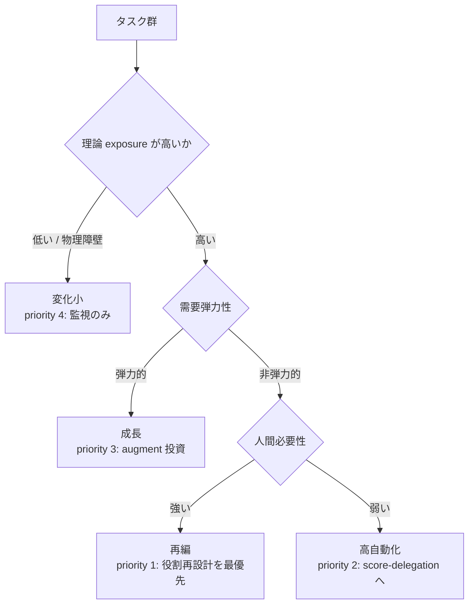
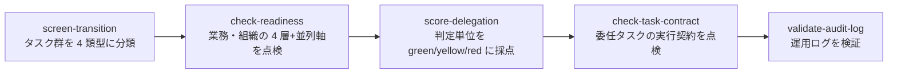
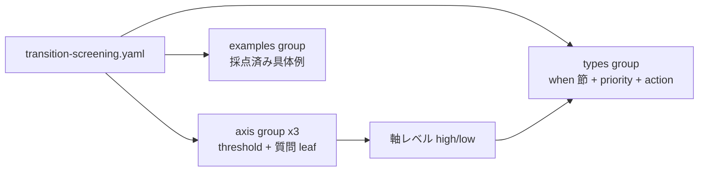

# 09. 委任の前に「どのタスク群から手を付けるか」を 4 類型で地図にする

## TL;DR

委任採点(`score-delegation`)の**前段**として、タスク群を 3 軸(理論 exposure / 人間必要性 / 需要弾力性)で
**AI 移行 4 類型**(成長 / 高自動化 / 再編 / 変化小)に振り分けます。
出力は委任設計の優先度順で、最優先は**再編**(人は残るが人員需要は減りうる、最も設計が要るゾーン)です。
各類型には推奨の意思決定順序(タスク分解 → 仕分け → 役割再定義 → reskill → **headcount は最後**)が付きます。
骨格は OpenAI「AI Jobs Transition Framework for the EU」(2026-06)から抽出した**簡易スクリーニング**であり、
原典の定量推計の再現ではありません(**予測ではなく準備の地図**)。

## 前提(これだけ知っていれば読めます)

- 全体像([docs/00](00_overview.md))の本線 5 ステップのうち、本書は
  **ステップ 1(どこから手を付けるか)** を扱います
- **exposure(エクスポージャ)**= タスク時間のうち、現行の AI で代替・短縮できる部分の
  割合。「理論上できる」であって「実際に使われている」ではありません
- **需要弾力性** = コストが下がったとき需要(依頼件数)が増えるか。増えるなら
  AI 化は削減でなく成長につながります
- **HITL**(human-in-the-loop)= 人間を最終判断に残す運用
- 物語上の位置: ミドリ精機の経理部が、経営指示を受けて最初にやることを決める場面です

## When to use this

- AI 化の対象選定で「削減対象探し」に引きずられず、**どのタスク群から委任設計に手を付けるか**を根拠付きで決めたいとき
- 顧客・経営への提案で「4 類型マップ → 委任設計 → headcount は最後」の**意思決定順序**を一次データ付きで示したいとき
- `score-delegation` / `check-readiness` の採点対象(母集団)を選ぶ前段が欲しいとき

## Quick use

```bash
# タスク群を 4 類型に振り分ける(委任設計の優先度順に出力)
bin/aidr screen-transition examples/task-groups/sample-task-groups.yaml

# 軸の構成を確認
bin/aidr list-definitions --target transition
```

出力例(ミドリ精機のタスク群 4 つ。抜粋):

```text
[REORG ] priority 1: financial_disclosure_draft: REORGANIZATION [HITL]  (technical_exposure=high(2/3), human_necessity=high(2/3), demand_elasticity=low(1/3))
[AUTO  ] priority 2: expense_entry_check: HIGH_AUTOMATION  (technical_exposure=high(3/3), human_necessity=low(0/3), demand_elasticity=low(0/3))
[GROWTH] priority 3: sales_proposal_draft: GROWTH  (technical_exposure=high(3/3), human_necessity=high(1/3), demand_elasticity=high(3/3))
[STABLE] priority 4: equipment_maintenance: MINIMAL_CHANGE  (technical_exposure=low(1/3), human_necessity=high(1/3), demand_elasticity=low(1/3))
```

決算開示資料ドラフトが最優先(再編 + HITL)、経費精算チェックが委任採点へ進む候補
(高自動化)になりました。物語はここから経費精算チェックの readiness 診断
([docs/01](01_four_layer_framework.md))へ進みます。

- **全質問への回答が必須**です(fail-closed)。未回答があると欠落 id を列挙して入力エラー(exit 3)になります。
  未回答を no 扱いすると、人間必要性が low に倒れて高自動化(人間不要側)へ誤分類されるためです。
- 成功時の exit code は**常に 0** です。スクリーニングは合否ゲートでなく分類なので、
  類型は exit code に写しません(`score-delegation` の 0/1/2 とは契約が異なります)。

## Concept

### 3 軸 → 4 類型の決定木

正本は [`definitions/transition-screening.yaml`](../definitions/transition-screening.yaml) です。値はここに二重保持しません。



| 要素名 | 説明 |
|---|---|
| 理論 exposure(technical_exposure) | タスク時間が現行 AI に晒される度合い。E1〜E3 の 2/3 yes で high |
| 需要弾力性(demand_elasticity) | AI がコストを下げたとき需要が拡大するか。D1〜D3 の 2/3 yes で high |
| 人間必要性(human_necessity) | 規制・関係・物理の**いずれか**で人間が残る必要。H1〜H3 の **1 つでも** yes で high |
| 再編(reorganization) | 人は残るが人員需要は減りうる最難ゾーン。委任設計の最優先(priority 1) |
| 高自動化(high_automation) | 委任候補。まず `check-readiness` で業務を診断し、PASS 後に `score-delegation` で判定単位に採点する |
| 成長(growth) | コスト低下が需要を拡大。augment 投資・役割拡張 |
| 変化小(minimal_change) | 低 exposure / 物理障壁。監視のみで過剰投資を避ける |

**この決定木は原典の再現ではありません。** OpenAI の原典は ESCO 職業分類上の定量推計
(net-effect)であり、本定義はその概念構造を観測可能な yes/no 質問に落とした
**簡易スクリーニング(design_proposal)**です。境界例は必ず人が見直してください。

### HITL 固定域と委任マトリクスの対応

human_necessity の H1(規制)は **HITL 既定固定域 = 権利・財務・健康・規制**の正本です。
H1 = yes のタスク群は、**類型がどれであっても** `human_control_required: true`(text 出力では
`[HITL]`)が付きます。成長類型に落ちても財務の最終承認は人間に残る、を握りつぶさないためです。

| 本定義(スクリーニング) | 委任マトリクス([docs/03](03_delegation_matrix.md)) | 意味 |
|---|---|---|
| H1 = yes(規制固定域) | red 領域(human only)の運用上の既定 | 最終判断は人間。AI は参照のみ |
| H2 / H3 = yes(関係・物理) | (マトリクス対象外のことが多い) | 委任対象のタスク自体が少ない |
| human_necessity = low | green / yellow を `score-delegation` で判定 | 判定単位の採点へ進む |

スクリーニングは**タスク群**の粗い分類、委任マトリクスは**判定単位**の採点です。
H1 = yes でも、群の中の個別判定が green になることはあります(例: 財務承認業務の中の
機械的チェック)。その場合も最終承認の判定だけは red(human only)に残します。

### 意思決定の順序 — headcount は最後

4 類型の地図は「誰を減らすか」ではなく「どの職務をどう再設計するか」を決めるためのものです。
推奨順序は各類型の `action`(正本: 定義 YAML)に埋め込まれており、CLI 出力にそのまま表示されます。

1. タスク分解(職種名でなくタスク単位で見る)
2. automate / augment / human の仕分け
3. 役割再定義
4. reskill と権限移譲
5. **headcount は最後に決める**

削減判断の前には redeploy 経路(スキル隣接性)の評価を挟みます。WEF Future of Jobs Report 2025 は
100 人中 **29 人が現職 upskill / 19 人が redeploy 可能 / 11 人が移行困難**という目安を示します
(**confidence: claim_needs_verification** — 一次 PDF が取得できず二次要約由来。
顧客向け資料で断定値として使わないでください)。マクロ推計であり個社にそのまま写像はできませんが、
「削減候補に見える層にも相当の再配置余地がある」ことの参照値になります。

### 数値の出典と取り違え注意

| 数値 | 値 | confidence |
|---|---|---|
| EU 雇用シェア(成長/高自動化/再編/変化小) | **12 / 14 / 27 / 47%** | observed_fact |
| 米国版(比較用) | 18 / 24 / 12 / 46% | observed_fact |
| capability overhang(理論 vs 観測 exposure) | 92.8% vs 24.6% | observed_fact |
| exposure-only モデルの採用変動説明力 | 約 14%(比較優位モデルは約 60%) | claim_needs_verification |
| 生成 AI 導入組織で測定可能リターンなし | 95% | claim_needs_verification |

**取り違え注意**: 一部の二次メディアは EU の数値を「自動化 18% / 再編 24%」と報じていますが、
これは**米国版の数値の取り違え**です。OpenAI の EU 報告書は「EU は米国より automation 比率が
小さい」と明記しており、EU の高自動化は 14% が正です。出典 URL と confidence ラベルは定義 YAML の
`types` group の `case_evidence` が正本で、`--format json` の出力にも同梱されます。

### ■構造(パイプラインのどこに入るか)



| 要素名 | 説明 |
|---|---|
| screen-transition | **今回追加**。母集団(タスク群)の分類と優先順位付け。合否は出さない |
| check-readiness | 優先度が付いた業務の readiness を点検 |
| score-delegation | 高自動化ゾーンの判定単位を委任マトリクスで採点 |
| check-task-contract | 委任する 1 タスクの与え方・採点者を点検 |
| validate-audit-log | 運用開始後のログを検証 |

順序の正本は README の「使い方(想定ワークフロー)」です。スクリーニングで優先度を付けた
タスク群に対し、業務単位の readiness(check-readiness)→ 判定単位の採点(score-delegation)
の順で掘り下げます。

### ■データ

概念モデルは委任マトリクス([docs/03](03_delegation_matrix.md))と同じ枠組みです:
axis group(header の `threshold` + 質問 leaf)と、軸レベルの組をルックアップする
`types` group(委任マトリクスの `regions` に相当)、および `examples` group(データ)。



| エンティティ | 説明 |
|---|---|
| axis group | `technical_exposure` / `human_necessity` / `demand_elasticity`。header の `threshold` で high/low を決める |
| 質問 leaf | 観測可能な yes/no 質問。`flag: human_control` を持つ leaf(H1)は HITL フラグの源 |
| types group | 軸レベル 3 つ組 → 類型のルックアップ。`delegation_priority` と `action`(推奨文言の正本)を持つ |
| examples group | 採点済みの具体例(design_proposal)。overlay で自社例を追加できる。**定義内の examples は各類型の判定基準を例示するリファレンスケースで、ミドリ精機の物語とは独立** |

overlay で可能なのは 3 軸 + examples への `add` のみです。**threshold の strengthen は
意図的に開けていません** — 閾値を上げると exposure=high に入りにくくなり、再編対象が
変化小(監視のみ)へ落ちて**見逃される**ためです(準備の地図では見逃しが害)。

## References

- 正本: [`definitions/transition-screening.yaml`](../definitions/transition-screening.yaml)(質問の日本語文は `text_ja`)
- サンプル: [`examples/task-groups/sample-task-groups.yaml`](../examples/task-groups/sample-task-groups.yaml)(ミドリ精機のタスク群 4 つ)
- 物語の前後: 本書がステップ 1 です。次のステップは
  [01 4 層フレーム](01_four_layer_framework.md)(readiness 診断)→
  [03 委任マトリクス](03_delegation_matrix.md)(判定単位の振り分け)
- 出典: [Mapping Europe's AI Workforce Opportunity (OpenAI EU)](https://openai.com/index/mapping-ai-jobs-transition-eu/) /
  [The AI Jobs Transition Framework for the EU (PDF)](https://cdn.openai.com/pdf/the-ai-jobs-transition-framework-for-the-eu.pdf) /
  [GPTs are GPTs (Eloundou et al. 2023)](https://arxiv.org/abs/2303.10130) /
  [WEF Future of Jobs Report 2025 (PDF)](https://reports.weforum.org/docs/WEF_Future_of_Jobs_Report_2025.pdf) /
  抽出元の分析記事: [OpenAIのEU職種4類型マップを経営の職務再設計に使う](https://suwa-sh.github.io/zenn-contents/articles/openai-eu-ai-jobs-transition_20260630/)
