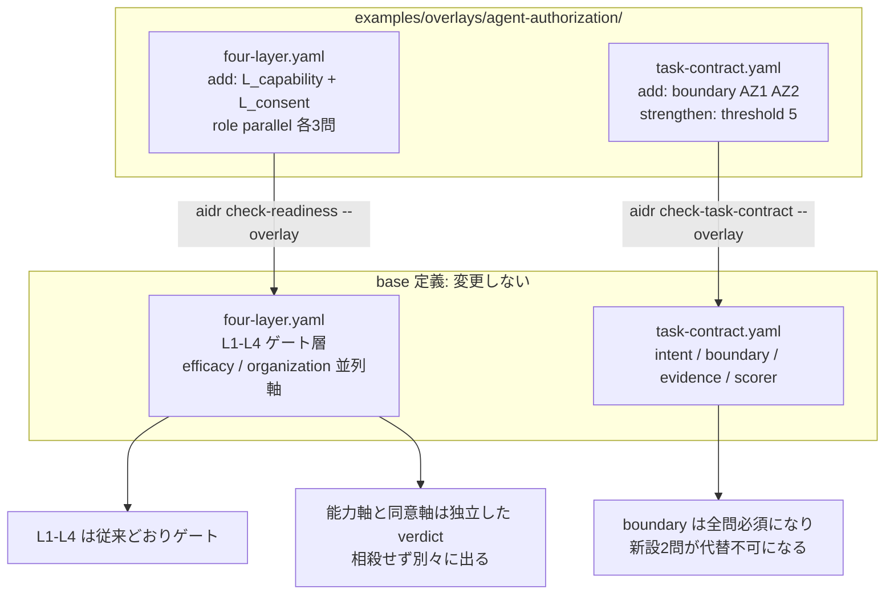

# 10. エージェントに渡す権限を能力軸と同意軸に分けて点検する

## TL;DR

エージェントに権限を渡す設計で「ユーザーに確認を取っているから大丈夫」と言えるのか? —
答えは「言えない」です。**同意をいくら丁寧に取っても越えられない壁**が実行基盤側にあり、
逆に**同意の形式が完璧でも有効とは限らない**からです。本 overlay は base 定義を変えずに、
権限設計を **能力軸**(実行基盤が何を許すか)と **同意軸**(利用者が何を許すか)の
2 本の並列軸として採点し、どちら側が薄いかを別々の verdict で示します。

骨格は **エージェント権限の 2 軸分解の分析** から抽出しています。事実と一般化はラベル分けで
示します: **【観測事実】** / **【設計提案】**。

## 前提

- 本書は**応用編**です。本線 5 ステップ([docs/00](00_overview.md))と
  overlay の仕組み(README の「自社ルールで拡張する」)を先に読んでください
- **能力**(capability)= 実行基盤が主体に行使を許す範囲。ユーザーの意思とは独立に決まります
- **同意**(consent)= 利用者が何を・どの粒度で許諾するか
- **TCB**(Trusted Computing Base)= そのシステムの安全性が依存している構成要素の集合。
  ここに含まれたものが壊れると全体が壊れます
- **elicitation** = エージェントが処理の途中で利用者に確認を求める仕組み
- **DMA**(Digital Markets Act)= EU のデジタル市場法。大手プラットフォームに相互運用性を義務付けます
- **TCF**(Transparency and Consent Framework)= 広告業界の同意管理の標準枠組み
- 題材は架空の顧客対応部門で、ミドリ精機の物語とは独立した応用例です

## When to use this

- エージェントに権限を渡す設計をレビューし、能力側の壁と同意側の穴を切り分けたい
- 顧客に「ここは同意設計では開かない、方針変更が要る」と根拠つきで説明したい
- 既存の権限設計が「確認ダイアログを増やす」方向に寄っていないか点検したい

## 事例で見る(架空の顧客対応部門)

```bash
bin/aidr check-readiness examples/business/sample-agent-authz-readiness.csv \
  --overlay examples/overlays/agent-authorization/four-layer.yaml
```

入力: [`examples/business/sample-agent-authz-readiness.csv`](../examples/business/sample-agent-authz-readiness.csv)

問い合わせへの一次回答をエージェントに起案させている部門です。業務そのものは標準化が
進んでおり、権限の棚卸しも実施しています。

```text
Target: 顧客問い合わせ一次回答エージェント(架空)

[OK] L1 業務標準化層: PASS (100%)
[OK] L2 判断構造化層: PASS (100%)
[OK] L3 委任範囲層: PASS (100%)
[OK] L4 統制・追跡層: PASS (100%)
[OK] efficacy 効果測定: PASS (100%)
[OK] organization 組織 readiness層: PASS (100%)
[OK] L_capability 能力軸: PASS (100%)
[NG] L_consent 同意軸: BLOCK (33%)
    no: L_consent.S1, L_consent.S3

Conclusion: BLOCK
```

出力の読み方は次のとおりです。

- **L1〜L4 と組織軸はすべて PASS** — 業務プロセスとしては委任に耐えます
- **`L_capability` は PASS** — 禁止能力の分類、未行使権限の削除、LLM を TCB に含める判断の
  記録がそろっています
- **`L_consent` は BLOCK** — 同意の文面は整っていますが、利用者が何に同意したか理解できて
  いるかを実測しておらず(S1)、運用は確認ダイアログを増やす方向に寄っています(S3)
- **`Conclusion: BLOCK`** — 並列軸の BLOCK は全体結論を BLOCK にします。ただし
  `First gate to fix` は出ません。並列軸はゲート層ではないため、L1〜L4 の積み上げを塞がないからです

**ここが 2 軸に分ける理由です。** 仮に 6 問を 1 本の軸にまとめていたら 4/6 = 67% となり、
中間の REVISE に丸められて BLOCK が消えます。能力側の充実が同意側の欠落を埋め合わせた形に
見えてしまい、**能力と同意は互いに代替しない**という主張を採点モデル自身が壊します。

タスク単位側も点検できます。

```bash
bin/aidr check-task-contract examples/task-contracts/sample-agent-authz-contract.csv \
  --overlay examples/overlays/agent-authorization/task-contract.yaml
```

入力: [`examples/task-contracts/sample-agent-authz-contract.csv`](../examples/task-contracts/sample-agent-authz-contract.csv)

```text
Task: 問い合わせ 1 件への一次回答ドラフト作成(架空)

[GREEN ] intent 意図: PRESENT (3/2)
[YELLOW] boundary 境界: PARTIAL (4/5)
    no: boundary.AZ2
[GREEN ] evidence 証跡: PRESENT (3/2)
[GREEN ] scorer 採点者: PRESENT (2/2)

scorer: two_stage (iRULER double-eval: no)

Region: YELLOW — 要素に穴
  Every element is addressed but at least one is below threshold. Fill the
thin element before delegating; the contract is incomplete, not unsafe by
itself.
```

担当者が対象の 1 件を選択し、その 1 件だけが読み取り範囲になる設計(AZ1)まではできています。
関連案件を辿る過程で参照範囲が広がりうる点(AZ2)が露出して YELLOW に落ちました。

**同じ回答内容を base 定義だけで採点すると GREEN です。** boundary は 3 問中 2 問で present に
なるため、B1〜B3 が yes ならその時点で通ります。この差が、閾値を強化した効果です。
なおこのサンプル自体を `--overlay` なしで実行することはできません。CSV は未知の質問 id を
拒否するため、AZ1 / AZ2 の行が入力エラー(exit 3)になります。base との比較は
`tests/test_check_task_contract.py` が同一回答を両方の定義で採点して固定しています。

## Concept

### 能力軸 — 同意では越えられない壁

正本は [`examples/overlays/agent-authorization/four-layer.yaml`](../examples/overlays/agent-authorization/four-layer.yaml)
の `L_capability` group です。値はここに二重保持しません。

【観測事実】Android 16 の CDD 9.8 は、ユーザーがインストールしたアプリが hotword detection
service を提供することを禁じています。技術的に不可能なのではなく、互換性の方針で閉じている
状態です。ユーザーがどれだけ同意しても開きません。

【観測事実】seL4 の設計思想では、capability は「without referring back to Alice」に行使できる
ことが要点です。**非対話性こそが capability の目的**なので、そこにユーザーへの問い合わせを
差し込む行為は設計目標そのものに反します。同意は capability レイヤの中に後付けできません。

【設計提案】この非対話性は seL4 に限らないというのが出典分析の一般化です。capability が強い
システム(Capsicum / Fuchsia / WASI)ほどユーザー同意の概念を持たず、最も弱い Deno だけが
まともな同意機構を持つ、という横断の観察です。ここで引用している seL4 白書が裏付けるのは
seL4 の分だけなので、残りは一般化として扱ってください。

【設計提案】能力を閉じる仕組みは 1 種類ではありません。設計の議論では 4 つを区別すると
噛み合います。

| ゲート種別 | 同意での通過 | 方針変更で開くか |
|---|---|---|
| 技術的制約 | 不可 | 開かない(本質的) |
| 出荷形態ゲート | 不可 | **開く**(方針による) |
| allowlist ゲート | 不可 | **開く**(方針による) |
| 流通ポリシーゲート | 不可 | **開く**(契約による) |

2 番目から 4 番目は技術的必然ではありません。「できない」と言われたとき、それが物理的な
制約なのか方針上の制約なのかで、打てる手が変わります。C1 はこの区別を記録しているかを問います。

### 同意軸 — 形式が整っていることと有効であることは別

正本は同ファイルの `L_consent` group です。

【観測事実】IAB TCF は同意を 11 の purposes と約 5000 ベンダーの機械可読リストとして
**列挙できています**。それでもブリュッセル市場裁判所は 2025 年 5 月 14 日、この枠組みが
GDPR の有効な法的根拠を確立できていないと判示しました。列挙は同意に**表現形式**を与えますが、
**有効性**は与えません。

【観測事実】W3C TAG の設計原則は、パーミッションプロンプトを**失敗モード**として扱い、
確認は例外的な場合にのみ行うべきだとしています。

【設計提案】エージェントは行動回数が多いため、この問題が行動数に比例して悪化する、というのが
出典分析の一般化です。悪化の度合いそのものは TAG が示した観測値ではありません。

【設計提案】したがって狙うべきは確認の回数を増やすことではなく、**同意の形を変える**ことです。
iOS のファイル選択では、利用者は「写真へのアクセス権」という抽象的な権限に同意しているのでは
なく、「この 3 枚」という具体的な指定を行い、その指定がそのまま権限の範囲になります。
選ぶ行為そのものが権限付与になっており、ここでは能力と同意が同時に成立しています。

### 設問が自己申告で yes にならないようにした理由

この分析の中心主張は「列挙 ≠ 最小化」「列挙 ≠ 有効性」です。ここで
「権限の最小化を検討したか」「同意の有効性を評価したか」と問うと、**分析自身が挙げた反例でも
yes になってしまいます**。DMA は 11 機能を列挙しましたし、TCF は同意を精緻に列挙しました。
それでも目的は達していません。設問がこの構造を再現しては意味がありません。

そこで C2 と S1 は**実測・実績の有無**を問う形にしています。

| 設問 | 反例 | 反例での回答 |
|---|---|---|
| C2 未行使権限を洗い出して削除する棚卸しを定期的に行い、直近の回を完了したか | DMA の 11 機能列挙 | **no**(列挙・開放はしたが、未使用権限を継続的に削る運用ではない) |
| S1 利用者が何にどこまで同意したか説明できると実測で確認したか | IAB TCF | **no**(機械可読な列挙はあるが、利用者の理解度は測っていない) |

設問の書き方にも同じ配慮を入れています。

- **C1 は拒否した能力だけでなく棚卸しを求めます。** 拒否した能力だけを採点対象にすると、
  すべてを許可しているエージェントは対象集合が空になり、自動的に yes になってしまいます
- **C2 は過去の実績でなく継続運用を求めます。** 「一度 2 件削除した」が永久に yes のままだと、
  その後に権限が積み上がっても検出できません
- **S1 が測るのは理解度であって法的有効性ではありません。** 有効性の判断は法務や規制当局の
  領分で、診断ツールが下せる判定ではありません。理解度の実測は観測可能な代理指標です。
  TCF がここで no になるのは「測っていないから」であり、yes が有効性の証明になるわけではありません

### 閾値の読み方

2 軸とも 3 問等重み、`pass: 1.0` / `revise: 0.66` です。3 問すべて yes で PASS、
2 問で REVISE、1 問以下で BLOCK になります。2 軸は**対称**にしてあります。片方だけ厳しくすると、
どちら側が薄いかを読み比べられなくなるためです。

タスク単位側の `boundary` は threshold を 2 → 5(全問必須)に強化しています。task-contract は
比率でなく**件数**で判定するため、2 問足して threshold を据え置くと 5 問中 2 問(40%)になり、
base の 3 問中 2 問(67%)より緩みます。算術上は 4 で単調性を保てますが、4 だと新設 2 問が
互いに代替可能になり、どちらか一方が no でも present と判定されます。

### 運用指針

権限設計を見直すときは次の順で考えます。

| 順序 | 判断 |
|---|---|
| 1 | 能力の問題か、同意の問題かを最初に切り分ける |
| 2 | 能力側は列挙する。ただし最小化との混同を避ける |
| 3 | 同意側は選択行為そのものを権限付与にする形を志向する |
| 4 | 機微な同意はエージェントの文脈の外へ分離する |
| 5 | LLM を TCB に含めるかを明示的に決める |

4 番目について補足します。MCP の URL mode elicitation はこの形を採用しており、クライアントは
URL を自動取得してはならず、明示同意なしに開いてはならず、完全な URL を利用者に提示する必要が
あります。エージェントに権限を渡すのではなく、**同意の瞬間だけエージェントを迂回させる**設計です。

### 適用範囲の限定 — プロンプトインジェクション対策ではありません

**この 2 軸はプロンプトインジェクション対策になりません。** capability を正しく配っても、
プロンプトインジェクション由来の confused deputy は止まらないためです。攻撃者が LLM の判断を
操作した場合、**権限は正規、同意も正規のまま、対象の指定だけが攻撃者の制御下に入ります**。

2 軸は問題を分解する語彙です。攻撃を防ぐ機構は別のレイヤに必要です。

なお、エージェントの委譲権限には批准済みの標準がまだありません。純粋な capability システムに
おける権限伝播の問題は 1984 年に指摘されて以来、未解決のまま残っています。

### ■構造(overlay が base のどこに効くか)



- **2 軸とも並列軸**: header に `role: parallel` を指定するため、`check-readiness` の
  `axis_role()` が並列軸として扱い、efficacy / organization と同じ枠で採点します。
  ゲート層(L1〜L4)の `blocked_from` には関与しません。振り分けの仕組みとデータモデルは
  [`03_organization_axis.md`](03_organization_axis.md) の■構造・■データを参照(同じ枠組みです)
- **`L_` 接頭辞の理由**: overlay で新規 group を足せるのは `extension_points` の `L*` selector に
  合う名前だけです。名前の `L` は「ゲート層」を意味しません(gating/parallel は `role` フィールド
  だけで決まります)。同じ回避を `L_insourcing` も採っています
- **高責任ドメイン overlay と併用できます**: `L5` と `L_capability` / `L_consent` は別 id なので、
  `--overlay` を 2 つ渡して同時に適用できます
- **opt-in**: `--overlay` で渡した診断にだけ効きます。base だけの利用者には無影響です

### ■データ

概念モデルは [`03_organization_axis.md`](03_organization_axis.md) の■データと共通です
(base group + overlay が add する leaf、header の `role` で軸種を決定)。本 overlay は
`role: parallel` の group を 2 本(`L_capability` / `L_consent`)とその配下の質問 leaf を
3 つずつ足し、加えて task-contract 側の既存 group `boundary` に質問 leaf を 2 つ足して
その `threshold` を強化します。

## References

- 正本: [`examples/overlays/agent-authorization/four-layer.yaml`](../examples/overlays/agent-authorization/four-layer.yaml) /
  [`examples/overlays/agent-authorization/task-contract.yaml`](../examples/overlays/agent-authorization/task-contract.yaml)
- サンプル: [`examples/business/sample-agent-authz-readiness.csv`](../examples/business/sample-agent-authz-readiness.csv) /
  [`examples/task-contracts/sample-agent-authz-contract.csv`](../examples/task-contracts/sample-agent-authz-contract.csv)
- 関連 doc: [`02_four_layer_framework.md`](02_four_layer_framework.md)(4 層フレーム)/
  [`03_organization_axis.md`](03_organization_axis.md)(並列軸とゲート層の振り分け・データモデル)/
  [`05_task_contract_execution_rubric.md`](05_task_contract_execution_rubric.md)(実行ルーブリックと overlay 単調性)/
  [`09_insourcing_judgment_overlay.md`](09_insourcing_judgment_overlay.md)(並列軸を足す別のドメイン overlay)
- 出典: エージェント権限の 2 軸分解の分析。一次資料は
  [Android Compatibility Definition Document](https://source.android.com/docs/compatibility/cdd) /
  [seL4 Whitepaper](https://sel4.systems/About/seL4-whitepaper.pdf) /
  [W3C TAG Design Principles](https://www.w3.org/TR/design-principles/) /
  [Model Context Protocol Specification](https://modelcontextprotocol.io/specification/2025-11-25) /
  [DMA: Commission guidance to Google for AI interoperability on Android (2026-07-16)](https://digital-markets-act.ec.europa.eu/commission-provides-guidance-google-ai-interoperability-android-and-sharing-google-search-data-under-2026-07-16_en) /
  [The Confused Deputy](https://cap-lore.com/CapTheory/ConfusedDeputy.html)
