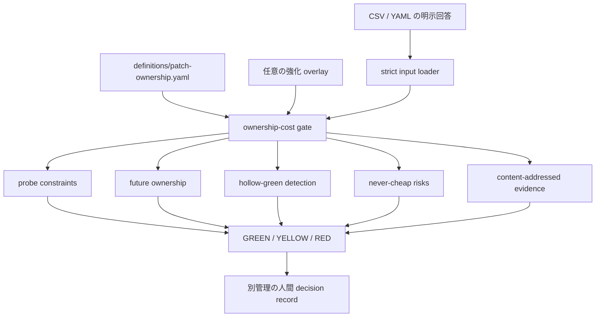
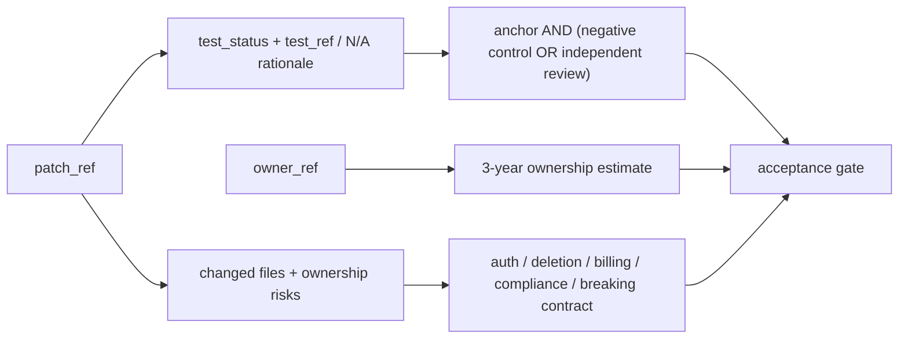

# 11. AI 生成パッチの所有コスト受入ゲート

## TL;DR

`aidr check-patch-ownership` は、AI が生成したコード差分を「いま動くか」だけでなく、
人間が将来も保守・検証・障害対応・説明できるかで判定します。GREEN は自動マージ命令では
なく、受入判断に進める最低条件です。認可・削除・課金・規制・公開契約の変更は、統制が
揃っても YELLOW の人間判断です。テスト証拠なし、hollow green、高リスク統制不足は RED です。

## 前提

- 対象は AI が全体または一部を生成したコード差分です
- 判定者は、その差分を受け入れる Engineering Manager、maintainer、CODEOWNER です
- **所有コスト**は実装時間ではなく、3 年間の保守・再検証・障害対応・説明責任を含みます
- CLI は証拠参照の形式と digest を検査しますが、参照先を取得・再検証しません
- 最終的な採否記録はゲート結果とは別の decision record に残します

## When to use this

- coding agent の成果物を PR または main へ受け入れる前
- 「テストは緑だが、この変更を本当に引き取れるか」を明示的に判断したいとき
- AI 生成差分の受入条件を CI で fail-closed にしたいとき
- 自社固有の探針条件・所有条件・高リスク分類を overlay で追加したいとき

## ミドリ精機の例

ミドリ精機の開発チームは、経費精算エージェントの小さな修正を coding agent に依頼しました。
テスト成功だけを採用条件にせず、将来所有者、変更ファイルの risk manifest、外部仕様に固定した
期待値、negative control を記録します。

```bash
bin/aidr init --target patch-ownership --format csv > my-patch.csv
bin/aidr check-patch-ownership my-patch.csv --format json
```

同梱例は境界を 3 本に分けています。

| サンプル | 判定 | 理由 |
|---|---|---|
| [`sample-cheap-green.csv`](../examples/patches/sample-cheap-green.csv) | GREEN | 最小差分・所有責任・実質的テスト証拠が揃い、高リスクなし |
| [`sample-never-cheap-yellow.csv`](../examples/patches/sample-never-cheap-yellow.csv) | YELLOW | 認可境界を変更するため、統制が揃っても人間が採否判断 |
| [`sample-hollow-green-red.csv`](../examples/patches/sample-hollow-green-red.csv) | RED | テスト期待値の外部 anchor がなく hollow green |

## 判定の構造





機械可読の正本は [`definitions/patch-ownership.yaml`](../definitions/patch-ownership.yaml) です。
probe は全項目、ownership は通常時 O1〜O3、高リスク時 O1〜O4 が必要です。
hollow green は固定論理 `H1 AND (H2 OR H3)` で判定し、overlay から変更できません。

## exit code とゲート

| exit | region | 意味 |
|---:|---|---|
| 0 | GREEN | 高リスクなし。probe・ownership・evidence・test integrity が成立 |
| 1 | YELLOW | 統制済み高リスク、または通常条件に不足。自動受入しない |
| 2 | RED | テスト証拠なし、hollow green、高リスク統制不足。受入不可 |
| 3 | input error | 未回答・曖昧回答・未知 ID・重複 YAML key・不正 enum/ref/overlay |

`never_cheap.N1`〜`N5` は認可、データ保持/削除、課金/会計、規制/プライバシー、
公開契約の破壊的変更です。1 つでも yes なら GREEN にはなりません。

## 証拠参照の契約

許可形式は次の 4 つです。`TBD` や短縮 SHA は拒否します。

```text
git:<40-hex-commit>
file:<relative-path>#sha256=<64-hex-digest>
https://...#sha256=<64-hex-digest>
ci:<provider>:<run-id>#sha256=<64-hex-digest>
```

`evidence.test_status` は `present | absent | not_applicable` のいずれかです。
`present` は `test_ref`、`not_applicable` は再確認可能な `test_na_ref` を要求します。
この検査は参照文字列の content address を確認するだけで、ファイル・URL・CI を開きません。
そのため、証拠内容の真正性と意味的妥当性は受入者が別途確認してください。

## overlay で強化する

`probe` と `ownership` の追加質問は GREEN の必須条件、`never_cheap` の追加質問は
新しいハードリスクになります。`hollow_green` の拡張・置換はできません。

```bash
bin/aidr check-overlay examples/overlays/patch-ownership/extra-risk.yaml
bin/aidr check-patch-ownership my-patch.csv \
  --overlay examples/overlays/patch-ownership/extra-risk.yaml
```

## 回顧検証と限界

[`tests/fixtures/patch_ownership_validation/`](../tests/fixtures/patch_ownership_validation/) には、
実コミット 5 件の full SHA・差分 digest・質問回答・期待 region だけを保存しています。
raw diff、秘密情報、存在しなかったテスト/レビュー証拠は保存も捏造もしていません。
さらにテストで 5 種の高リスク、hollow-green の全真理値、条件付き統制を合成変異させています。

このゲートは脆弱性スキャナ、コードレビュー、テスト実行、法務判断の代替ではありません。
「低コストに見える AI 生成」を、人間が負う長期責任へ変換して問うための受入境界です。

## References

- 正本: [`definitions/patch-ownership.yaml`](../definitions/patch-ownership.yaml)
- CLI 実装: [`src/adr/check_patch_ownership.py`](../src/adr/check_patch_ownership.py)
- AI エージェント連携例: [`examples/skills/patch-ownership-check/`](../examples/skills/patch-ownership-check/)
