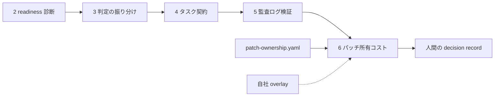
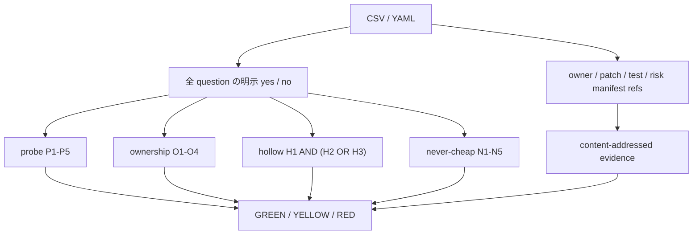

# 11. AI 生成パッチを将来も所有できる条件で受け入れる

## TL;DR

AI が生成したパッチは、テストが通っただけでは「受け入れてよい」と言えません。
`aidr check-patch-ownership` は、**この変更を人間が将来も保守・検証・説明できるか**を問い、
🟢 **受入判断へ進める** / 🟡 **人間が採否を決める** / 🔴 **受入不可** に分けます。
認可・削除・課金・規制・公開契約を変えるパッチは、統制が揃っても自動受入しません。
GREEN も自動マージ命令ではなく、人間が受入判断へ進むための最低条件です。

正本は [`definitions/patch-ownership.yaml`](../definitions/patch-ownership.yaml) です。

## 前提

- 全体像([docs/00](00_overview.md))の本線 6 ステップのうち、本書は
  **ステップ 6(AI 生成パッチを将来も所有できるか)** を扱います
- **所有コスト** = 実装時間ではなく、3 年間の保守・再検証・障害対応・説明責任です
- **hollow green** = テストが成功していても、実装の現在の挙動をなぞるだけで
  要求を検証できていない状態です
- 判定者は、差分を受け入れる Engineering Manager、maintainer、CODEOWNER です。
  最終的な採否は、ゲート結果とは別の decision record に残します

## When to use this

- coding agent が生成した commit / PR / diff を受け入れる前
- 「テストは緑だが、この変更を本当に引き取れるか」を明示的に判断したいとき
- AI 生成差分の受入条件を CI で fail-closed にしたいとき
- 自社固有の探針条件・所有条件・高リスク分類を overlay で追加したいとき

## ミドリ精機の事例で見る(🟢・🟡・🔴 の 3 例)

ミドリ精機の開発チームは、経費精算エージェントの修正を coding agent に依頼しました。
テスト成功だけを採用条件にせず、将来の所有者、変更ファイルの risk manifest、
外部仕様に固定した期待値、negative control を記録してから判定します。

```bash
bin/aidr check-patch-ownership examples/patches/sample-cheap-green.csv
# => Region: GREEN — 所有可能(exit 0)

bin/aidr check-patch-ownership examples/patches/sample-never-cheap-yellow.csv
# => Region: YELLOW — 人間の採否判断が必要(exit 1)

bin/aidr check-patch-ownership examples/patches/sample-hollow-green-red.csv
# => Region: RED — 受入不可(exit 2)
```

入力: [`examples/patches/sample-cheap-green.csv`](../examples/patches/sample-cheap-green.csv) /
[`sample-never-cheap-yellow.csv`](../examples/patches/sample-never-cheap-yellow.csv) /
[`sample-hollow-green-red.csv`](../examples/patches/sample-hollow-green-red.csv)

| 例 | 出力の読み方 |
|---|---|
| sample-cheap-green → 🟢 | 最小差分・将来所有者・実質的テスト証拠が揃い、高リスク分類がない。**人間の受入判断へ進める** |
| sample-never-cheap-yellow → 🟡 | 認可境界を変える。所有統制が揃っても**自動受入せず、指名した人間が採否を決める** |
| sample-hollow-green-red → 🔴 | テスト期待値の外部 anchor がない。テスト成功を根拠にせず、**受け入れない** |

自社用の入力は `bin/aidr init --target patch-ownership --format csv > my-patch.csv` で
生成します。終了コードは CI の受入ゲートにそのまま使えます。

## Concept

ここからは、3 つの判定領域(外側)→ 判定を作る 4 つの観点 → 質問と証拠の詳細 →
運用指針 → 回顧検証と限界 → 構造 / データ(内側)→ overlay、の順に掘り下げます。

### 3 つの判定領域 — 出力が意味するもの

| exit | region | 読み方 | 次の行動 |
|---:|---|---|---|
| 0 | 🟢 GREEN | 高リスクなし。探針・所有責任・証拠・test integrity が成立 | 証拠内容を人間が確認し、採否を decision record に残す |
| 1 | 🟡 YELLOW | 統制済み高リスク、または通常条件に不足 | 自動受入せず、指名した owner が採否を決めるか不足を埋める |
| 2 | 🔴 RED | テスト証拠なし、hollow green、高リスク統制不足 | 受け入れず、欠落した証拠・統制を作り直す |
| 3 | input error | 未回答、曖昧回答、未知 ID、重複 key、不正な enum / ref / overlay | 入力契約を直して再実行する |

GREEN と「merge する」は同義ではありません。CLI は受入可能性を判定し、最終責任は
人間に残します。YELLOW も「条件付き自動承認」ではなく、**人間の採否判断が必須**です。

### 4 つの観点 — なぜテスト成功だけでは足りないのか

| 観点 | 問うこと | GREEN / RED への効き方 |
|---|---|---|
| **探針 probe** | 要求の大きさを測る最小・可逆な差分か | 全必須条件を満たさないと GREEN にならない |
| **将来所有 ownership** | 誰が 3 年間の保守・障害・説明責任を持つか | 通常 O1〜O3、高リスク O1〜O4 が必要 |
| **test integrity** | テストが実装の言い換えでなく要求を検証するか | hollow-green 条件に失敗すると RED |
| **never cheap** | 人間が採否を負うべき高リスク変更か | 1 件でも該当すれば GREEN 禁止 |

### 探針パッチの 5 制約

探針は採用の既定路線ではなく、要求の値札を得るための price discovery です。

| id | 必須条件 |
|---|---|
| P1 | 要求を検証できる、まとまりを保った最小の差分 |
| P2 | 挙動変更は既存 feature flag の裏。適用外ならロールバック容易という根拠あり |
| P3 | 公開契約を維持。破壊的変更なら高リスクとして人間判断へ回す |
| P4 | テストを追加・更新。適用外なら再確認可能な根拠あり |
| P5 | 触った全ファイルと所有リスクを risk manifest に列挙 |

overlay で probe 質問を追加すると、その質問も GREEN の必須条件になります。
threshold は質問数を超えない整数へ強化できますが、緩和はできません。

### 将来の所有責任 — 生成者でなく owner を先に決める

| id | 通常 | 高リスク | 確認すること |
|---|:---:|:---:|---|
| O1 | 必須 | 必須 | 将来 owner を `user:` / `team:` / `codeowners:` で指名したか |
| O2 | 必須 | 必須 | 3 年間の保守・検証・障害対応・説明コストを見積もったか |
| O3 | 必須 | 必須 | 責任分界・エスカレーション・ロールバック owner が明確か |
| O4 | — | 必須 | 高リスク変更を判断する人間 review route を予約したか |

`TBD`、`user:<id>`、空欄は owner ではありません。高リスク時は O4 の yes に加えて、
content-addressed な `ownership.review_route_ref` が必要です。

### hollow green — `anchor AND (negative control OR independent review)`

テスト完全性は yes の合計ではなく、次の固定論理で判定します。

| id | 役割 | 確認すること |
|---|---|---|
| H1 | anchor | 期待挙動が外部契約・修正前失敗・独立作成の受入基準に固定されているか |
| H2 | alternative | negative control・故障注入・修正前失敗で、テストが失敗できると確認したか |
| H3 | alternative | パッチ生成者と別の主体が受入証拠を独立 review したか |

H1 は常に必要です。その上で H2 または H3 のどちらかが必要です。
この論理は安全ゲートなので、overlay から追加・置換・緩和できません。

### 「決して安く所有できない」5 カテゴリ

| id | 高リスク変更 |
|---|---|
| N1 | 認可の挙動・承認境界 |
| N2 | データ保持・削除の意味 |
| N3 | 課金・計量・価格・会計計上の意味 |
| N4 | プライバシー・規制・コンプライアンスの挙動 |
| N5 | 公開 API・ファイル形式・プロトコル・文書化済み契約の破壊 |

1 つでも yes なら GREEN にはなりません。所有統制と review route が揃えば YELLOW、
揃わなければ RED です。カテゴリを追加する overlay は新しい hard risk になります。

### 証拠参照 — content address と実体確認を分ける

許可する参照形式は次の 4 つです。`TBD`、短縮 SHA、絶対 / traversal file path は拒否します。

```text
git:<40-hex-commit>
file:<relative-path>#sha256=<64-hex-digest>
https://...#sha256=<64-hex-digest>
ci:<provider>:<run-id>#sha256=<64-hex-digest>
```

`evidence.test_status` は `present | absent | not_applicable` のいずれかです。
`present` は `test_ref`、`not_applicable` は再確認可能な `test_na_ref` を要求します。
CLI が検査するのは参照形式と digest の存在です。参照先は取得しないため、内容の真正性と
意味的妥当性は受入者が別途確認します。

### 運用指針 — 準備 → 実行 → 人間の採否

1. `aidr init` で入力を生成し、全 question を明示的な yes / no で埋めます
2. patch、test、risk manifest、必要な review route を content-addressed ref にします
3. `aidr check-patch-ownership` を実行し、region と missing controls を確認します
4. 🔴 は受け入れず、🟡 は指名 owner が判断し、🟢 は証拠内容の人間確認へ進めます
5. CLI 結果と最終採否を別々に decision record へ残します

テスト・review・owner の証拠が確認できないときは推測で埋めません。`absent` または no とし、
作成者へ不足を返します。

### 回顧検証と限界

【観測事実】[`tests/fixtures/patch_ownership_validation/`](../tests/fixtures/patch_ownership_validation/)
には、実コミット 5 件の full SHA、差分 digest、redacted risk manifest、質問回答、期待 region を
保存しています。raw diff・秘密情報・存在しなかった test / review 証拠は保存も捏造もしていません。

【設計提案】5 種の高リスク分類、hollow-green 論理、3 年所有コストは、本リポが採用した
規範的な受入境界です。普遍的に実証された閾値ではありません。自社で追加質問を置く場合も、
緩和でなく追加・強化として運用します。

このゲートは、脆弱性 scan、code review、テスト実行、法務判断の代替ではありません。
また、証拠参照の実体を取得しないため、GREEN だけを根拠に merge してはいけません。

### ■構造(本線のどこに入るか)



### ■データ(判定入力の概念モデル)



機械可読の判定条件は定義 YAML、条件評価は
[`src/adr/check_patch_ownership.py`](../src/adr/check_patch_ownership.py) にあります。
成功時の JSON は `schema_version` を持ち、CSV は固定 header を持ちます。
入力契約違反は `[ERROR]` と exit 3 で返します。

### 拡張(overlay)

`probe` / `ownership` への追加は GREEN の必須条件、`never_cheap` への追加は
新しい hard risk です。既存項目の上書き・削除、hollow-green の変更、閾値緩和は拒否します。

```bash
bin/aidr check-overlay examples/overlays/patch-ownership/extra-risk.yaml
bin/aidr check-patch-ownership my-patch.csv \
  --overlay examples/overlays/patch-ownership/extra-risk.yaml
```

## References

- 正本: [`definitions/patch-ownership.yaml`](../definitions/patch-ownership.yaml)
- サンプル入力: [`examples/patches/`](../examples/patches/)(GREEN / YELLOW / RED)
- CLI: `bin/aidr check-patch-ownership --help` / テンプレート生成は `bin/aidr init --target patch-ownership --format csv`
- AI エージェント連携例: [`examples/skills/patch-ownership-check/`](../examples/skills/patch-ownership-check/)
- 前のステップ: [06 監査ログスキーマ](06_audit_log_schema.md)
- 関連 doc: [`05_task_contract_execution_rubric.md`](05_task_contract_execution_rubric.md)(委任タスクの受入条件) /
  [`07_audit_log_gap_check.md`](07_audit_log_gap_check.md)(証拠を残す既存基盤の点検)

次のステップ: [12 パッチ受入の運用ループ](12_patch_decision_loop.md)(決定記録と月次の破棄率振り返り)
