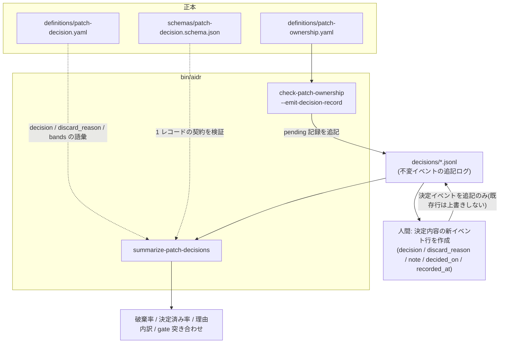
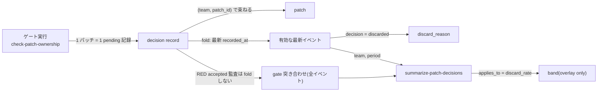
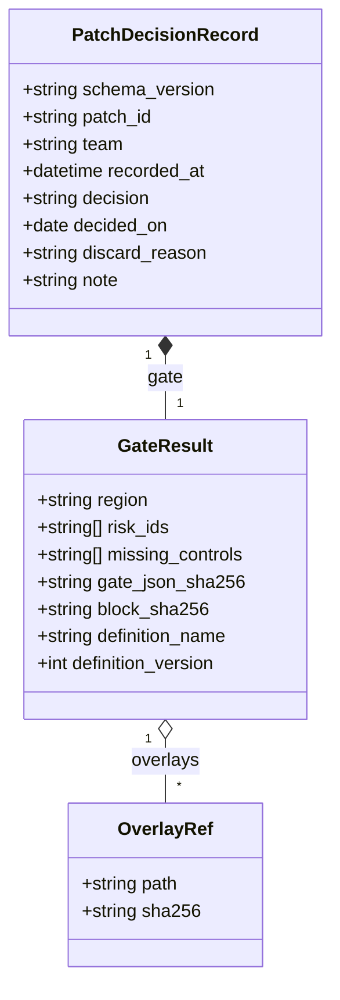

# 12. パッチ受入ゲートの後、破棄率で「乱発」と「断れていない」を見分ける

## TL;DR

`aidr check-patch-ownership` は 1 件のパッチを GREEN / YELLOW / RED に分けますが、
GREEN でも人間の最終採否は別の**決定記録**に残す約束でした([docs/11](11_patch_ownership_gate.md))。
本書は、その決定記録の**形式**と、月次でそれを集計する `aidr summarize-patch-decisions` を扱います。
出るのは **破棄率**(捨てた割合)と**決定済み率**(まだ決めていない件数がどれだけ残っているか)の
2 つだけです。破棄率は高すぎても低すぎても失敗の兆候になります。

正本は [`definitions/patch-decision.yaml`](../definitions/patch-decision.yaml) /
[`schemas/patch-decision.schema.json`](../schemas/patch-decision.schema.json) です。

## 前提

- 本書は [docs/11 パッチ所有コスト](11_patch_ownership_gate.md)の**運用ループ(拡張)**です。
  本線 6 ステップは変わりません。ステップ 6 の先に位置する、月次の任意運用として読んでください
- **決定記録(decision record)** = 1 パッチについて「ゲートの判定」と「人間の採否」を
  1 レコードにまとめた不変イベント。JSON Lines(1 行 1 レコード)で追記します
- **破棄率(discard rate)** = 探針パッチのうち、人間が「採用しない」と決めた割合。
  探針は最初から採用前提ではなく、要求の大きさを測る price discovery です([docs/11](11_patch_ownership_gate.md#探針パッチの-5-制約) 参照)
- 題材はミドリ精機の開発チームです。docs/11 の GREEN / YELLOW / RED の続き(その後、
  人間はどう決め、それを月次でどう振り返るか)にあたります

## When to use this

- `aidr check-patch-ownership` の判定と、その後の人間の採否を **1 つの記録**として残したいとき
- 月次でチームの「探針パッチをどれだけ捨てているか」を振り返りたいとき
- 破棄率だけを見て「低いから順調」「高いから非効率」と早合点せず、両側の失敗を疑いたいとき
- 自社の健全域(この破棄率なら妥当、という数値)を overlay で定義したいとき

## 事例で見る(ミドリ精機・2026年7月)

ミドリ精機の開発チームは、経費精算エージェントへのパッチを 1 件ゲートにかけるたびに、
`--emit-decision-record` で pending の決定記録を追記します。

```bash
bin/aidr check-patch-ownership examples/patches/sample-cheap-green.csv \
  --emit-decision-record /tmp/demo-out.jsonl --team midori-seiki-platform
```

```text
Patch: cheap-green

[GREEN ] probe 探針パッチの制約: PRESENT (5/5)
[GREEN ] ownership 将来の所有責任: PRESENT (3/3)
[GREEN ] hollow_green hollow green 検査: PRESENT (2/2)
    no: hollow_green.H3

Never-cheap risks: (none)
Missing controls: (none)
Evidence refs: format + digest validated; targets were not dereferenced.

Region: GREEN — 所有可能
```

`/tmp/demo-out.jsonl` に追記された行(整形):

```json
{
  "schema_version": "1",
  "patch_id": "cheap-green",
  "team": "midori-seiki-platform",
  "recorded_at": "2026-08-01T19:55:40Z",
  "decision": "pending",
  "gate": {
    "region": "green",
    "risk_ids": [],
    "missing_controls": [],
    "gate_json_sha256": "5fa312ca4c8e52cabfa26ba0b206cbc565bb317e21318b583839cf8e0890adc8",
    "definition_name": "patch-ownership",
    "definition_version": 1,
    "overlays": [],
    "block_sha256": "a2f1309c612323d9d1c86dcf95db1c5912c3b2fc4057e58198105c48a505523e"
  }
}
```

`gate_json_sha256` は `--format json` が実際に出力するバイト列(末尾改行込み)の digest です。
照合できます。

```bash
bin/aidr check-patch-ownership examples/patches/sample-cheap-green.csv --format json | shasum -a 256
# => 5fa312ca4c8e52cabfa26ba0b206cbc565bb317e21318b583839cf8e0890adc8  -
```

`decision` は自動では `pending` にしかなりません。**採否は人間が別途、この事実を新しいイベント行として
追記します**(この行を上書きしません。手順は [運用手順](#月次の運用手順準備--決定--振り返り)を参照)。

1 か月分たまった記録を、月次で集計します。

```bash
bin/aidr summarize-patch-decisions examples/patch-decisions/sample-midori-2026-07.jsonl
echo "EXIT=$?"
```

入力: [`examples/patch-decisions/sample-midori-2026-07.jsonl`](../examples/patch-decisions/sample-midori-2026-07.jsonl)

```text
Team: midori-seiki-platform
Period: 2026-07
Records read: 14 -> 13 patches in scope (repeated events for one patch fold to its latest)

Discard rate (gated patches): 25.0%  = 3 discarded / 12 decided
Decided rate: 92.3%  = 12 decided / 13 patches
Undecided: 1 patch(es)
Band: not configured — this tool ships no numeric healthy range. See docs/12 to set your own baseline by overlay.

Discard reasons:
  never_cheap_rejected: 1 (33.3% of discards)
  probe_oversized: 1 (33.3% of discards)
  test_integrity_failed: 1 (33.3% of discards)

Gate cross-check:
  [NG] RED accepted: 1 (expense-retention-purge-job)
       RED means 'do not accept'. Accepting it contradicts the gate.
  [..] YELLOW accepted: 2 (a human decision was required; this is the designed path)

How to read this:
  High discard rate  -> probes may be produced faster than they can be judged.
  Low discard rate   -> a working patch may be accepted by default (sunk cost).
  Low decided rate   -> the rate comes from a small decided subset; read it later.

Coverage limit: the denominator is patches that went through the gate and
produced a record. Patches discarded without running the gate never appear here.
EXIT=2
```

出力の 1 行ずつの読み方:

| 行 | 読み方 |
|---|---|
| `Records read: 14 -> 13 patches in scope` | 14 イベントが記録されているが、`expense-locale-fallback` が pending→accepted の 2 イベントを持つため、パッチ単位では 13 件。同一 `patch_id` は最新イベントに畳み込む(fold) |
| `Discard rate (gated patches): 25.0%` | 分母は **決定済みの 12 件だけ**。pending の 1 件は分母に入らない |
| `Decided rate: 92.3%` | 分母は **全 13 件**。決定済みがどれだけ進んでいるかを見る |
| `Undecided: 1 patch(es)` | 決定済み率の分子に入らなかった件数を、率とは別に明示する |
| `Band: not configured` | 健全域を overlay していないので、判定はしない(次項で overlay を足す) |
| `Discard reasons:` | 破棄 3 件の内訳。%は **discarded 合計に対して**(3 件中の割合) |
| `Gate cross-check: [NG] RED accepted: 1` | RED を accepted した記録が 1 件ある。ゲートと矛盾する採否なので `[NG]` |
| `[..] YELLOW accepted: 2` | YELLOW を accepted したのは矛盾ではなく、設計どおり人間が判断した経路 |
| `EXIT=2`(コマンドに付けた `echo "EXIT=$?"` の出力) | RED accepted が 1 件でもあると exit 2(未決あり = 1 より優先) |

同じ入力に自社の健全域 overlay を足すと `Band` 行が変わります。

```bash
bin/aidr summarize-patch-decisions examples/patch-decisions/sample-midori-2026-07.jsonl \
  --overlay examples/overlays/patch-decision/team-bands.yaml
```

```text
...
Band: 健全 [0.15, 0.5)
...
```

25.0% は overlay で定義した「健全」帯 `[0.15, 0.5)` に収まっています。

## Concept

ここからは、出力の意味 → 両側の失敗の読み方 → 記録形式・分母・fold 規則 → 月次の運用手順 →
出典と限界 → ■構造 / ■データ → 拡張、の順に掘り下げます。

### 出力の読み方(まとめ)

| 指標 | 定義 | 分母 |
|---|---|---|
| 破棄率 | discarded / (accepted + discarded) | 決定済みの件数だけ。pending は含まない。決定済みが 0 件のときは `N/A` |
| 決定済み率 | (accepted + discarded) / 全パッチ | 記録されている全パッチ。未決件数を常に別行で表示する |
| 破棄理由の内訳 | 理由別件数 / discarded 合計 | discarded の件数のみ。合計 100% になる |
| gate 突き合わせ | RED accepted / YELLOW accepted の件数 | ゲート判定と人間の採否が矛盾していないかの点検。RED accepted は `[NG]`、YELLOW accepted は設計どおりの経路として `[..]`。**RED accepted だけは fold 後の最新イベントではなく、同じ period/team スコープの全イベントから検出する**(fold 後の他の行は最新イベント基準) |

**なぜ破棄率と決定済み率を分けるか**: 破棄率だけを見ると、未決が溜まっているチームほど
「少数の決定済み分から算出した率」が実態より極端に振れます。決定済み率と未決件数を必ず併記することで、
「まだ読めない状態」を破棄率の分母操作で隠さないようにしています。

### 両側の失敗 — 破棄率は高くても低くても危ない

破棄率に「正しい 1 点」はありません。本定義は**健全域の数値を同梱せず**、次の 2 つの読み筋だけを
提供します(正本は [`definitions/patch-decision.yaml`](../definitions/patch-decision.yaml) の `reading` group)。

| 側 | 兆候 | 疑うべきこと |
|---|---|---|
| 高すぎる | 破棄率が高い | 判断できる速度を超えて探針を乱発しており、負荷がレビュー側に移っている(意思決定疲れ) |
| 低すぎる | 破棄率が低い | 目の前で動くパッチを既定で採用しており、探針が避けようとしたサンクコストの経路に乗っている |
| 決定済み率が低い | 未決が多い | 破棄率は少数の決定済み分から計算されており、チームの傾向としてまだ読めない |

破棄率だけを KPI 化して「下げる」「上げる」目標にすると、どちらの側の失敗にも倒れます。
まず決定済み率を見て「読める状態か」を確認し、その上で破棄率をどちらの側から読むかを判断します。

### 記録形式・分母・fold 規則

1 レコード = 1 イベントで、契約は [`schemas/patch-decision.schema.json`](../schemas/patch-decision.schema.json)
が定めます。値の一覧(`decision` の 3 状態、`discard_reason` の 5 分類)は
[`definitions/patch-decision.yaml`](../definitions/patch-decision.yaml) が正本で、ここでは二重保持しません。

要点だけ挙げます。

- **記録は不変イベント**です。同じ識別子に複数回書いてよく、`summarize-patch-decisions` は
  `recorded_at` が最も新しいイベントだけを採用します(fold)。事例の `expense-locale-fallback` は
  pending → accepted の 2 イベントを持ちますが、集計は 1 件として数えます。**pending 行を決定内容で
  上書きしません**。上書きすると「いつ pending だったか」「決定がいつ起きたか」が消えます
- **fold の識別子は `patch_id` 単体ではなく `(team, patch_id)` です**。`patch_id` はチーム内での
  一意性だけを契約しています。別チームが同じ `patch_id` を使っても、fold で互いのイベントを
  上書きしません
- **入力は 1 ファイルでもディレクトリでもよく、`*.jsonl`(1 行 1 レコード)と `*.json`
  (1 ファイル 1 レコード)の両方を読みます**。ディレクトリを渡すと、両方の拡張子のファイルを
  まとめて読みます。**`.` で始まる隠しファイル(エディタの一時ファイルや同期ツールの残骸)は
  読み飛ばします**
- **`gate` ブロックはゲート機械側の転記**です。`region` / `risk_ids` / `missing_controls` /
  `gate_json_sha256` / `definition_name` / `definition_version` / `block_sha256` を保持します。
  `block_sha256` は `block_sha256` 自身を除いた gate ブロックの digest(文字列は NFC 正規化してから
  ハッシュするので、エディタの NFC/NFD の違いだけで拒否されることはありません)で、
  `summarize-patch-decisions` が読み込み時に**再計算して照合**します。手で `region` を書き換えて
  RED を green にすると、digest が合わずに **exit 3 で読み込み自体が拒否されます**。
  ただし、これは編集検知であって改ざん耐性ではありません。**`block_sha256` も一緒に
  再計算し直せば通ってしまいます**。防げるのは手違いや casual な書き換えまでで、
  意図的な改ざんを防ぐ仕組みではありません
- **`gate_json_sha256` は照合可能**です。ゲートの `--format json` が実際に出力するバイト列
  (末尾改行込み)の digest なので、`bin/aidr check-patch-ownership <input> --format json | shasum -a 256`
  で再現できます
- **`decided_on` と `discard_reason` は条件付き必須**です。`decision: pending` のときは
  `decided_on` を持ってはいけません(まだ決めていないので日付がない)。`decision: discarded`
  のときだけ `discard_reason` が必須です
- **`recorded_at` は RFC 3339 の大文字小文字どちらの `T` / `Z` も受け付けます**。解析できない
  値は traceback ではなく exit 3 の入力エラーになります
- **同一時刻の 2 イベントは、`decision` / `decided_on` / `discard_reason` / `gate.block_sha256`
  の全部が一致しないと exit 3 です**。手順どおり `recorded_at` を都度の現在時刻にしていれば
  通常は起きませんが、自動化で同時刻書き込みが起きうる場合は注意します

### 月次の運用手順(準備 → 決定 → 振り返り)

1. パッチをゲートにかけるたびに、pending の記録を追記します。ファイル名の拡張子は
   `.jsonl`(1 行 1 レコード)を使います。`decisions/` のようなディレクトリに月別ファイルを
   置く運用にすると、集計時にディレクトリごと渡せます(`.jsonl` / `.json` の両方を読みます)。

   ```bash
   bin/aidr check-patch-ownership my-patch.csv \
     --emit-decision-record decisions/2026-08.jsonl --team midori-seiki-platform
   ```

2. 人間が採否を決めたら、**pending 行を上書きせず、決定内容を持つ新しいイベント行を追記**します。
   記録は不変イベントなので、上書きは「pending だった事実」と「決定が起きた時刻」を消してしまいます。
   新しい行では次を変更します。

   - `decision` を `accepted` / `discarded` に
   - `decided_on` を決定日(`YYYY-MM-DD`)に
   - `discarded` のときだけ `discard_reason` を(`definitions/patch-decision.yaml` の leaf id)
   - 任意で `note` を
   - **`recorded_at` を、コマンドを実行する「そのときの現在時刻」に更新する**。固定時刻(たとえば
     常に `09:00:00Z`)を入れてはいけません。fold は `recorded_at` が最も新しいイベントを
     採用するため、pending 行の記録時刻より前・同時刻になると決定側が採用されず、
     `Decided rate` が上がらないまま `Undecided` に残ります

   **`gate` ブロックは触りません**(`block_sha256` を再計算しない限り、`region` などを書き換えると
   `summarize-patch-decisions` が digest 不一致で exit 3 にします)。

   受け入れる場合、追記された pending 行を取り出し、変更点だけ差し替えて 1 行追記します。
   `recorded_at` には `date -u` で得た**実行時点の現在時刻**を渡します。

   ```bash
   tail -n 1 decisions/2026-08.jsonl | jq -c \
     --arg date "$(date -u +%F)" --arg now "$(date -u +%Y-%m-%dT%H:%M:%SZ)" \
     '.decision = "accepted" | .decided_on = $date | .note = "Reviewed and accepted." \
      | .recorded_at = $now' \
     >> decisions/2026-08.jsonl
   ```

   破棄する場合:

   ```bash
   tail -n 1 decisions/2026-08.jsonl | jq -c \
     --arg date "$(date -u +%F)" --arg now "$(date -u +%Y-%m-%dT%H:%M:%SZ)" \
     '.decision = "discarded" | .decided_on = $date \
      | .discard_reason = "probe_oversized" | .note = "Requirement was larger than assumed." \
      | .recorded_at = $now' \
     >> decisions/2026-08.jsonl
   ```

   `tail -n 1` は「直前に自分が追記した pending 行」を指す前提です。複数人・複数パッチが同じ
   ファイルに追記される運用では `jq 'select(.patch_id == "my-patch")' | tail -n 1` のように
   `patch_id` で絞り込んでから最後の行を取り出します。後日、同じパッチの採否を訂正したい
   ときも同じ手順(既存行を書き換えず、新しいイベント行を追記)を使います。

   実際に実行して確認した例(pending の数秒後に accepted を追記):

   ```text
   Discard rate (gated patches): 0.0%  = 0 discarded / 1 decided
   Decided rate: 100.0%  = 1 decided / 1 patches
   Undecided: 0 patch(es)
   ```

3. 月次で集計し、決定済み率・未決件数・破棄率・理由内訳・gate 突き合わせを確認します。

   ```bash
   bin/aidr summarize-patch-decisions decisions/ --period 2026-08 --team midori-seiki-platform
   ```

   `decisions` にはファイルとディレクトリのどちらも渡せます。`--period` は `YYYY-MM`(月は
   `01`–`12`)以外の形式を渡すと exit 3 で拒否されます(typo を「0 件・exit 0」に化けさせないため)。

   **fold してから期間で絞り込みます**。7 月に pending として記録し、8 月に採否が決まった
   パッチは、そのイベントの `recorded_at` が 8 月になるため、**`--period 2026-07` のレポートには
   現れません**(最新イベントが 8 月にある以上、fold の結果は 8 月のパッチとして扱われます)。
   月をまたいで決定したパッチを追いたいときは、決定が起きた月のレポートを見ます。

4. `Gate cross-check` に `[NG] RED accepted` があれば、その `patch_id` を個別に確認します。
   ゲートが RED と判定した変更を受け入れた記録なので、放置しません。**`RED accepted` は
   fold 後の最新イベントではなく、同じ period / team スコープの全イベントから検出します**。
   採用後に同じパッチを再度ゲートにかけて pending が追記されると、`Decided rate` の分子は
   その最新 pending に引きずられて `Undecided` になりますが、過去に RED を accepted した
   事実は消えません。つまり `Undecided: 1` と `RED accepted: 1` が同じレポートに同時に
   出ることがあり、これは矛盾ではなく仕様です(「起きた矛盾は起きなかったことにならない」)。

   実際に「RED を accepted → 同じパッチを再ゲートして pending 追記」を実行して確認した例:

   ```text
   Decided rate: 0.0%  = 0 decided / 1 patches
   Undecided: 1 patch(es)
   ...
   Gate cross-check:
     [NG] RED accepted: 1 (hollow-green)
          RED means 'do not accept'. Accepting it contradicts the gate.
   ```

5. 未決が多い(決定済み率が低い)月は、破棄率の解釈を保留し、まず決定を進めます。

「準備 → 決定 → 振り返り」の順で回すのがこの運用ループです。1〜2 が準備と決定、3〜5 が振り返りにあたります。

### 出典と限界

- **数値の健全域は同梱しません**。実証された閾値が存在しないため、「この破棄率なら妥当」という
  基準線は各組織が自チームの実績から overlay で置きます(次項「拡張」参照)
- **分母は「gate に掛けて記録が起きたパッチ」に限られます**。gate を通さずに捨てたパッチは、
  この仕組みでは原理的に観測できません。したがって、ここで出る破棄率は
  **探針パッチ全体の破棄率ではありません**。gate を経由しない破棄が多いチームでは、
  この率は実態より低く出ます
- [`examples/patch-decisions/demo-from-fixtures.jsonl`](../examples/patch-decisions/demo-from-fixtures.jsonl)
  は [`tests/fixtures/patch_ownership_validation/`](../tests/fixtures/patch_ownership_validation/)
  の既存の回顧検証 fixture から生成した**機能デモ**であり、**運用実績の証拠ではありません**。
  5 件はいずれもマージ済みコミットから選ばれているため、破棄率 0% は選択条件からほぼ自明です
  (捨てられたパッチはそもそも fixture の選定対象になりません)。5 件のうち 2 件は
  別リポジトリ(pkm)のコミットです
- **リードタイム(ゲートから決定までの日数)は取りません**。`recorded_at` と `decided_on` は
  fold の順序付けと監査目的の日付であり、所要時間の指標として設計・検証していません

### ■構造(ゲート・記録・集計・正本の関係)



### ■データ(概念モデル)



| エンティティ | 説明 |
|---|---|
| decision record | 1 イベント。不変。`schema_version` / `patch_id` / `team` / `recorded_at` / `decision` / `gate` が必須。**識別子は `patch_id` 単体ではなく `(team, patch_id)`**(`patch_id` はチーム内一意) |
| gate(埋め込み） | ゲート実行結果の転記。`region` / `risk_ids` / `missing_controls` / `gate_json_sha256` / `definition_name` / `definition_version` / `overlays` / `block_sha256`(自身を除くブロックの digest。NFC 正規化後に読み込み時再検証) |
| discard_reason | `decision: discarded` のときだけ必須。base 5 分類 + overlay で追加可 |
| band | 破棄率のしきい値ラベル。base は空。overlay だけが定義する |

記録は永続化される不変イベントなので、情報モデルも添えます。



### 拡張(overlay)

`bands` と `discard_reason` は overlay で `add` できます(正本は
[`definitions/patch-decision.yaml`](../definitions/patch-decision.yaml) の `extension_points`)。
`decision` / `reading` は記録の契約・読み方の規範なので overlay 対象外です
(`patch-ownership` の `hollow_green` / `never_cheap` と同じ、拡張できない安全境界の作り方)。

`bands` の 1 件は次の 5 フィールドが必須です。

- `applies_to`(現状は `discard_rate` のみ)
- `low` / `high`(`0.0`–`1.0`、`low < high`)
- `label` / `label_ja`

区間は **半開区間 `[low, high)`** です。境界値をどちらの帯にも属さない/両方に属する、
という曖昧さを避けるため、上限は含みません。区間の重複も禁止です。

```yaml
# examples/overlays/patch-decision/team-bands.yaml(抜粋)
add:
  - id: "bands.healthy"
    kind: lookup
    applies_to: discard_rate
    low: 0.15
    high: 0.5
    label: Healthy
    label_ja: 健全
    rationale: The band this team observed while probes were used for price discovery.
```

不正な band(`low >= high`、範囲外、区間重複)は `aidr check-overlay` が violation として、
`aidr summarize-patch-decisions --overlay <path>` が exit 3 として弾きます。

```bash
bin/aidr check-overlay examples/overlays/patch-decision/team-bands.yaml
# => [OK] overlay ... merges cleanly onto base ...

bin/aidr summarize-patch-decisions examples/patch-decisions/sample-midori-2026-07.jsonl \
  --overlay examples/overlays/patch-decision/team-bands.yaml
# => Band: 健全 [0.15, 0.5)
```

## References

- 正本: [`definitions/patch-decision.yaml`](../definitions/patch-decision.yaml) /
  [`schemas/patch-decision.schema.json`](../schemas/patch-decision.schema.json)
- サンプル記録: [`examples/patch-decisions/sample-midori-2026-07.jsonl`](../examples/patch-decisions/sample-midori-2026-07.jsonl)(ミドリ精機の物語)/
  [`demo-from-fixtures.jsonl`](../examples/patch-decisions/demo-from-fixtures.jsonl)(機能デモ。応用例)
- overlay サンプル: [`examples/overlays/patch-decision/team-bands.yaml`](../examples/overlays/patch-decision/team-bands.yaml)
- CLI: `bin/aidr check-patch-ownership --emit-decision-record --help` /
  `bin/aidr summarize-patch-decisions --help`
- AI エージェント連携例: [`examples/skills/patch-decision-summary/`](../examples/skills/patch-decision-summary/)
- 前のステップ: [11 パッチ所有コスト](11_patch_ownership_gate.md)
- 出典: [`tests/fixtures/patch_ownership_validation/`](../tests/fixtures/patch_ownership_validation/)(回顧検証 fixture。`demo-from-fixtures.jsonl` の元データ)

次のステップ: このリポの読み順に戻るときは [docs/00 全体像](00_overview.md)。
