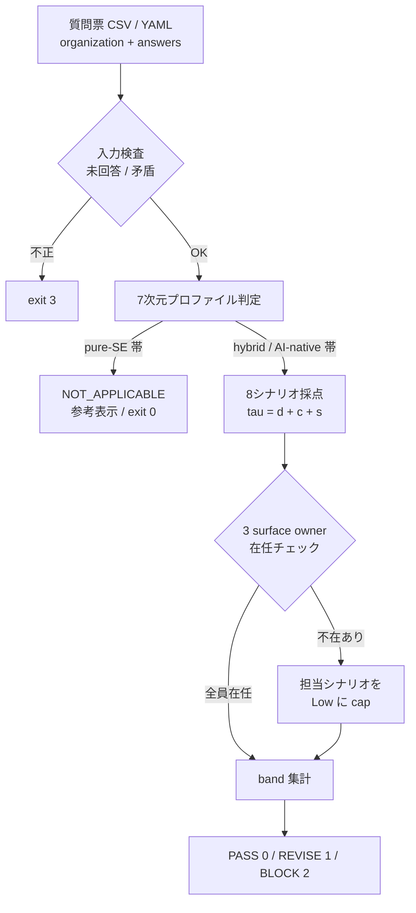
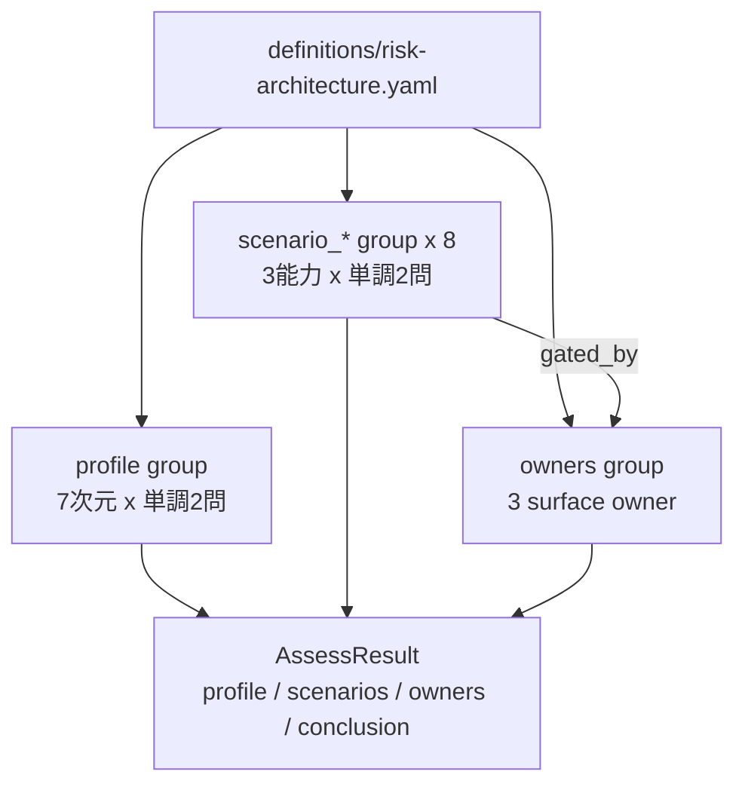

# 13. 委任を受ける組織に、事故を止める体制があるかを採点する

## TL;DR

エージェントに本番作業を任せ始めた組織が、「事故に気づけるか・止められるか・責任者に
届くか」を質問票 1 枚で採点できます。結果は失敗シナリオごとの 3 段階
(Low = 体制のカバー不足 / Medium / High)と、責任者(owner)不在の警告です。
最初に埋めるべき穴が「どのシナリオの、どの能力か」まで特定されます。

## 前提

- **本線 6 ステップ(docs/00〜11)は「何をどう委任するか」の診断**でした。
  本 doc は拡張で、**委任を受けて運用する組織の側**を診断します
- 元論文は "Risk Architecture for AI-Native Engineering Teams"
  ([arXiv:2607.01421](https://arxiv.org/abs/2607.01421))。エージェント型システムを
  運用する組織のリスク管理を、個人のスキルでなく**組織の構造**の問題として扱います
- **surface owner** = 論文が新設を求める 3 つの責任者。契約層(ツールの入出力の
  約束事)、因果連鎖(エージェントの多段実行)、組織境界(自チームの出力を使う
  他チームとの境目)のそれぞれに、一意に名前の決まった責任者を置きます

次のステップ: [docs/00 全体像](00_overview.md)

## When to use this

| あなたが... | このレンズで分かること |
|---|---|
| **EM / PMO** でエージェントの自律度を上げる判断を控えている | どの失敗シナリオが「誰も止められない」状態か。自律度を上げる前に埋める穴 |
| **発注側・経営** でベンダー / 開発チームを評価する | 「3 つの surface に名前付きの責任者が居るか」を SLA レビュー項目にできる |
| 既存の aidr 利用者 | 業務単位の診断(check-readiness)に、組織側の体制診断を同じ入力形式で足せる |

## ミドリ精機の事例で見る

経理エージェントを多段自律実行(per-action 承認なし)に広げたミドリ精機の
運用チームを採点します。

```bash
bin/aidr assess-risk-architecture examples/business/sample-risk-architecture.csv
```

入力: [`examples/business/sample-risk-architecture.csv`](../examples/business/sample-risk-architecture.csv)

出力(抜粋):

```text
organization: ミドリ精機 経理エージェント運用チーム
profile: D1=2 D2=2 D3=1 D4=2 D5=1 D6=2 D7=2  total=12  band=ai_native
scenarios:
[LOW   ] scenario_f_drift (サイレントな境界契約ドリフト): tau=1 (d=0 c=1 e=0) raw=Low effective=Low  zero: detection, escalation
[LOW   ] scenario_f_ownership (境界オーナーシップの欠落): tau=2 (d=1 c=1 e=0) raw=Low effective=Low  (capped: boundary_channel_owner missing)  zero: escalation
...
owners: contract_owner=yes agent_workflow_owner=yes boundary_channel_owner=NO
conclusion: BLOCK
```

出力の読み方:

- `profile` 行 — 7 次元の 0/1/2 と合計。この組織は AI-native 帯
  (確率的出力・多段自律実行が本番に入っている)
- `[LOW ]` 行 — 未カバーのシナリオ。`tau=1 (d=0 c=1 e=0)` は検知 0 点・抑制 1 点・
  エスカレーション 0 点の意味。`zero:` が最初に埋める能力
- `(capped: ... missing)` — 素点は Medium 以上でも、担当 owner 不在のため
  安全側に Low へ落とした印(本ツール独自のゲート)
- `owners` 行 — 3 surface owner の在任。`NO` が改善の起点
- `conclusion: BLOCK` — Low が残るか owner 不在の間は BLOCK(exit code 2)。
  CI やレビュー会のゲートに使えます

## Concept

### 結果の意味 — band と conclusion

シナリオごとに coverage tier τ(タウ)= 検知 + 抑制 + エスカレーション(各 0〜2 点)を
算出し、3 段階に分けます。

| band | τ | 意味 |
|---|---|---|
| Low | 0〜2 | 未カバー。3 能力の総合カバレッジが不足している(最大でも 1 能力しか直接的でない)。**個々の能力が部分的に残っていても、体制としては穴** |
| Medium | 3〜4 | 中位。間接・手動の対応はできるが、直接的な検知・停止・責任経路が揃っていない |
| High | 5〜6 | 3 能力がほぼ直接的に機能する |

conclusion は全シナリオの集計です: 全 High + owner 充足 = PASS(0)/
Medium あり = REVISE(1)/ Low ありまたは owner 不在 = BLOCK(2)/
pure-SE 帯 = NOT_APPLICABLE(0。下記)。

### 仕組み — 前段診断 → シナリオ採点 → owner ゲート

1. **7 次元プロファイル(前段診断)**: 出力の決定論性(D1)からリスク面の変異速度(D7)
   まで 7 次元を各 0/1/2 で採点し、組織が pure-SE / hybrid / AI-native のどの帯かを
   見ます。**pure-SE 帯ならシナリオ採点は参考表示になり、ゲートは適用されません**
   (シナリオは AI-native の失敗様式を想定した基準のため、無関係な組織を誤って
   BLOCK しないための契約です)。ただし **D2=2(per-action 承認なしの多段自律実行)の
   組織は、合計が低くてもゲートが適用されます** — D2 は論文がプロファイル遷移の
   最も強いシグナルとする次元で、その自律性だけで agentic な失敗様式が有効になる
   ためです。D2=1(AI が提案し人間が不可逆操作を承認)はこの例外に含めません
2. **代表シナリオ採点(8 本)**: 論文の 6 失敗クラスタから、A〜E は代表 1 本、
   最重要の F(組織境界の失敗)は 3 本(契約ドリフト / ロールバック非対称 /
   境界オーナー欠落)を採点します
3. **owner ゲート**: 3 surface owner の在任を確認し、不在の owner が担当する
   シナリオの effective band を Low に落とします

### 質問の作り — 単調 2 問で論文の 0-2 点を写像する

各能力は「**弱い能力以上**があるか」→「**強い能力**があるか」の 2 問です。
yes の数がそのまま論文の 0 / 1 / 2 になります。

| 回答の組(弱, 強) | 点 | 意味(検知の例) |
|---|---|---|
| no, no | 0 | 気づく手段が無い |
| yes, no | 1 | 事後・間接でなら気づける |
| yes, yes | 2 | 直接発火するトリガがある |
| no, yes | エラー | 矛盾(強い能力は弱い能力を含意する)。採点せず exit 3 |

### owner ゲートは本ツール独自の安全側設計

論文では owner の割当は escalation の点数を通じて band に反映されます。本ツールは
それに加えて、**owner 不在を担当シナリオの effective band への Low キャップ**として
扱います(素点 `raw_band` は保持し、`capped_by_missing_owner` で追跡できます)。
「素点が良くても、責任者が居なければ体制として未カバー」という安全側の製品判断であり、
論文の機構そのものではありません。

owner とシナリオの対応: contract owner → サイレントモデル更新・契約ドリフト /
agent-workflow owner → スコープ外の不可逆アクション / boundary channel owner →
ロールバック非対称・境界オーナー欠落。

### 運用指針 — 楽観バイアスを抑える 3 点

- **「owner を置けば Low は消える」は実測ではない**: 論文の定量結果は著者による
  分析上の反事実(derived counterfactual)です。owner 指名は「Low を減らす仮説」として
  導入し、1〜2 四半期は自組織のインシデント実績で効果を確認してください
- **共同指名は RACI アンチパターン**: boundary channel owner は producer + consumer の
  共同指名ですが、Accountable を 2 者で共有すると「相手が見ているはず」で誰も動かない
  状態(diffusion of responsibility)になりがちです。平時の役割分担と、障害時に権限を
  一本化する 1 名を決めてから導入してください
- **一律ガバナンスは失敗する**: カバレッジが低いからといって全チームに同じ統制を
  課すと、シンプルなエージェントの開発速度を落として shadow development を誘発します。
  統制強度は自律性レベル(D2)に比例させてください

### 出典と限界

- 本レンズは**代表シナリオ簡易チェック**です。論文は 3 プロファイル × 全シナリオの
  マトリクス採点ですが、自組織診断では自分の帯 1 つを採点すれば足りるため、
  シナリオを 8 本に絞っています。結論は採点したシナリオにのみ適用され、
  クラスタ全体への結論は出しません
- 質問文・band 閾値の具体化は本リポの設計提案(design_proposal)です。論文由来の
  事実(observed_fact)との区別は定義ファイルの `case_evidence` に確度ラベルで
  記録しています

### ■構造(パイプラインのどこに入るか)



| 要素名 | 説明 |
|---|---|
| 入力検査 | 全問回答必須(fail-closed)。未回答・曖昧値・単調性矛盾は採点せず exit 3 |
| 7次元プロファイル判定 | D1〜D7 の 7 値ベクトル + 合計による帯。帯が適用契約を決める |
| 8シナリオ採点 | 各シナリオの d / c / s(各 0〜2)から τ と raw band を算出 |
| owner 在任チェック | 不在 owner の担当シナリオを effective Low に cap(本ツール独自) |
| band 集計 | effective band と owner 充足から conclusion と exit code を決定 |

### ■データ(定義ファイルの概念モデル)



| 要素名 | 説明 |
|---|---|
| profile group | 各次元 2 問(hybrid 以上 / AI-native)。header の hybrid_min / ai_native_min が帯の閾値 |
| scenario_* group | 各シナリオ 6 問。header の medium_min / high_min が band 閾値、gated_by が担当 owner |
| owners group | owner_key 付きの在任 3 問。gated_by の参照先 |
| AssessResult | profile 7 値ベクトル + シナリオごとの raw / effective band + owners + conclusion |

### 拡張(overlay)

各社の overlay で可能な操作は 2 つです(`aidr check-overlay` と実行時の両方で検証):

- **新シナリオの group 一式追加**: header + 単調 2 問 × 3 能力の 6 問セット。
  形状(ちょうど 6 問・能力ごとに弱強 1 問ずつ)は契約 validator が検査し、
  崩れた追加は拒否されます。既存 group への質問追加は開けていません
  (7 次元 × 2 問と 3 owner は採点尺度そのもののため)
- **band 閾値の強化**: `medium_min` / `high_min` を厳しい方向(higher)のみ

```yaml
# overlay 例: 自社固有の失敗シナリオを 1 本足す
version: 1
extends: risk-architecture
add:
  - {id: "scenario_x", name: custom, name_ja: 自社シナリオ, cluster: X, medium_min: 3, high_min: 5}
  - {id: "scenario_x.D1", capability: detection, strength: weak, text: "...", text_ja: "..."}
  # ... D2 / C1 / C2 / S1 / S2 の計 6 問
strengthen:
  "scenario_a": {high_min: 6}
```

## References

- 正本定義: [`definitions/risk-architecture.yaml`](../definitions/risk-architecture.yaml)
- 記入例: [`examples/business/sample-risk-architecture.csv`](../examples/business/sample-risk-architecture.csv)
- AI エージェント連携: [`examples/skills/risk-architecture/SKILL.md`](../examples/skills/risk-architecture/SKILL.md)
- 元論文: [Risk Architecture for AI-Native Engineering Teams (arXiv:2607.01421)](https://arxiv.org/abs/2607.01421)
- 楽観バイアス注記の根拠: [RACI Pitfalls (Meegle)](https://www.meegle.com/en_us/topics/raci-matrix/raci-matrix-pitfalls) / [Gartner: Uniform Governance Across AI Agents Will Lead to Failure](https://www.gartner.com/en/newsroom/press-releases/2026-05-26-gartner-says-applying-uniform-governance-across-ai-agents-will-lead-to-enterprise-ai-agent-failure)

次のステップ: [docs/00 全体像](00_overview.md) / [docs/12 パッチ受入の運用ループ](12_patch_decision_loop.md)
