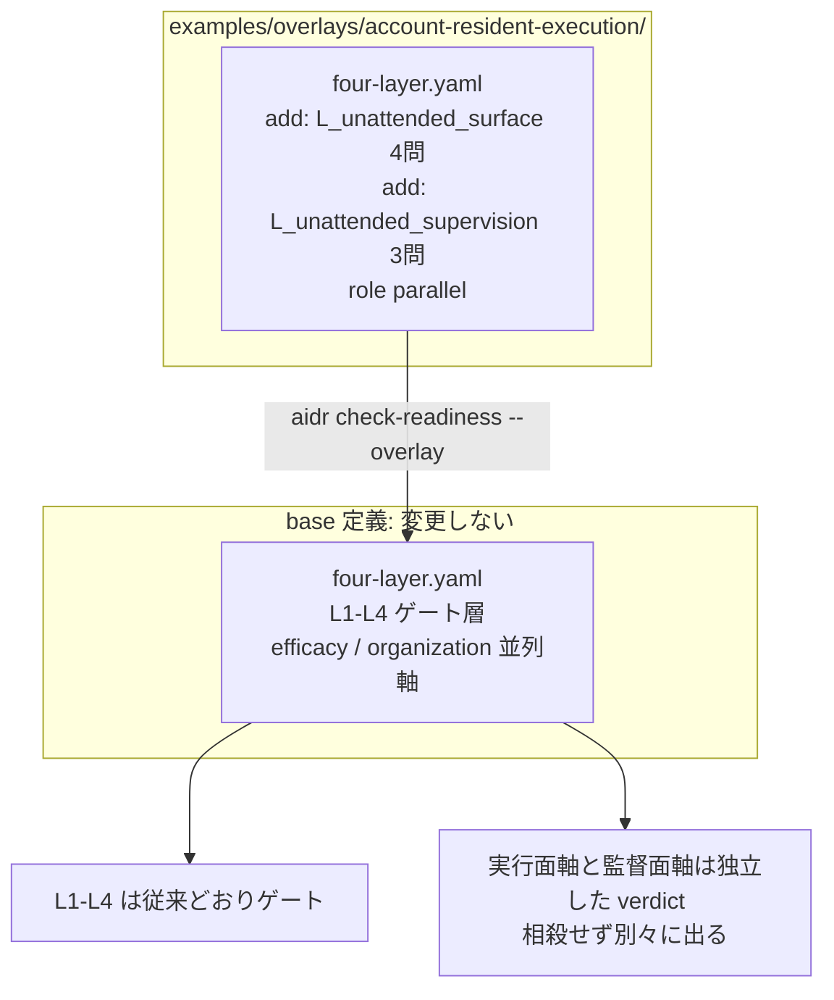

# 14. アカウント常駐エージェントの無人実行面を実行面軸と監督面軸で点検する

## TL;DR

「承認するまで送信しない機能があるから大丈夫」と言えるのか? — 答えは「それだけでは言えない」です。
委任型エージェントが**端末上の道具からアカウント常駐の作業者**へ移ると、scheduled task は
監督端末が 1 台もオンラインでなくても実行され、承認は非同期にスマホへ届きます。既存の委任判断が
暗黙に置いていた「誰かが見ている間だけ動く」前提が崩れます。本 overlay は base 定義を変えずに、
無人実行の統制を **実行面軸**(無人で「動く・見える・止まる」を統制しているか)と
**監督面軸**(人間の承認とデータ所在が実測で担保されているか)の 2 本の並列軸として採点し、
どちら側が薄いかを別々の verdict で示します。

骨格は **Claude Cowork のアカウント常駐リモート実行の技術調査**(2026-07-07 の web / mobile 拡張)
から抽出しています。事実と一般化はラベル分けで示します: **【観測事実】** / **【設計提案】**。

## 前提

- 本書は**応用編**です。本線 6 ステップ([docs/00](00_overview.md))と
  overlay の仕組み(README の「自社ルールで拡張する」)を先に読んでください
- **アカウント常駐**(account-resident)= セッション・ファイル・タスクが端末でなくアカウントに
  紐づき、クラウド側で実行・同期される形態。Claude Cowork の 2026-07-07 拡張が代表例です
- **無人実行**(unattended execution)= 監督する端末が 1 台もオンラインでない状態でも
  scheduled task が実行されること
- **非同期承認** = エージェントが判断の要る箇所で問い合わせを発行し、承認者のスマホ等に
  通知が届き、承認するまで送信を保留する方式
- **サーフェス**(surface)= 利用面(desktop / web / mobile / server)。同じ委任でも実行する
  サーフェスによって到達できる能力が異なります
- **fail-closed** = 確認が取れない場合に「実行しない」側へ倒れる設計。逆は fail-open
- 題材はミドリ精機の営業部門です。本線 6 ステップ(経理業務の物語)とは別部門の応用例です

### 端末常駐との対比

| 比較項目 | 端末常駐(従来) | アカウント常駐(今回の対象) |
|---|---|---|
| 実行の持続性 | 端末を閉じると停止 | 端末 0 台でも scheduled task が実行 |
| データ所在 | 端末ローカル中心 | セッション・ファイルがクラウド常駐 |
| 承認 | 実行中の画面で同期的に確認 | 非同期。スマホに届き、応答まで保留 |
| 能力 | 1 台の端末の能力に固定 | サーフェス別に非対称(ローカル資源は desktop 依存) |

## When to use this

- Cowork / ChatGPT scheduled tasks / 自前の常駐 worker など、**無人実行しうる実行面を持つ**
  委任を導入してよいか採点したい
- 「承認機能がある」という製品の主張と、自組織で**実測した統制**とを切り分けたい
- 自組織の常駐エージェント基盤(cron / ワークフローエンジン)を同じ物差しで点検したい

**適用の契約**: この overlay を `--overlay` で指定すると 2 軸は常に採点され、未回答は
unknown(0 点)として分母に残ります。無人実行面を持たない委任に適用すると BLOCK が出ますが、
これは仕様です — 無人実行面を採点したいときに**利用者が明示的に適用する**追加質問セットです。

## 事例で見る(ミドリ精機 営業部門)

```bash
bin/aidr check-readiness examples/business/sample-unattended-cowork.csv \
  --overlay examples/overlays/account-resident-execution/four-layer.yaml
```

入力: [`examples/business/sample-unattended-cowork.csv`](../examples/business/sample-unattended-cowork.csv)

毎週月曜 6:00 に「クライアント向けブリーフィング資料の自動作成」を無人実行させたい部門です。
業務そのものは標準化が進んでおり、基本 4 層と組織軸はすべて PASS します。

```text
Target: 週次クライアントブリーフィング自動作成の Claude Cowork への委任(ミドリ精機 営業部門)

[OK] L1 業務標準化層: PASS (100%)
[OK] L2 判断構造化層: PASS (100%)
[OK] L3 委任範囲層: PASS (100%)
[OK] L4 統制・追跡層: PASS (100%)
[OK] efficacy 効果測定: PASS (100%)
[OK] organization 組織 readiness層: PASS (100%)
[..] L_unattended_surface 無人実行面軸: REVISE (75%)
    unknown: L_unattended_surface.U2
[..] L_unattended_supervision 無人監督面軸: REVISE (66%)
    unknown: L_unattended_supervision.S2

Conclusion: REVISE
```

出力の読み方は次のとおりです。

- **L1〜L4 と組織軸はすべて PASS** — 業務プロセスとしては委任に耐えます
- **実行面軸は REVISE** — タスクの棚卸し・停止試験・サーフェス棚卸しはできていますが、
  失敗検知の実績(U2)が unknown です。失敗時のリトライ・通知タイミングが公式未明示のため、
  自組織で検知実績を作るまで yes にできません
- **監督面軸は REVISE** — 常駐データの棚卸しと fail-closed の試験送信は済んでいますが、
  承認要求の到達 SLA(S2)が実測できていません
- **unknown は「証拠不足の表面化」です** — no(統制が無いと確認した)とは区別されますが、
  採点上はどちらも 0 点です。「公開情報が無いから分からない」を PASS 側に丸めません

### 3 つの実行基盤を同じ条件で見比べる

同一の部門(ミドリ精機 営業部門)・同一業務・**共通の組織側回答**のまま、委任先の実行基盤だけを
変えた 3 サンプルを同梱しています。差が出るのは基盤側の事実に依存する項目だけです。

| 質問 | [Cowork](../examples/business/sample-unattended-cowork.csv) | [ChatGPT tasks](../examples/business/sample-unattended-chatgpt-tasks.csv) | [自前 Kestra worker](../examples/business/sample-unattended-selfhosted.csv) |
|---|---|---|---|
| U1 無人実行タスクの棚卸しと承認記録 | yes(組織側統制) | yes(組織側統制) | yes(組織側統制) |
| U2 逸脱・失敗の検知実績 | unknown(挙動が公式未明示) | unknown | yes(日次トリアージで実績) |
| U3 停止手段の試験 | yes(PoC で試験済み) | unknown(挙動未公表・未試験) | yes(kill の運用実績) |
| U4 サーフェス非対称の棚卸し | yes(公式の機能表あり) | unknown(公式一覧なし) | yes(server 実行のみ) |
| S1 常駐禁止データの棚卸し | yes(組織側統制) | yes(組織側統制) | yes(denylist で機械化) |
| S2 承認の到達 SLA 実測 | unknown(SLA 未公表・未実測) | unknown | **no**(未実測・エスカレーション未定義) |
| S3 fail-closed の試験 | yes(公式保証 + 試験送信) | unknown(保証・試験とも無し) | **no**(承認なし送信の worker が存在) |
| **実行面軸** | REVISE (75%) | **BLOCK (25%)** | PASS (100%) |
| **監督面軸** | REVISE (66%) | **BLOCK (33%)** | **BLOCK (33%)** |
| **Conclusion** | REVISE | BLOCK | **BLOCK** |

この比較が示すのは**安全性の優劣ではありません**。「同一の組織条件のもとで、その基盤が提供する
保証を公開情報または自組織の実測でどこまで確認できるか」の差です。

- **ChatGPT tasks の BLOCK** は「危険」の判定ではなく、確認できる公開情報が乏しく unknown が
  積み上がった結果です。導入するなら自組織で試験して unknown を潰すのが次の一手です
- **自前 Kestra worker の BLOCK** が最も示唆的です。実行面軸は満点(ログも kill switch も
  自分のものだから確認できる)なのに、監督面軸の fail-closed(S3)と承認 SLA(S2)が no で
  全体 BLOCK になります。**自前基盤は「見える・止められる」が強く、「人間の承認」が弱い** —
  1 軸に平均していたら 5/7 = 71% の REVISE に丸まって消えていた発見です

## Concept

### 実行面軸 — 無人で「動く・見える・止まる」の統制

正本は [`examples/overlays/account-resident-execution/four-layer.yaml`](../examples/overlays/account-resident-execution/four-layer.yaml)
の `L_unattended_surface` group です。値はここに二重保持しません。

【観測事実】Cowork のローンチ発表は、scheduled task が**端末が 1 台もオンラインでなくても
実行される**ことを明言しています。監督者ゼロで動く実行面が製品仕様として存在します。

【観測事実】公式のサーフェス別機能表は、local files / browser use / computer use を
desktop アプリ起動中に限定しています。同じ委任でも、どのサーフェスが実行するかで
到達できる能力が変わります(U4 がこの棚卸しを問います)。

【観測事実】失敗した scheduled run のリトライ回数や失敗通知のタイミングは公式未明示です。
無人実行が**静かに失敗**したとき、それに気づく仕組みは導入組織の責任になります
(U2 が検知の**実績**を問う理由です)。

【設計提案】「アカウント常駐化は『誰かが見ている間だけ動く』という委任前提を崩す」というのは
出典調査の一般化です。公式がそう述べているわけではありません。

### 監督面軸 — 人間の承認とデータ所在は実測で担保する

正本は同ファイルの `L_unattended_supervision` group です。

【観測事実】ローンチ発表は "Nothing ships until you've reviewed and approved it"
(承認するまで何も送信しない)を保証として掲げます。承認は非同期でスマホに届きます。
このとき**承認の到達時間と期限切れ時の挙動が運用パラメータ**になります(S2)。

【観測事実】セッションとファイルはアカウント常駐でデバイス間同期されます。作業データの
クラウド常駐が「明示的な配置判断」でなく**既定値**になります(S1 が棚卸しの実績を問う理由です)。

【観測事実 + 出典の欠落】組織監査ログは Enterprise で過去 180 日分をエクスポートできると
明示されています。ただし記録対象として列挙されているのはアカウント・プロジェクト・会話・
ファイル等で、**scheduled run の開始・結果・失敗が記録対象かは出典から確認できません**。
無人実行の証跡が要るなら、エクスポートの実物で確認してから前提にしてください。

【設計提案】承認要求の到達 SLA と、応答されないまま期限切れになったときの挙動は公式未明示です。
fail-closed は**製品の主張から推定せず、試験送信で実測してから** yes にします(S3)。

### 1 本の軸にまとめない理由

採点は軸内の加重平均です。1 軸 7 問にまとめると、独立であるべき統制が相殺されます。
上の自前 Kestra worker の例がそのものです: 実行面 4 問が全部 yes でも、監督面の S2 / S3 が
no なら委任は止まるべきです。1 軸なら 5/7 = 71% の REVISE に丸まり、**完全な kill switch が
承認 fail-closed の欠落を埋め合わせた**形になります。kill switch と承認は互いに代替しません。
別々の verdict として表面化させるために軸を分けています([docs/10](10_agent_authorization_overlay.md)
の能力軸 / 同意軸の分割と同じ判断です)。

### 設問が自己申告で yes にならないようにした理由

「無人実行のポリシーを検討したか」型の設問は、方針文書を書いただけで yes になります。
全 7 問を**棚卸し・実測・試験・記録の有無**という観測可能な形にしています。

| 設問 | 「検討したか」型なら yes になる反例 | 本 overlay での回答 |
|---|---|---|
| U2 逸脱を期待した時間内に検知した実績があるか | ダッシュボードを整備した(が、何も検知したことがない) | **no**(実績が無い) |
| U3 実際に止まることを試験で確認したか | 停止手順書を書いた | **no**(試験していない) |
| S1 直近の棚卸しで禁止データの非常駐を確認し例外を記録したか | データ分類基準を策定した | **no**(実データと突き合わせていない) |
| S3 承認なしでは外部へ出ないことを試験で確認したか | 製品が「承認まで送信しない」と主張している | **no**(自分で試験していない) |

### 閾値の読み方

実行面軸は 4 問等重みで `pass: 1.0` / `revise: 0.75`、監督面軸は 3 問等重みで
`pass: 1.0` / `revise: 0.66` です。**どちらの軸も「1 問欠けたら REVISE、2 問欠けたら BLOCK」**
に揃えてあります(問数が違うため閾値の数値は異なります)。並列軸なので L1〜L4 の積み上げは
塞ぎませんが、BLOCK は全体結論を BLOCK にします。

**受容している限界**: 「2 問欠けたら BLOCK」は**軸ごと**の契約です。実行面と監督面に
1 問ずつ(合計 2 問)欠けた場合は両軸 REVISE となり、全体も REVISE に留まります
(上の Cowork サンプルがこの形です)。軸をまたぐ欠落を合算して BLOCK にはしません —
合算すると 2 軸に分けた意味(どちら側が薄いかの読み分け)が崩れるためで、
efficacy / organization / 既存 overlay の並列軸と同じ扱いです。REVISE は
「委任してよい」ではなく「no / unknown の設問を潰してから委任する」の判定です。

### 運用指針 — 無人実行面の管理対象と統制の対応

アカウント常駐エージェントを導入するとき、何を管理対象にすべきかを 2 軸 7 問と対応させて
整理します。エンタープライズ管理機能(Enterprise プラン等の統制)との対応も併記します。

| 管理対象 | 何が起きるか | 対応する設問 | エンタープライズ統制との対応 |
|---|---|---|---|
| 無人実行タスクの台帳 | 端末 0 台でも走るタスクが増殖する | U1 | RBAC(scheduled task 作成をロールで制限する運用) |
| 実行の観測 | 静かな失敗・予定外起動に誰も気づかない | U2 | 監査ログ / OpenTelemetry / Compliance API |
| 停止権限 | 暴走時に「誰が止めるか」が決まっていない | U3 | RBAC(停止権限の割り当て) |
| サーフェス構成 | ローカル資源依存のタスクが desktop 停止で暗黙に死ぬ | U4 | capability 統制(サーフェス・機能の許可) |
| データ所在 | 機微データが既定値のままクラウド常駐する | S1 | connector 権限の絞り込み(read のみ等) |
| 承認の到達 | 承認要求が誰にも届かず滞留・期限切れする | S2 | 通知・エスカレーションの運用設計 |
| 送信ゲート | 承認前に外部送信が起きる(fail-open) | S3 | spend / model 統制 + 承認ワークフロー |

seat / surface の配布統制(誰にどのサーフェスを配るか)はこの overlay の採点対象外ですが、
U4(サーフェス棚卸し)の入力情報になります。配布統制を絞るほど U4 の棚卸しは単純になります。

### 補完診断 — 検知・停止の深掘りは risk-architecture で

U2(検知)と U3(停止)は無人実行面に特化した**入口の 2 問**です。失敗統制そのものの網羅
(実行中/実行後の検知、run 単位のキルスイッチ、責任者へのエスカレーション経路)は
[`aidr assess-risk-architecture`](13_risk_architecture.md) が Detection / Containment /
Escalation の 3 能力として深掘りします。無人実行するタスクに不可逆アクション(送信・削除・
支払い)が含まれる場合は、本 overlay と併せて risk-architecture の該当シナリオを実施してください。

### 適用範囲の限定 — 攻撃対策でも委任マトリクスの再分類でもありません

**この 2 軸はプロンプトインジェクションや connector の脆弱性への対策になりません。**
統制の存在を問う語彙であり、攻撃を防ぐ機構は別のレイヤに必要です([docs/10](10_agent_authorization_overlay.md)
の適用範囲の限定と同じ構造です)。

また、本 overlay が変えるのは**業務全体の readiness 判定**(check-readiness)だけです。
委任マトリクス([docs/04](04_delegation_matrix.md))の判定単位の Green/Yellow/Red 写像は
再分類しません。無人実行の可否を判定単位の region に織り込む必要が出た場合は、base 定義の
拡張として別途設計します。

### ■構造(overlay が base のどこに効くか)



- **2 軸とも並列軸**: header に `role: parallel` を指定するため、`check-readiness` の
  `axis_role()` が並列軸として扱い、efficacy / organization と同じ枠で採点します。
  振り分けの仕組みとデータモデルは [`03_organization_axis.md`](03_organization_axis.md) の
  ■構造・■データを参照(同じ枠組みです)
- **`L_` 接頭辞の理由**: overlay で新規 group を足せるのは `extension_points` の `L*` selector に
  合う名前だけです。名前の `L` は「ゲート層」を意味しません(gating / parallel は `role`
  フィールドだけで決まります)。`L_insourcing` / `L_capability` と同じ回避です
- **既存 3 overlay と併用できます**: `L5` / `L_insourcing` / `L_capability` / `L_consent` とは
  別 id なので、`--overlay` を複数渡して同時に適用できます
- **opt-in**: `--overlay` で渡した診断にだけ効きます。base だけの利用者には無影響です

### ■データ

概念モデルは [`03_organization_axis.md`](03_organization_axis.md) の■データと共通です
(base group + overlay が add する leaf、header の `role` で軸種を決定)。本 overlay は
`role: parallel` の group を 2 本(`L_unattended_surface` / `L_unattended_supervision`)と
その配下の質問 leaf を 4 つ / 3 つ足すだけで、strengthen は使いません。

## References

- 正本: [`examples/overlays/account-resident-execution/four-layer.yaml`](../examples/overlays/account-resident-execution/four-layer.yaml)
- サンプル: [`examples/business/sample-unattended-cowork.csv`](../examples/business/sample-unattended-cowork.csv) /
  [`examples/business/sample-unattended-chatgpt-tasks.csv`](../examples/business/sample-unattended-chatgpt-tasks.csv) /
  [`examples/business/sample-unattended-selfhosted.csv`](../examples/business/sample-unattended-selfhosted.csv)
- 関連 doc: [`02_four_layer_framework.md`](02_four_layer_framework.md)(4 層フレーム)/
  [`03_organization_axis.md`](03_organization_axis.md)(並列軸とゲート層の振り分け・データモデル)/
  [`10_agent_authorization_overlay.md`](10_agent_authorization_overlay.md)(2 軸分割の先行例)/
  [`13_risk_architecture.md`](13_risk_architecture.md)(検知・封じ込め・エスカレーションの深掘り)
- 出典: Claude Cowork のアカウント常駐リモート実行の技術調査
  ([suwa-sh.github.io/zenn-contents](https://suwa-sh.github.io/zenn-contents/articles/anthropic-cowork-remote-execution_20260709/))。
  一次資料は
  [Cowork is rolling out to mobile and web](https://claude.com/blog/cowork-web-mobile/) /
  [Use Claude Cowork on web, desktop, and mobile](https://support.claude.com/en/articles/15520349-use-claude-cowork-on-web-desktop-and-mobile) /
  [Schedule recurring tasks in Claude Cowork](https://support.claude.com/en/articles/13854387-schedule-recurring-tasks-in-claude-cowork) /
  [Access audit logs](https://support.claude.com/en/articles/9970975-access-audit-logs)
