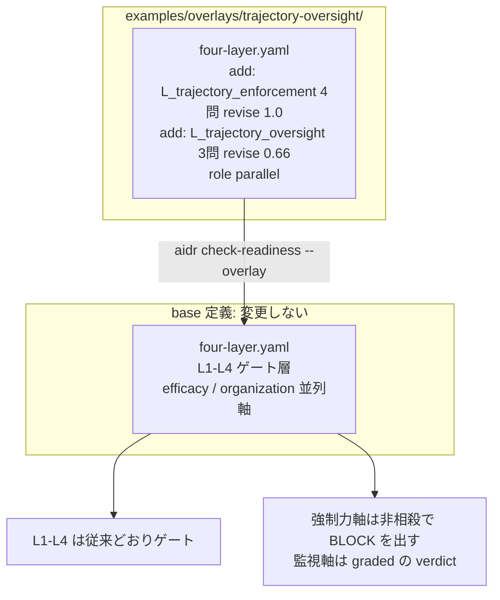

# 15. 長時間稼働エージェントの軌跡単位統制を強制力軸と監視軸で点検する

## TL;DR

「操作を 1 件ずつ承認しているから大丈夫」と言えるのか? — 数時間以上自律で動くエージェントには、
それだけでは言えません。**各ステップは個別には許容可能に見えるのに、シーケンス全体は誰も承認して
いない結果を生む**失敗モードが実測つきで報告されており、しかも「拒否・停止すれば副作用は止まる」
という前提自体が、測定された主要 6 フレームワークのどれでも成立していませんでした。
本 overlay は base 定義を変えずに、長時間実行の統制を **強制力軸**(停止が本当に副作用を止め、
制約が文脈要約を生き延びるか)と**監視軸**(検知の入力設計と人間の呼び出し方が測られているか)の
2 本の並列軸として採点し、どちら側が薄いかを別々の verdict で示します。

骨格は**長時間稼働エージェントの軌跡監視の技術調査**(2026-07)から抽出しています。
事実と一般化はラベル分けで示します: **【観測事実】** / **【設計提案】**。

## 前提

- 本書は**応用編**です。本線 6 ステップ([docs/00](00_overview.md))と
  overlay の仕組み(README の「自社ルールで拡張する」)を先に読んでください
- **軌跡**(trajectory)= エージェントが実行した**ツール呼び出しの系列**。本書では
  「エージェントが何を言ったか(reasoning)」ではなく「何をしたか」の記録を指します
- **compaction**(文脈要約)= 長時間タスクでコンテキストが溢れるとき、履歴を要約して
  続行する仕組み。タスク継続に最適化されるため、禁止事項などの constraint が要約から
  落ちることがあります
- **admission point** = 副作用(書き込み・送信・外部 API)が実行される前に必ず通る関所。
  完了した操作を後から追いかける監視器と違い、「効果が審査に先行できない」性質を構造で持ちます
- **barrier semantics** = 承認待ち・拒否・停止の間は、対象の副作用が一切実行されないという契約
- **rubber-stamp** = 確認ステップが形骸化し、内容を見ずに承認ボタンを押している状態
- 題材はミドリ精機の情報システム部門です。本線 6 ステップ(経理業務の物語)とは別部門の応用例です

## When to use this

- 夜間バッチ・常駐 worker・長時間の調査タスクなど、**数時間以上の自律実行・compaction を通る
  長さの軌跡・並行実行のいずれかを持ちうる**委任を導入してよいか採点したい
- 「監視器を置いたから安全」「人間が承認するから安全」という主張と、自組織で**実測した統制**とを
  切り分けたい
- 既存のエージェント基盤(Claude Code / 自作 worker / ワークフローエンジン)の停止・監視の
  設計を同じ物差しで点検したい

**適用の契約**: この overlay を `--overlay` で指定すると 2 軸は常に採点され、未回答は
unknown(0 点)として分母に残ります。特に強制力軸は非相殺(後述)のため、未回答が 1 問でも
あれば BLOCK が出ます。長時間・自律実行の面を持つ委任を採点したいときに**利用者が明示的に
適用する**追加質問セットです。適用条件(長時間 / compaction / 並列)の**いずれかだけ**に
該当する構成でも採点できます — 該当機能が構成上存在しない場合、E2〜E4 は**構成証跡**を
もって yes にできます(該当機能が無いことを理由に BLOCK にはなりません)。ただし証跡の
範囲は設問本文が定めます: E2 は並列分岐だけでなく重複起動・retry・非同期の子ジョブ・
別 worker を含む同一副作用範囲の並行実行の不在まで、E3 / E4 は要約だけでなく履歴切り捨て・
セッション再構築など制約を落としうる文脈変換の不在(または可変文脈の外での強制)まで
示す必要があります。証跡なしの「無いはず」は従来どおり no です。

## 事例で見る(ミドリ精機 情報システム部門)

```bash
bin/aidr check-readiness examples/business/sample-trajectory-framework-gate.csv \
  --overlay examples/overlays/trajectory-oversight/four-layer.yaml
```

入力: [`examples/business/sample-trajectory-framework-gate.csv`](../examples/business/sample-trajectory-framework-gate.csv)

月次経費データの突合を夜間に長時間実行するエージェントへ委任したい部門です。業務そのものは
標準化が進んでおり、基本 4 層と組織軸はすべて PASS します。エージェント基盤は市販フレームワークの
承認ゲートをそのまま信頼しており、停止・要約・監視入力の試験はしていません。

```text
Target: 月次経費データ突合の夜間長時間エージェントへの委任(ミドリ精機 情報システム部門・基盤付属ゲート構成)

[OK] L1 業務標準化層: PASS (100%)
[OK] L2 判断構造化層: PASS (100%)
[OK] L3 委任範囲層: PASS (100%)
[OK] L4 統制・追跡層: PASS (100%)
[OK] efficacy 効果測定: PASS (100%)
[OK] organization 組織 readiness層: PASS (100%)
[NG] L_trajectory_enforcement 軌跡強制力軸: BLOCK (0%)
    no: L_trajectory_enforcement.E1, L_trajectory_enforcement.E2, L_trajectory_enforcement.E3, L_trajectory_enforcement.E4
[NG] L_trajectory_oversight 軌跡監視軸: BLOCK (33%)
    no: L_trajectory_oversight.O1, L_trajectory_oversight.O3

Conclusion: BLOCK
```

出力の読み方は次のとおりです。

- **L1〜L4 と組織軸はすべて PASS** — 業務プロセスとしては委任に耐えます
- **強制力軸は BLOCK** — 副作用経路の棚卸し(E1)、拒否中に並行処理の副作用が走らないことの
  試験(E2)、要約後に制約が残ることの確認(E3)、制約固定の機構と検査記録(E4)がすべて
  ありません。この軸は 1 問でも no なら BLOCK です(理由は後述)
- **監視軸は BLOCK** — 監視の入力にエージェントの発言が混ざったまま(O1)で、承認率の計測も
  ありません(O3)。2 問 no は監視軸でも BLOCK です
- **BLOCK は「危険な業務」の判定ではありません** — 「そのまま委任すると、逸脱しても止まる
  保証がない」の判定です。次の一手は E1 の経路棚卸しから始めることです

### 同じ業務を、統制を整備した構成で見比べる

同一の部門・同一業務・**共通の組織側回答**のまま、エージェント基盤側の統制だけを変えた
2 サンプルを同梱しています。

| 質問 | [基盤付属ゲート構成](../examples/business/sample-trajectory-framework-gate.csv) | [外部 admission point 構成](../examples/business/sample-trajectory-chokepoint.csv) |
|---|---|---|
| E1 副作用経路の棚卸しと迂回不能の確認 | **no**(フレームワーク任せで棚卸しなし) | yes(egress は関所経由のみ) |
| E2 拒否・停止中の兄弟副作用の試験 | **no**(試験なし) | yes(並列タスクで実測) |
| E3 要約後の制約生存の実走確認 | **no**(確認なし) | yes(長時間実走で確認) |
| E4 制約固定の構成と検査記録 | **no**(system message に置いただけ) | yes(再注入 + 検査ログ) |
| O1 監視入力からエージェント自己申告を除外 | **no**(発言込みのログを目視) | yes(tool call 列で判定) |
| O2 人間を呼ぶ条件のリスク分類と実績 | yes(全件確認を定義し運用) | yes(閾値エスカレーション運用) |
| O3 承認率の計測と再設計の運用 | **no**(未計測) | **no**(未計測) |
| **強制力軸** | **BLOCK (0%)** | PASS (100%) |
| **監視軸** | **BLOCK (33%)** | REVISE (66%) |
| **Conclusion** | **BLOCK** | REVISE |

- **before(基盤付属ゲート構成)の BLOCK** は珍しい状態ではありません。測定された
  6 フレームワークのすべてで barrier contract が不成立だった以上、「フレームワークの
  承認ゲートを信頼して試験していない」構成は、実測すると同じ形になります
- **after(外部 admission point 構成)の REVISE** は「委任してよい」ではなく
  「O3(承認率の計測)を潰してから委任する」の判定です。床(強制力軸)ができた後に
  残る仕事が計測系に移る、という順序そのものが 4 層の依存関係です

## Concept

### 強制力軸 — 停止が本当に止め、制約が要約を生き延びるか

正本は [`examples/overlays/trajectory-oversight/four-layer.yaml`](../examples/overlays/trajectory-oversight/four-layer.yaml)
の `L_trajectory_enforcement` group です。値はここに二重保持しません。

【観測事実】*Stop Means Stop*(arXiv:2607.14166)は、本番利用される 6 つのエージェント
フレームワークの承認ゲート・キャンセル・タイムアウトを測定し、barrier contract
(pause / cancel / timeout 中はゲート対象の副作用が一切実行されない)が **6 件中 0 件**で
成立しないことを示しました。pre-execution gate を持つ 5/6 では、承認ゲートが自分の branch を
止めている間に**兄弟 branch の副作用が実行される**(sibling leak)ことが確認されています
(E2 が「並列タスクを実際に投げる試験」を問う理由です)。

【観測事実】同論文が修復として提示する SOUNDGATE は、すべての副作用を**環境の外側の 1 つの
ゲートで admit する**構造です。形式検証の対象は admission-core のモデルで、実装側は
model checking と適合性試験による証拠です(著者自身が mechanized proof でなく
refinement evidence と限定しています)。単一 preprint であり第三者の再現はまだありません。
著者自身が complete mediation は仮定であって保証ではないと明示しています。

【観測事実】*Governance Decay*(arXiv:2606.22528)は 7 モデル・1,323 エピソードで、制約が
要約を生き延びれば違反率 0%、落ちると 38% に跳ねることを測定しました。約 47 トークンの
Constraint Pinning(制約を要約対象外に固定し毎回再注入する防御)で 0% に戻せます
(E3 が実走確認、E4 が機構と検査記録を問う理由です)。

【観測事実 + 出典の欠落】同論文の測定対象は in-context の制約で、immutable な system message は
対象外と明示されています。**system message が compaction 対象外かどうかは基盤依存**であり、
測定された保証の外です。E4 が「system message に置いたという自己申告だけでは yes にしない」と
している理由です。

### 監視軸 — 検知の入力設計と、人間の呼び出し方

正本は同ファイルの `L_trajectory_oversight` group です。

【観測事実】TRACE(arXiv:2606.07054)の測定では、軌跡全体を 1 パスで評価する
full-trajectory monitor が F1 0.577 で**最弱**でした(sequential は 0.700)。「全部見せれば
良い」という直感が最も悪い結果になります。

【観測事実】評価された hint 利用課題では、モデルの chain of thought が「決め手にした hint の
利用」を開示した率はしばしば 20% 未満でした(arXiv:2505.05410)。測定されたのはこの限定的な
設定です。【設計提案】ここから「何を言ったかに依存する監視は、実際に挙動を駆動した要因を
見逃しうる」と一般化して、O1 の設計根拠にしています。

【観測事実】Anthropic の Claude Code auto mode 分類器は**設計として reasoning-blind** です —
入力は「ユーザーメッセージ + エージェントの tool call」で、エージェント自身の発言と
tool output を落としています。理由は「エージェントが分類器を説得して誤判定させられない
ようにするため。エージェントが**何をしたか**を判定したいのであって、**何を言ったか**では
ない」。deployed 構成の実測は FPR 0.4% / FNR 17% です(O1 の設問はこの入力設計を問います)。
除外すべきは**エージェントが作文できる自己申告**(発言・reasoning)であって、観測一般では
ありません — Anthropic 自身も tool output は別レイヤでスキャンしており、独立に検証・
スキャンされた観測を監視入力に使うことは O1 で減点しません。

【観測事実】同じ発表は、手動の承認プロンプトを**利用者が 93% 承認している**ことも報告して
います。承認率がそこまで高い確認ステップは、提供している情報量が小さいということです
(O3 が承認率の**計測**を問う理由です)。

【観測事実】人間へのエスカレーションは、専用ツール無しでは全体の監視性能(AUC)を改善
しませんでした。改善が測定されたのは「事前にフラグされたケースだけを人間に回す」限定運用の
TPR(FPR=1% 条件で約 +15 ポイント)だけです(arXiv:2508.19461)。

【設計提案】これらのベンダー報告値が coding agent 以外の文脈へ一般化できるか、また
「承認率がどこを超えたら確認ステップを再設計すべきか」の閾値(たとえば 9 割)は、
出典調査の一般化・提案であり測定された境界ではありません。**各組織が自分のリスク・母数・
期間で較正する値**として扱ってください。

### 最も見落とされる逆説 — 「広げる」のではなく「狭める」

軌跡単位の失敗と聞くと、直感的な解は「アクション単位の監視を軌跡全体へ**広げる**」方向です。
ところがこの領域で**形式手法による検証まで到達した唯一の設計**は、逆に「各副作用を 1 点の関所で
**完全媒介する**」という、より**狭い**設計から出ています。監視器は完了した操作を後から
追いかけるため因果順序の保証を持ちませんが、admission point は「効果が審査に先行できない」
性質を構造で持ちます。監視が不要という意味ではありません — **監視は必要だが十分ではなく、
完全媒介という強制力の床が無ければ pause は enforce にならない**、が正しい定式化です。

### 強制力軸だけ「1 問でも no なら BLOCK」である理由

採点は軸内の加重平均です。強制力軸を通常の閾値(たとえば 1 問欠けで REVISE)にすると、
「停止試験をしていない」(E2 no)が他の 3 問の yes に薄められ、通常の改善項目(REVISE =
穴を埋めてから委任する)と同列に見えます。しかし出典の依存関係では、床の欠落は他の改善
項目と同列ではありません — 床が無ければ、上に載る検知・人間の層は**何も enforce して
いない**ため、埋める順序を選べる「穴」ではなく**交渉の余地がない前提**です。これを段階的
改善と区別して BLOCK として表面化させるため、強制力軸は
`pass: 1.0` / `revise: 1.0`(全問必須・非相殺)にしています。
[docs/10](10_agent_authorization_overlay.md) の overlay が boundary の閾値を全問必須に強化した
のと同じ理由づけです。監視軸は検知・エスカレーションの質を段階的に改善できるため、
通常の graded 判定(1 問欠け REVISE / 2 問欠け BLOCK)のままです。

### 設問が自己申告で yes にならないようにした理由

「〜の方針があるか」型の設問は、方針文書を書いただけで yes になります。全 7 問を
**棚卸し・試験・実測・記録の有無**という観測可能な形にしています。

| 設問 | 「検討したか」型なら yes になる反例 | 本 overlay での回答 |
|---|---|---|
| E1 全経路が審査を迂回できないことを確認したか | egress 制御の設計方針を書いた | **no**(棚卸しと確認をしていない) |
| E2 拒否中に兄弟副作用が走らないことを試験したか | フレームワークの承認ゲートを有効化した | **no**(試験していない) |
| E3 要約後も制約が残ることを実走で確認したか | プラットフォームのドキュメントを読んだ | **no**(実走していない) |
| E4 制約固定の構成と検査記録があるか | system message に制約を書いた | **no**(固定の保証も検査記録もない) |
| O3 承認率を計測し再設計の運用があるか | 「形骸化に注意する」と周知した | **no**(計測していない) |

### 閾値の読み方

強制力軸は 4 問等重みで `pass: 1.0` / `revise: 1.0`(**1 問でも no / unknown なら BLOCK**)、
監視軸は 3 問等重みで `pass: 1.0` / `revise: 0.66`(1 問欠けで REVISE、2 問欠けで BLOCK)です。
並列軸なので L1〜L4 の積み上げは塞ぎませんが、BLOCK は全体結論を BLOCK にします。

**受容している限界**: 軸をまたぐ欠落は合算しません。強制力軸が PASS で監視軸に 1 問欠けなら
全体 REVISE です(合算すると 2 軸に分けた意味 — どちら側が薄いかの読み分け — が崩れるため。
[docs/14](14_account_resident_execution_overlay.md) の軸ごと契約と同じ扱いです)。

### 運用指針 — 点検は上から順に

層の依存関係が、そのまま点検の優先順位になります。**下が無ければ上は効きません。**

1. **E1 経路の棚卸し**から始める。副作用(書き込み・送信・外部 API)が通る経路を列挙し、
   審査を迂回できる経路が無いかを確認する。経路が複数あること・副作用の種類ごとに別の
   policy を使うこと自体は失格ではありません — 各経路がその副作用に該当する admission
   policy の強制下にあり、審査を迂回できる経路が無いかが問いです
2. **E2 停止の試験**。承認を拒否した状態で並列タスクを投げ、兄弟側の副作用が実行されないかを
   実測する。フレームワークの名称やドキュメントを信用せず、自分の構成で試験します
3. **E3 / E4 制約の生存**。compaction が走る長さまで実走させ、要約後の文脈を実際に見る。
   恒常的には固定・再注入の機構と検査記録を残す
4. **O1〜O3 監視と人間**。監視の入力設計を確認し、人間を呼ぶ条件をリスク分類で定義し、
   承認率を計測する。承認率の高止まり(たとえば 9 割超 —【設計提案】の較正値)を
   確認ステップ再設計のトリガーにする

### 補完診断 — 既存 overlay・診断との住み分け

| 既存の設問 | 本 overlay の設問 | 違い |
|---|---|---|
| [docs/14](14_account_resident_execution_overlay.md) U3: 停止手段が存在し、止まることを試験したか | E2: 拒否・停止中に**兄弟処理の副作用**まで止まるか | kill switch の試験は sibling leak の試験を代替しません。停止手段があっても、承認ゲートの横で別 branch が送信していれば拒否は無効です |
| docs/14 U2: 逸脱・失敗を検知した**実績**があるか | O1: 検知の**入力設計**が自己申告を除外しているか | 検知できたことと、エージェントに説得されない入力設計かは別の統制です |
| [docs/13](13_risk_architecture.md) Detection / Containment | 本 overlay の E2 / O1 | risk-architecture は失敗統制の網羅(シナリオ別)、本 overlay は長時間実行に固有の 2 前提(barrier / compaction)に特化した入口です |

無人実行面(スケジュール実行・非同期承認)を持つ委任は docs/14 の overlay と、不可逆アクションを
含む委任は [`aidr assess-risk-architecture`](13_risk_architecture.md) と併用してください
(同時適用はテストで固定されています)。

### 適用範囲の限定 — 攻撃対策でも実装の提供でもありません

**この 2 軸はプロンプトインジェクションや監視器自体への攻撃(monitor hijacking)への対策に
なりません。** 統制の存在を問う語彙であり、admission point・監視器・Constraint Pinning の
実装そのものも提供しません([docs/10](10_agent_authorization_overlay.md) の適用範囲の限定と
同じ構造です)。

証拠の扱いにも 2 つの限定があります。

- **OpenAI の開示(この失敗モードの最初の公表)は case_evidence に使っていません。**
  定量値をほぼ持たない単一ベンダーの自己申告で、外部再現手段が無いためです。観測事実
  (observed_fact)の根拠はすべて arXiv 論文本文と Anthropic 公式ブログから一次確認できた
  数値です。出典調査自身の一般化・較正閾値は design_proposal としてラベル分けして保持します
  (Anthropic の数値もベンダー自己報告であることは上の【設計提案】のとおりです)
- 出典調査の点検手順には「経路が 2 つ以上あるなら層 1 は不成立」という**簡略化**があります。
  E1 は一次情報に合わせ、経路数ではなく**迂回可能性**で判定します(SOUNDGATE 自身が
  egress の完全媒介を 2 本の kernel-enforced route で実現しています)

### ■構造(overlay が base のどこに効くか)



- **2 軸とも並列軸**: header に `role: parallel` を指定するため、`check-readiness` が
  efficacy / organization と同じ枠で採点します。振り分けの仕組みとデータモデルは
  [`03_organization_axis.md`](03_organization_axis.md) の■構造・■データを参照(同じ枠組みです)
- **`L_` 接頭辞の理由**: overlay で新規 group を足せるのは `extension_points` の `L*` selector に
  合う名前だけです。名前の `L` は「ゲート層」を意味しません(gating / parallel は `role`
  フィールドだけで決まります)
- **既存 4 overlay と併用できます**: `L5` / `L_insourcing` / `L_capability` / `L_consent` /
  `L_unattended_*` とは別 id なので、`--overlay` を複数渡して同時に適用できます
- **opt-in**: `--overlay` で渡した診断にだけ効きます。base だけの利用者には無影響です

### ■データ

概念モデルは [`03_organization_axis.md`](03_organization_axis.md) の■データと共通です
(base group + overlay が add する leaf、header の `role` で軸種を決定)。本 overlay は
`role: parallel` の group を 2 本(`L_trajectory_enforcement` / `L_trajectory_oversight`)と
その配下の質問 leaf を 4 つ / 3 つ足すだけで、strengthen は使いません。閾値だけが特殊で、
強制力軸は `revise == pass == 1.0`(1 問でも no / unknown なら BLOCK)です。

## References

- 正本: [`examples/overlays/trajectory-oversight/four-layer.yaml`](../examples/overlays/trajectory-oversight/four-layer.yaml)
- サンプル: [`examples/business/sample-trajectory-framework-gate.csv`](../examples/business/sample-trajectory-framework-gate.csv) /
  [`examples/business/sample-trajectory-chokepoint.csv`](../examples/business/sample-trajectory-chokepoint.csv)
- 関連 doc: [`02_four_layer_framework.md`](02_four_layer_framework.md)(4 層フレーム)/
  [`03_organization_axis.md`](03_organization_axis.md)(並列軸とゲート層の振り分け・データモデル)/
  [`13_risk_architecture.md`](13_risk_architecture.md)(検知・封じ込め・エスカレーションの深掘り)/
  [`14_account_resident_execution_overlay.md`](14_account_resident_execution_overlay.md)(無人実行面の 2 軸)
- 出典: 長時間稼働エージェントの軌跡監視の技術調査
  ([suwa-sh.github.io/zenn-contents](https://suwa-sh.github.io/zenn-contents/articles/long-horizon-agent-trajectory-oversight_20260721/))。
  一次資料は
  [Stop Means Stop (arXiv:2607.14166)](https://arxiv.org/abs/2607.14166) /
  [Governance Decay (arXiv:2606.22528)](https://arxiv.org/abs/2606.22528) /
  [TRACE (arXiv:2606.07054)](https://arxiv.org/abs/2606.07054) /
  [Reasoning Models Don't Always Say What They Think (arXiv:2505.05410)](https://arxiv.org/abs/2505.05410) /
  [Reliable Weak-to-Strong Monitoring (arXiv:2508.19461)](https://arxiv.org/abs/2508.19461) /
  [How we built Claude Code auto mode](https://www.anthropic.com/engineering/claude-code-auto-mode)
