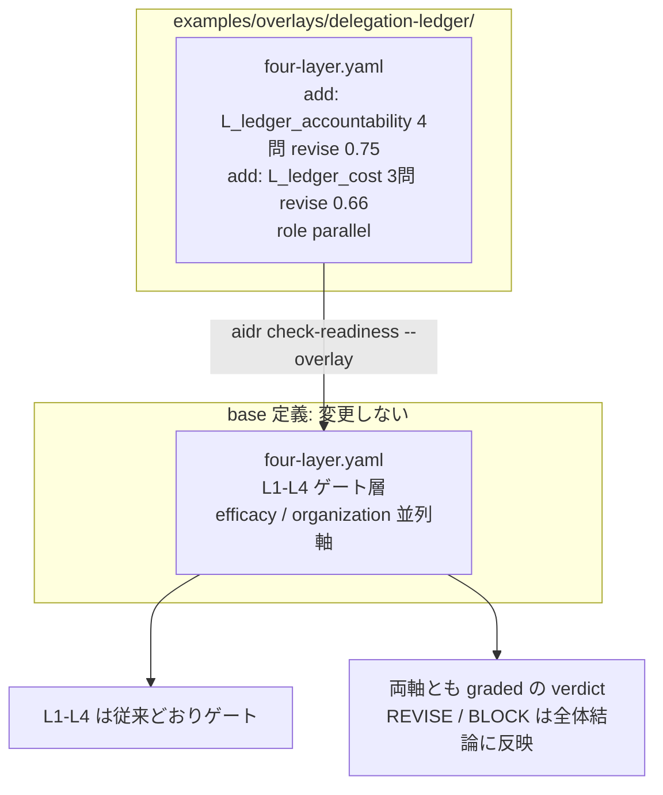

# 16. AI 委任の台帳が統制に耐えるかを責任軸とコスト軸で点検する

## TL;DR

委任した 1 件 1 件の契約は点検した。では「誰が実行し、誰が説明責任を負い、いくら掛かったか」を、
半年後に台帳から取り出せるでしょうか? — 複数の AI 委任を継続運用する段階に入ると、
チケットや worklist が委任の記録・統制・コスト計測の器(**台帳**)になります。
本 overlay は base 定義を変えずに、その器を**責任軸**(実行主体と説明責任者を区別して記録し、
取り出せて、承認の形骸化に気づけるか)と**コスト軸**(支出を抽出でき、成果と対応づけて測れ、
課金条件の変化に備えているか)の 2 本の並列軸として採点します。
問うのは「どのチケットシステムを選んだか」ではなく、
**記録・取り出し・集計・検知ができるように管理・環境整備してあるか**という能力です。

骨格は **Jira の AI 委任基盤発表を扱った調査記事**(2026-07)から抽出しています。
事実と一般化はラベル分けで示します: **【観測事実】** / **【設計提案】**。

## 前提

- 本書は**応用編**です。本線 6 ステップ([docs/00](00_overview.md))と
  overlay の仕組み(README の「自社ルールで拡張する」)を先に読んでください
- **台帳** = 委任の記録が集まる場所。チケットシステム・worklist・スプレッドシート・
  外部の台帳ファイルなど、形は問いません(本書は特定の製品を指しません)
- **説明責任**(accountability)と**実行**(responsibility)の区別 = 「実行はエージェントが
  担えても、結果に答える責任は名前のある人間に残る」という区別。業界の複数の立場が
  一致して主張しています(後述)
- **名目化**(rubber-stamp)= 承認が形だけになり、承認率は高いまま精査が痩せていく状態
- **成果あたりコスト** = AI への支出を、委任の目的に対応し品質条件を満たした成果単位
  (マージ・受入済みの成果物、正常処理された件数、正検知の件数など)の数で割った値。
  支出の総額だけでは委任の経済を説明できないため、分母の設計が問いになります
- 題材はミドリ精機の経理部です。本線 6 ステップで委任を開始した後、
  複数タスクの委任運用が回り始めた段階の応用例です

## When to use this

- **適用条件**: 個別タスクの契約([docs/05](05_task_contract_execution_rubric.md))を超えて、
  **複数の AI 委任をチケット・worklist 等の台帳で継続運用し、責任者別または費用の集計を
  行う段階**に入ったら適用します。単発・試行段階の委任には適用しません
- 「委任の記録は残している」という状態と、「責任者・コストを後から取り出せる」状態とを
  切り分けたい
- チケットシステムの**選定・乗り換えの判断そのものには使いません**。全 7 問は方式を問わない
  能力の問いであり、専用フィールドでも説明文テンプレート + 抽出スクリプトでも yes になります

**適用の契約**: この overlay を `--overlay` で指定すると 2 軸は常に採点され、未回答は
unknown(0 点)として分母に残ります。台帳運用の段階に入った委任を採点したいときに
**利用者が明示的に適用する**追加質問セットです。

## 事例で見る(ミドリ精機 経理部)

```bash
bin/aidr check-readiness examples/business/sample-ledger-scattered.csv \
  --overlay examples/overlays/delegation-ledger/four-layer.yaml
```

入力: [`examples/business/sample-ledger-scattered.csv`](../examples/business/sample-ledger-scattered.csv)

経費チェックや仕訳突合など、複数タスクの AI 委任が経理部で回り始めました。業務そのものは
標準化が進んでおり、基本 4 層と組織軸はすべて PASS します。ただし委任の記録は従来のチケット
運用のままです。担当欄は 1 本で、エージェントに任せたのか誰が責任者なのかを読み分けられません。
支出は請求書明細のエクスポートからツール横断で月次集計してはいるものの、その総額を委任件数で
割った参考値しかなく、成果との範囲の対応づけがありません。

```text
Target: 経理部の AI 委任運用台帳(経費チェック・仕訳突合など複数タスクの委任管理)(ミドリ精機 経理部・従来チケット運用のまま AI 委任を始めた構成)

[OK] L1 業務標準化層: PASS (100%)
[OK] L2 判断構造化層: PASS (100%)
[OK] L3 委任範囲層: PASS (100%)
[OK] L4 統制・追跡層: PASS (100%)
[OK] efficacy 効果測定: PASS (100%)
[OK] organization 組織 readiness層: PASS (100%)
[NG] L_ledger_accountability 委任責任台帳軸: BLOCK (25%)
    no: L_ledger_accountability.LA1, L_ledger_accountability.LA3, L_ledger_accountability.LA4
[..] L_ledger_cost 委任コスト計測統制軸: REVISE (66%)
    no: L_ledger_cost.LC2

Conclusion: BLOCK
```

出力の読み方は次のとおりです。

- **L1〜L4 と組織軸はすべて PASS** — 業務プロセスとしては委任に耐えます
- **責任軸は BLOCK** — 実行主体と説明責任者の区別記録(LA1)、責任者起点の一覧出力の
  実績(LA3)、名目化に気づく観測(LA4)がありません。1 軸内で 2 問以上の no は BLOCK です
- **コスト軸は REVISE** — 支出の抽出はできています(LC1 yes)が、範囲の合わない総額を
  件数で割っているだけなので成果あたりコストとは言えません(LC2 no)
- **BLOCK は「委任をやめよ」の判定ではありません** — 「委任を拡大する前に台帳を整備せよ」の
  判定です。次の一手は LA1 の記録の分離から始めることです

### 同じ台帳運用を、整備した構成で見比べる

同一の部門・同一の委任群・**共通の組織側回答**のまま、台帳の管理・環境整備だけを変えた
2 サンプルを同梱しています。整備側の構成は**専用フィールドではなく、チケット説明文の
テンプレートと抽出スクリプト**です。方式ではなく能力が採点されることを、この構成で示します。

| 質問 | [従来チケット運用のまま構成](../examples/business/sample-ledger-scattered.csv) | [説明文テンプレート + 抽出スクリプト構成](../examples/business/sample-ledger-managed.csv) |
|---|---|---|
| LA1 実行主体と説明責任者の区別記録 | **no**(担当欄 1 本に混在) | yes(テンプレートに「実行エージェント」「説明責任者」の 2 項目) |
| LA2 記録項目の標準化と実記録の確認 | yes(チケットの記入標準はある) | yes(テンプレート + 直近チケットの確認記録) |
| LA3 責任者起点の一覧出力の実績 | **no**(出せるはず、のまま) | yes(スクリプトで一覧を出力し、実行ログの件数と突合) |
| LA4 名目化に気づく観測 | **no**(観測なし) | **no**(観測なし。次の整備項目) |
| LC1 支出の抽出・集計 | yes(明細エクスポートをツール横断で月次集計済み) | yes(ツール横断で月次集計) |
| LC2 成果分母での計測 | **no**(月次総額 ÷ 委任件数) | yes(同一期間・同一範囲の支出と受入済み成果を対応づけ) |
| LC3 課金条件変化の統制 | yes(利用サービス一覧と公式通知の購読、通知猶予より短い月次確認、直近の確認記録あり) | yes(同左) |
| **責任軸** | **BLOCK (25%)** | REVISE (75%) |
| **コスト軸** | REVISE (66%) | PASS (100%) |
| **Conclusion** | **BLOCK** | REVISE |

- **before(従来チケット運用)の BLOCK** は珍しい状態ではありません。AI 委任は多くの場合、
  人間向けに設計された既存のチケット習慣の上に始まるためです
- **after(テンプレート + スクリプト)が REVISE 止まり**なのは、名目化の観測(LA4)が
  まだ無いためです。残る 1 問が次の整備項目としてそのまま読めます

## Concept

### 採点されるのはサービスの選定ではなく台帳の能力

委任の台帳に必要な能力は 4 つに整理できます(**【設計提案】** 出典調査の一般化)。

- **記録**: 実行主体と説明責任者を区別して、標準化された形で残せる(LA1 / LA2)
- **取り出し**: 責任者を起点に委任の一覧を後から出せる(LA3)
- **集計**: 支出を抽出し、成果と対応づけて測れる(LC1 / LC2)
- **検知**: 承認の形骸化・課金条件の変化という劣化に気づける(LA4 / LC3)

チケットシステムがこれをどう実装するかは製品ごとに分かれます。実行主体を担当者欄に
入れる設計も、担当者欄は人間に固定して委任先を別フィールドに持つ設計も実在します
(**【観測事実】** 出典記事が両方式を確認)。本 overlay はこの分裂のどちらが正しいかを
判定しません。どの方式でも、また専用機能を持たないチケットシステムに説明文テンプレートと
抽出スクリプトを重ねた構成でも、4 能力が満たせるなら同じ点数になります。
サービスごとの実装パターンの違いは出典記事を参照してください。

### 責任軸: 誰が実行し、誰が説明責任を負うかを台帳が答えられるか

実行と説明責任の分離は、業界の複数の立場が一致して主張しています(**【観測事実】**)。

- AI エージェント向けの RACI 再解釈は、エージェントが R / C / I を担えても
  「Accountable は例外なく名前付きの人間」とし、委任は説明責任を減らすのではなく
  増やすと述べます
- Addy Osmani は「A human owns the merge」— モデルはオンコールに呼び出せず責任を
  負えないため、マージした人間が所有者になると論じます
- 主要 AI コーディングツールの利用規約の分析は、正確性・安全性・法令遵守の責任が
  一貫してユーザー側に転嫁されていることを示します(arXiv:2605.04532)

台帳がこの分離を担えるかは、記録があるかだけでは決まりません。LA4 が観測を要求するのは、
「名前付きの人間に固定すれば統制できる」という前提自体に反例が報告されているためです。
レビューの習慣化を測った研究(arXiv:2606.22721、**査読前のプレプリント**)は、承認率が
30.1% から 36.8% へ上がる一方で inline コメントが 22% 減ったと報告しました(**【観測事実】**)。
同研究はレビューの滞留時間(3.5 倍増)を「queue で過ごす時間」として精査と区別しています。
待ち時間が延びたことを「精査が丁寧になった」と読むと方向を誤るため、LA4 は設問本文で
時間系の指標を精査の proxy から除外し、指摘件数・修正要求率という能動的な指標を、
比較の基準(前期間との反復比較または基準値)つきで要求します。同研究自身が前期と後期の
比較で精査の痩せを検出しており、基準の無い単発の計測では変化に気づけないためです
(抜き取り再検査は見逃し率を直接測れるため、比較期間なしでも数えられます)。

### コスト軸: 支出が成果と対応づくか

支出の総額は、委任が増えれば増えます。委任の経済を説明するのは「採用された成果あたりで
いくらか」という分母設計です(**【観測事実】** 開発者生産性計測プラットフォームの
AI コスト管理が「総支出 ÷ merged PR 数」を指標として定義)。同じドキュメントは、
分子(支出)と分母(成果)の範囲がずれるとこの指標を提供できないと明記しており、
LC2 が**同一期間・同一対象範囲の対応づけ**を要求するのはこの制約の一般化です。
範囲の合わない総支出を無関係な件数で割った数字は、指標の形をした別物です。
成果単位はマージ数に固定しません。検知や処理が目的の委任なら、正検知の件数・正常処理された
件数のように、**委任の目的に対応する成果単位**を分母に選び、その定義と品質条件を記録します。

LC3 が課金条件の変化を問うのは、条件が固定でないためです。あるベンダーの credit 制は
「超過課金は現在未実施。ただし課金開始の 90 日前通知と明示オプトインで活性化できる」と
規定済みです(**【観測事実】**)。従量移行の経路が敷設済みである以上、条件変化を見る
責任者と周期が無い台帳は、コストの前提が変わったことに気づけません。

### 設問が自己申告で yes にならないようにした理由

「〜できるはず」「〜の標準を定めた」型の設問は、実態が伴わなくても yes になります。
全 7 問を**実記録の確認・実際の出力・実際の集計・確認の記録の有無**という観測可能な形に
しています。

| 設問 | 「できるはず」型なら yes になる反例 | 本 overlay での回答 |
|---|---|---|
| LA2 標準を定義し実記録を確認したか | 記入テンプレートを作って周知した | **no**(直近の実記録を確認していない) |
| LA3 責任者起点の一覧を実際に出力したか | フィールドで検索できるはず(または台帳を台帳自身と照合しただけ) | **no**(独立の記録との突合をしていない) |
| LA4 能動的精査の指標で観測しているか | 「形骸化に注意」と周知した | **no**(計測していない) |
| LC1 支出をツール横断で集計したか | 請求書は保管してある | **no**(1 回も集計していない) |
| LC3 課金条件の確認記録があるか | ニュースが出たら気づくはず | **no**(責任者も周期も記録もない) |

### 閾値の読み方

責任軸は 4 問等重みで `pass: 1.0` / `revise: 0.75`、コスト軸は 3 問等重みで
`pass: 1.0` / `revise: 0.66` です(どちらも 1 問欠けで REVISE、2 問欠けで BLOCK)。
両軸とも graded なのは、台帳の整備が成熟度の問題であり、1 問の欠落が
「上位統制が機能する前提の欠落」([docs/15](15_trajectory_oversight_overlay.md) の
強制力軸が非相殺である理由)とは性質が違うためです。欠けた項目は「埋めてから委任を
拡大する」段階的改善項目として REVISE で表面化します。

**受容している限界**: 軸をまたぐ欠落は合算しません。責任軸とコスト軸に 1 問ずつの欠けなら
両軸 REVISE、全体も REVISE です(合算すると 2 軸に分けた意味 — 責任とコストのどちら側が
薄いかの読み分け — が崩れるため。[docs/14](14_account_resident_execution_overlay.md) /
[docs/15](15_trajectory_oversight_overlay.md) の軸ごと契約と同じ扱いです)。
この挙動はテストで固定しています。

### 運用指針: 整備は記録から順に

4 能力の依存関係が、そのまま整備の優先順位になります。**記録に無いものは取り出せず、
取り出せないものは集計も観測もできません。**

1. **LA1 / LA2 記録の分離と標準化**から始める。委任当時の実行主体と説明責任者を
   一意に再現できる値(または参照キー)を記録の標準に足す。専用フィールドが無ければ
   説明文テンプレートでよく、版管理された責任者台帳への参照でもよい
2. **LA3 取り出しの実証**。責任者起点の一覧を実際に 1 回出力し、台帳とは独立の記録
   (実行ログ・受付記録など)と突合する。「出せるはず」を実績に変えるのがこの一歩です
3. **LC1 / LC2 集計と分母**。支出をツール横断で 1 回集計し、同一期間・同一範囲の
   採用成果と対応づける。厳密な個別原価でなくてよく、配賦のしかたと限界を記録します
4. **LA4 / LC3 劣化の検知**。承認の実態を能動的指標で比較基準つきで観測する運用と、
   課金条件の変化が届く経路・発効前に対応できる周期・責任者を決める。ここまで揃うと
   台帳は「劣化に気づける器」になります

### 補完診断: 既存診断との住み分け

| 既存の設問 | 本 overlay の設問 | 違い |
|---|---|---|
| [docs/05](05_task_contract_execution_rubric.md) evidence 群: この 1 タスクでどの入出力を記録するか | LA1〜LA3: タスクをまたぐ台帳が記録・取り出しの能力を持つか | 1 タスクの証跡定義は、台帳からの責任者別一覧の出力を代替しません |
| [docs/12](12_patch_decision_loop.md) 破棄率の計測: 個別パッチの採否の追跡 | LC2: 支出と採用成果の対応づけ | 採否の記録とコストの分母設計は別の能力です |
| [docs/15](15_trajectory_oversight_overlay.md) O3: 承認プロンプトの承認率計測 | LA4: 台帳上の受入の名目化観測 | O3 は実行時の確認ステップ、LA4 は台帳に残る受入判断の観測です。承認率だけでなく精査の中身(指摘件数等)を要求する点も違います |

個別タスクの渡し方は [`aidr check-task-contract`](05_task_contract_execution_rubric.md)、
長時間実行の統制は docs/15 の overlay と併用してください(全同梱 overlay の同時適用は
テストで固定されています)。

### 適用範囲の限定: 選定ガイドでも実装の提供でもありません

**この 2 軸はチケットシステムの選定・比較の判断材料になりません。** どの製品がどの方式で
台帳を実装しているかは採点に現れない設計です。また、テンプレート・抽出スクリプト・
コスト集計の実装そのものも提供しません。統制の存在を問う語彙です。

証拠の扱いにも限定があります。名目化の根拠(arXiv:2606.22721)は査読前のプレプリントで
あり、観測された環境(大規模 OSS のコードレビュー)の外への一般化は本 overlay の
**【設計提案】**です。4 能力の枠組み自体も出典調査の一般化であり、業界標準ではありません。

### ■構造(overlay が base のどこに効くか)



- **2 軸とも並列軸**: header に `role: parallel` を指定するため、`check-readiness` が
  efficacy / organization と同じ枠で採点します。振り分けの仕組みとデータモデルは
  [`03_organization_axis.md`](03_organization_axis.md) の■構造・■データを参照(同じ枠組みです)
- **`L_` 接頭辞の理由**: overlay で新規 group を足せるのは `extension_points` の `L*` selector に
  合う名前だけです。名前の `L` は「ゲート層」を意味しません(gating / parallel は `role`
  フィールドだけで決まります)
- **既存 5 overlay と併用できます**: `L5` / `L_insourcing` / `L_capability` / `L_consent` /
  `L_unattended_*` / `L_trajectory_*` とは別 id なので、`--overlay` を複数渡して同時に適用できます
- **opt-in**: `--overlay` で渡した診断にだけ効きます。base だけの利用者には無影響です

### ■データ

概念モデルは [`03_organization_axis.md`](03_organization_axis.md) の■データと共通です
(base group + overlay が add する leaf、header の `role` で軸種を決定)。本 overlay は
`role: parallel` の group を 2 本(`L_ledger_accountability` / `L_ledger_cost`)と
その配下の質問 leaf を 4 つ / 3 つ足すだけで、strengthen は使いません。
閾値は両軸とも graded(`revise` 0.75 / 0.66)で、特殊な床型閾値はありません。

## References

- 正本: [`examples/overlays/delegation-ledger/four-layer.yaml`](../examples/overlays/delegation-ledger/four-layer.yaml)
- サンプル: [`examples/business/sample-ledger-scattered.csv`](../examples/business/sample-ledger-scattered.csv) /
  [`examples/business/sample-ledger-managed.csv`](../examples/business/sample-ledger-managed.csv)
- 関連 doc: [`02_four_layer_framework.md`](02_four_layer_framework.md)(4 層フレーム)/
  [`03_organization_axis.md`](03_organization_axis.md)(並列軸とゲート層の振り分け・データモデル)/
  [`05_task_contract_execution_rubric.md`](05_task_contract_execution_rubric.md)(1 タスクの契約)/
  [`15_trajectory_oversight_overlay.md`](15_trajectory_oversight_overlay.md)(長時間実行の 2 軸)
- 出典: Jira の AI 委任基盤発表の調査記事
  ([suwa-sh.github.io/zenn-contents](https://suwa-sh.github.io/zenn-contents/articles/jira-ai-delegation-ledger_20260723/))。
  一次資料は
  [AI Agents in Your RACI (Profit.co)](https://www.profit.co/blog/project-management/ai-agents-in-your-raci-where-they-fit/) /
  [Agentic code review (Addy Osmani)](https://addyosmani.com/blog/agentic-code-review/) /
  [Terms-of-service analysis (arXiv:2605.04532)](https://arxiv.org/abs/2605.04532) /
  [Review habituation study (arXiv:2606.22721)](https://arxiv.org/abs/2606.22721) /
  [AI cost management (DX Docs)](https://docs.getdx.com/reports/ai-cost-management/) /
  [Rovo usage limits (Atlassian Support)](https://support.atlassian.com/rovo/docs/rovo-usage-limits/)

次のステップ: [docs/15](15_trajectory_oversight_overlay.md)(長時間実行の統制)/
[docs/00](00_overview.md)(本線への戻り導線)
